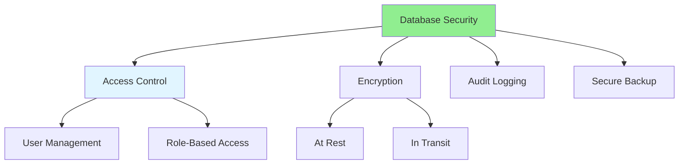

# 06.16 Database Security / Bảo mật Database

## Table of Contents / Mục lục
1. [Introduction / Giới thiệu](#introduction--giới-thiệu)
2. [Security Measures / Biện pháp bảo mật](#security-measures--biện-pháp-bảo-mật)
3. [Best Practices / Thực hành tốt nhất](#best-practices--thực-hành-tốt-nhất)
4. [Summary / Tóm tắt](#summary--tóm-tắt)

---

## Introduction / Giới thiệu

### Overview / Tổng quan

**English**: Database security protects sensitive data from unauthorized access. Learn security best practices for database protection.

**Vietnamese**: Bảo mật database bảo vệ dữ liệu nhạy cảm khỏi truy cập trái phép. Học thực hành tốt nhất về bảo mật để bảo vệ database.

### Database Security Measures / Biện pháp bảo mật Database



---

## Security Measures / Biện pháp bảo mật

### Example 1: Access Control / Ví dụ 1: Kiểm soát truy cập

```sql
-- Create user with limited privileges / Tạo user với quyền hạn chế
CREATE USER app_user WITH PASSWORD 'secure_password';

-- Grant only necessary permissions / Cấp chỉ quyền cần thiết
GRANT SELECT, INSERT, UPDATE ON users TO app_user;
GRANT SELECT, INSERT ON orders TO app_user;
-- No DELETE permission / Không có quyền DELETE

-- Revoke unnecessary permissions / Thu hồi quyền không cần thiết
REVOKE ALL ON DATABASE mydb FROM PUBLIC;

-- Role-based access / Truy cập dựa trên vai trò
CREATE ROLE read_only;
GRANT SELECT ON ALL TABLES IN SCHEMA public TO read_only;

CREATE ROLE app_read_write;
GRANT SELECT, INSERT, UPDATE ON ALL TABLES IN SCHEMA public TO app_read_write;
```

### Example 2: Data Encryption / Ví dụ 2: Mã hóa dữ liệu

```typescript
// Encrypt sensitive data / Mã hóa dữ liệu nhạy cảm
import crypto from 'crypto';

const algorithm = 'aes-256-gcm';
const key = process.env.ENCRYPTION_KEY!;

function encrypt(text: string): string {
  const iv = crypto.randomBytes(16);
  const cipher = crypto.createCipheriv(algorithm, Buffer.from(key, 'hex'), iv);
  
  let encrypted = cipher.update(text, 'utf8', 'hex');
  encrypted += cipher.final('hex');
  
  const authTag = cipher.getAuthTag();
  return iv.toString('hex') + ':' + authTag.toString('hex') + ':' + encrypted;
}

function decrypt(encryptedText: string): string {
  const parts = encryptedText.split(':');
  const iv = Buffer.from(parts[0], 'hex');
  const authTag = Buffer.from(parts[1], 'hex');
  const encrypted = parts[2];
  
  const decipher = crypto.createDecipheriv(algorithm, Buffer.from(key, 'hex'), iv);
  decipher.setAuthTag(authTag);
  
  let decrypted = decipher.update(encrypted, 'hex', 'utf8');
  decrypted += decipher.final('utf8');
  return decrypted;
}

// Store encrypted data / Lưu trữ dữ liệu mã hóa
const encryptedEmail = encrypt(user.email);
await prisma.user.create({
  data: {
    email_encrypted: encryptedEmail,
    // ... other fields
  }
});
```

---

## Best Practices / Thực hành tốt nhất

1. **Least privilege** - Grant minimum necessary permissions
2. **Encrypt sensitive data** - Encrypt at rest and in transit
3. **Use parameterized queries** - Prevent SQL injection
4. **Regular updates** - Keep database updated
5. **Audit logging** - Log all database access

---

## Summary / Tóm tắt

### Key Takeaways / Điểm chính

- **Access control**: Limit user permissions
- **Encryption**: Encrypt sensitive data
- **Parameterized queries**: Prevent SQL injection
- **Updates**: Keep database patched
- **Audit**: Log database access

### Next Steps / Bước tiếp theo

- ✅ Complete Group 06: Database Analysis
- Move to [Group 07: Unit Test & Debug](../Group-07-Unit-Test-Debug/) - Coming next

---

**Last Updated / Cập nhật lần cuối**: 2024

