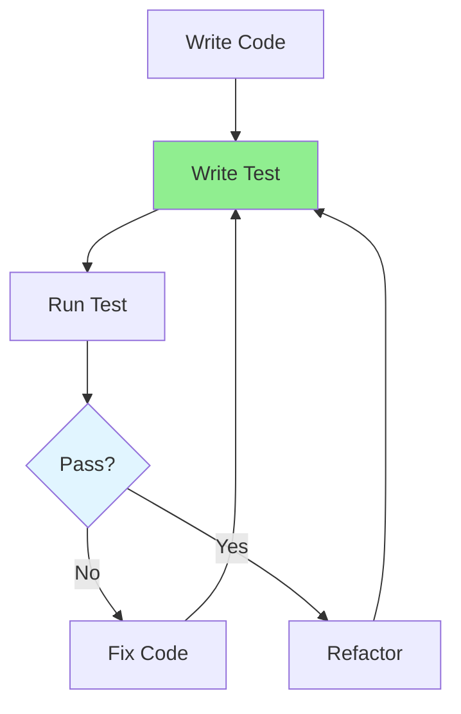

# 07.01 Unit Test Basics / Unit Test cơ bản - Viết test đầu tiên

## Table of Contents / Mục lục
1. [Introduction / Giới thiệu](#introduction--giới-thiệu)
2. [What is Unit Testing? / Unit Test là gì?](#what-is-unit-testing--unit-test-là-gì)
3. [Test Structure / Cấu trúc test](#test-structure--cấu-trúc-test)
4. [Writing Your First Test / Viết test đầu tiên](#writing-your-first-test--viết-test-đầu-tiên)
5. [Testing Frameworks / Framework testing](#testing-frameworks--framework-testing)
6. [Best Practices / Thực hành tốt nhất](#best-practices--thực-hành-tốt-nhất)
7. [Summary / Tóm tắt](#summary--tóm-tắt)

---

## Introduction / Giới thiệu

### Overview / Tổng quan

**English**: Unit tests verify that individual units of code work correctly in isolation. Writing unit tests is fundamental to ensuring code quality and preventing bugs.

**Vietnamese**: Unit test xác minh rằng các đơn vị code riêng lẻ hoạt động đúng trong sự cô lập. Viết unit test là nền tảng để đảm bảo chất lượng code và ngăn chặn bug.

### Unit Test Flow / Luồng Unit Test



---

## What is Unit Testing? / Unit Test là gì?

### Example 1: Unit Test Concept / Ví dụ 1: Khái niệm Unit Test

```typescript
// Unit: A function that calculates total price / Đơn vị: Hàm tính tổng giá
function calculateTotal(items: CartItem[]): number {
  return items.reduce((sum, item) => sum + (item.price * item.quantity), 0);
}

// Unit Test: Test this function in isolation / Unit Test: Test hàm này trong sự cô lập
describe('calculateTotal', () => {
  it('should calculate total for multiple items', () => {
    // Arrange: Setup test data / Sắp xếp: Thiết lập dữ liệu test
    const items: CartItem[] = [
      { price: 10, quantity: 2 },
      { price: 5, quantity: 3 }
    ];
    
    // Act: Execute function / Hành động: Thực thi hàm
    const result = calculateTotal(items);
    
    // Assert: Verify result / Khẳng định: Xác minh kết quả
    expect(result).toBe(35); // (10*2) + (5*3) = 35
  });
});
```

---

## Test Structure / Cấu trúc test

### Example 2: Arrange-Act-Assert Pattern / Ví dụ 2: Mẫu Arrange-Act-Assert

```typescript
// Arrange-Act-Assert (AAA) Pattern / Mẫu Arrange-Act-Assert
describe('UserService', () => {
  describe('createUser', () => {
    it('should create user with valid data', () => {
      // Arrange: Setup / Sắp xếp: Thiết lập
      const userData = {
        email: 'test@example.com',
        name: 'Test User',
        password: 'password123'
      };
      const mockRepository = {
        create: jest.fn().mockResolvedValue({ id: 1, ...userData })
      };
      const service = new UserService(mockRepository);
      
      // Act: Execute / Hành động: Thực thi
      const result = await service.createUser(userData);
      
      // Assert: Verify / Khẳng định: Xác minh
      expect(result).toHaveProperty('id');
      expect(result.email).toBe(userData.email);
      expect(mockRepository.create).toHaveBeenCalledWith(userData);
    });
  });
});
```

---

## Writing Your First Test / Viết test đầu tiên

### Example 3: Simple Test Examples / Ví dụ 3: Ví dụ test đơn giản

```typescript
// Jest example / Ví dụ Jest
// math.ts
export function add(a: number, b: number): number {
  return a + b;
}

export function divide(a: number, b: number): number {
  if (b === 0) {
    throw new Error('Division by zero');
  }
  return a / b;
}

// math.test.ts
import { add, divide } from './math';

describe('Math functions', () => {
  describe('add', () => {
    it('should add two positive numbers', () => {
      expect(add(2, 3)).toBe(5);
    });
    
    it('should handle negative numbers', () => {
      expect(add(-1, 1)).toBe(0);
    });
  });
  
  describe('divide', () => {
    it('should divide two numbers', () => {
      expect(divide(10, 2)).toBe(5);
    });
    
    it('should throw error when dividing by zero', () => {
      expect(() => divide(10, 0)).toThrow('Division by zero');
    });
  });
});
```

---

## Testing Frameworks / Framework testing

### Example 4: Framework Comparison / Ví dụ 4: So sánh framework

```typescript
// Jest (JavaScript/TypeScript) / Jest
describe('User', () => {
  test('should create user', () => {
    const user = new User('test@example.com');
    expect(user.email).toBe('test@example.com');
  });
});

// Vitest (Modern Jest alternative) / Vitest
import { describe, it, expect } from 'vitest';

// Mocha + Chai (Alternative) / Mocha + Chai
import { expect } from 'chai';

// Python pytest / pytest
def test_add():
    assert add(2, 3) == 5
```

---

## Best Practices / Thực hành tốt nhất

1. **Test one thing** - Each test should verify one behavior
2. **Clear names** - Descriptive test names
3. **Independent tests** - Tests should not depend on each other
4. **Fast tests** - Unit tests should run quickly
5. **Maintain tests** - Keep tests updated with code

---

## Summary / Tóm tắt

### Key Takeaways / Điểm chính

- **Unit test**: Test individual units in isolation
- **Structure**: Arrange-Act-Assert pattern
- **Frameworks**: Jest, Vitest, pytest
- **Best practices**: Clear, independent, fast tests

### Next Steps / Bước tiếp theo

- [07.02 Test Cases Design](./07.02_Test_Cases_Design.md) - Next: Test Case Design

---

**Last Updated / Cập nhật lần cuối**: 2024

