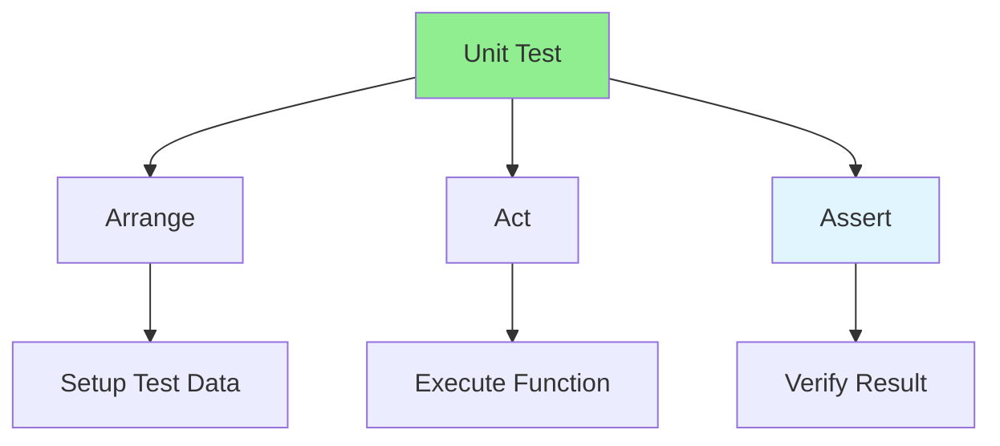

# 07.01 Unit Test: Basics / Unit Test: Cơ bản

## Table of Contents / Mục lục
1. [Introduction / Giới thiệu](#introduction--giới-thiệu)
2. [Unit Test Structure / Cấu trúc Unit Test](#unit-test-structure--cấu-trúc-unit-test)
3. [Writing Unit Tests / Viết Unit Test](#writing-unit-tests--viết-unit-test)
4. [Best Practices / Thực hành tốt nhất](#best-practices--thực-hành-tốt-nhất)
5. [Summary / Tóm tắt](#summary--tóm-tắt)

---

## Introduction / Giới thiệu

### Overview / Tổng quan

**English**: Unit tests verify individual functions work correctly. Learn to write unit tests using testing frameworks like Jest and Vitest.

**Vietnamese**: Unit test xác minh các hàm riêng lẻ hoạt động đúng. Học cách viết unit test sử dụng framework test như Jest và Vitest.

### Unit Test Structure (AAA) / Cấu trúc Unit Test (AAA)



---

## Unit Test Structure / Cấu trúc Unit Test

### Example 1: Basic Unit Test / Ví dụ 1: Unit Test cơ bản

```typescript
// Function to test / Hàm cần test
function add(a: number, b: number): number {
  return a + b;
}

// Unit test / Unit test
describe('add', () => {
  it('should add two positive numbers', () => {
    // Arrange / Sắp xếp
    const a = 2;
    const b = 3;
    
    // Act / Hành động
    const result = add(a, b);
    
    // Assert / Xác nhận
    expect(result).toBe(5);
  });
  
  it('should handle negative numbers', () => {
    expect(add(-2, 3)).toBe(1);
  });
  
  it('should handle zero', () => {
    expect(add(0, 5)).toBe(5);
  });
});
```

### Example 2: Testing Service / Ví dụ 2: Test Service

```typescript
// Service to test / Service cần test
class UserService {
  async getUserById(id: string): Promise<User | null> {
    return await prisma.user.findUnique({ where: { id } });
  }
  
  async createUser(data: CreateUserDto): Promise<User> {
    return await prisma.user.create({ data });
  }
}

// Unit test with mocking / Unit test với mocking
describe('UserService', () => {
  let userService: UserService;
  let mockPrisma: jest.Mocked<typeof prisma>;
  
  beforeEach(() => {
    mockPrisma = prisma as jest.Mocked<typeof prisma>;
    userService = new UserService();
  });
  
  describe('getUserById', () => {
    it('should return user when found', async () => {
      // Arrange
      const mockUser = { id: '1', email: 'test@example.com', name: 'Test' };
      mockPrisma.user.findUnique.mockResolvedValue(mockUser);
      
      // Act
      const result = await userService.getUserById('1');
      
      // Assert
      expect(result).toEqual(mockUser);
      expect(mockPrisma.user.findUnique).toHaveBeenCalledWith({
        where: { id: '1' }
      });
    });
    
    it('should return null when user not found', async () => {
      mockPrisma.user.findUnique.mockResolvedValue(null);
      
      const result = await userService.getUserById('999');
      
      expect(result).toBeNull();
    });
  });
});
```

---

## Best Practices / Thực hành tốt nhất

1. **AAA pattern** - Arrange, Act, Assert
2. **Test one thing** - Each test should test one behavior
3. **Use descriptive names** - Test names should describe what's tested
4. **Mock dependencies** - Mock external dependencies
5. **Test edge cases** - Test boundary conditions

---

## Summary / Tóm tắt

### Key Takeaways / Điểm chính

- **AAA pattern**: Arrange, Act, Assert
- **Isolation**: Test functions in isolation
- **Mocking**: Mock external dependencies
- **Coverage**: Aim for high test coverage
- **Maintainable**: Keep tests simple and readable

### Next Steps / Bước tiếp theo

- [07.02 Test Cases Design](./07.02_Test_Cases_Design.md) - Next: Test Cases

---

**Last Updated / Cập nhật lần cuối**: 2024


