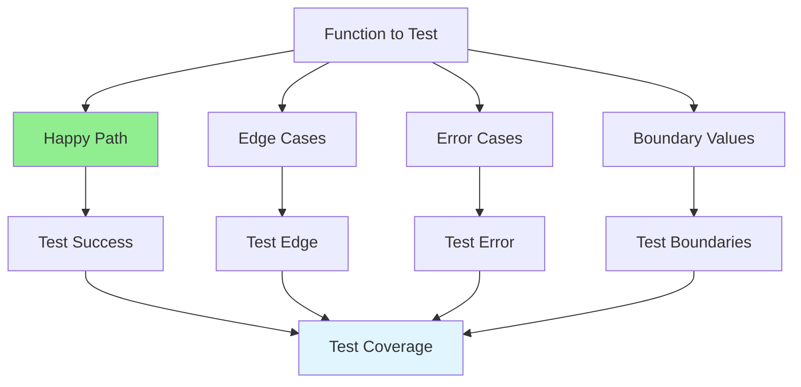

# 07.02 Test Cases Design / Thiết kế test cases

## Table of Contents / Mục lục
1. [Introduction / Giới thiệu](#introduction--giới-thiệu)
2. [Test Case Types / Loại test case](#test-case-types--loại-test-case)
3. [Test Coverage / Coverage test](#test-coverage--coverage-test)
4. [Best Practices / Thực hành tốt nhất](#best-practices--thực-hành-tốt-nhất)
5. [Summary / Tóm tắt](#summary--tóm-tắt)

---

## Introduction / Giới thiệu

### Overview / Tổng quan

**English**: Well-designed test cases cover all scenarios: happy paths, edge cases, error cases, and boundary values. Good test design ensures comprehensive coverage.

**Vietnamese**: Test case được thiết kế tốt bao phủ tất cả scenario: happy path, edge case, error case và giá trị biên. Thiết kế test tốt đảm bảo coverage toàn diện.

### Test Case Coverage / Coverage test case



---

## Test Case Types / Loại test case

### Example 1: Test Case Examples / Ví dụ 1: Ví dụ test case

```typescript
// Function to test / Hàm cần test
function validateEmail(email: string): boolean {
  const emailRegex = /^[^\s@]+@[^\s@]+\.[^\s@]+$/;
  return emailRegex.test(email);
}

// Test cases / Test case
describe('validateEmail', () => {
  // Happy path / Happy path
  it('should return true for valid email', () => {
    expect(validateEmail('user@example.com')).toBe(true);
  });
  
  // Edge cases / Edge case
  it('should handle email with plus sign', () => {
    expect(validateEmail('user+tag@example.com')).toBe(true);
  });
  
  it('should handle email with subdomain', () => {
    expect(validateEmail('user@mail.example.com')).toBe(true);
  });
  
  // Error cases / Error case
  it('should return false for invalid email', () => {
    expect(validateEmail('invalid-email')).toBe(false);
  });
  
  it('should return false for email without @', () => {
    expect(validateEmail('userexample.com')).toBe(false);
  });
  
  // Boundary values / Giá trị biên
  it('should handle empty string', () => {
    expect(validateEmail('')).toBe(false);
  });
  
  it('should handle very long email', () => {
    const longEmail = 'a'.repeat(100) + '@example.com';
    expect(validateEmail(longEmail)).toBe(true);
  });
});
```

---

## Test Coverage / Coverage test

### Example 2: Coverage Types / Ví dụ 2: Loại coverage

```typescript
// Statement coverage / Coverage câu lệnh
function calculateDiscount(price: number, isPremium: boolean): number {
  if (isPremium) { // Statement 1 / Câu lệnh 1
    return price * 0.2; // Statement 2 / Câu lệnh 2
  }
  return price * 0.1; // Statement 3 / Câu lệnh 3
}

// To achieve 100% statement coverage / Để đạt 100% statement coverage
describe('calculateDiscount', () => {
  it('should apply premium discount', () => {
    expect(calculateDiscount(100, true)).toBe(20); // Covers statement 1, 2 / Bao phủ câu lệnh 1, 2
  });
  
  it('should apply regular discount', () => {
    expect(calculateDiscount(100, false)).toBe(10); // Covers statement 3 / Bao phủ câu lệnh 3
  });
});

// Branch coverage / Coverage nhánh
function processOrder(order: Order): string {
  if (order.total > 1000) { // Branch 1 / Nhánh 1
    return 'VIP';
  } else if (order.total > 500) { // Branch 2 / Nhánh 2
    return 'Premium';
  }
  return 'Standard'; // Branch 3 / Nhánh 3
}

// Test all branches / Test tất cả nhánh
describe('processOrder', () => {
  it('should return VIP for orders > 1000', () => {
    expect(processOrder({ total: 1500 })).toBe('VIP');
  });
  
  it('should return Premium for orders > 500', () => {
    expect(processOrder({ total: 750 })).toBe('Premium');
  });
  
  it('should return Standard for orders <= 500', () => {
    expect(processOrder({ total: 300 })).toBe('Standard');
  });
});
```

---

## Best Practices / Thực hành tốt nhất

1. **Cover all paths** - Happy, edge, error, boundary
2. **Test one thing** - Each test verifies one behavior
3. **Clear names** - Descriptive test names
4. **Independent** - Tests don't depend on each other
5. **Maintainable** - Easy to update

---

## Summary / Tóm tắt

### Key Takeaways / Điểm chính

- **Types**: Happy path, edge cases, errors, boundaries
- **Coverage**: Statement, branch, path coverage
- **Design**: Comprehensive, clear, independent

### Next Steps / Bước tiếp theo

- [07.03 Mock and Stub](./07.03_Mock_Stub.md) - Next: Mock & Stub

---

**Last Updated / Cập nhật lần cuối**: 2024

