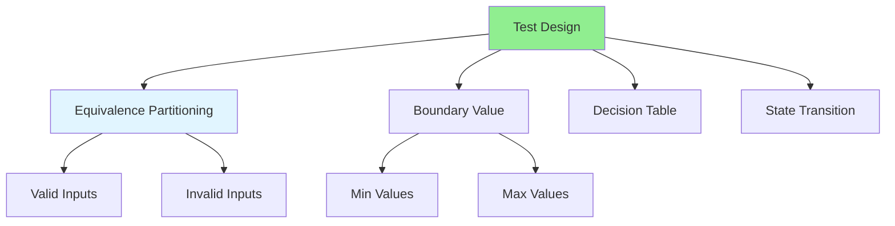

# 07.02 Test Cases: Design / Test Case: Thiết kế

## Table of Contents / Mục lục
1. [Introduction / Giới thiệu](#introduction--giới-thiệu)
2. [Test Case Design Techniques / Kỹ thuật thiết kế Test Case](#test-case-design-techniques--kỹ-thuật-thiết-kế-test-case)
3. [Test Scenarios / Kịch bản test](#test-scenarios--kịch-bản-test)
4. [Best Practices / Thực hành tốt nhất](#best-practices--thực-hành-tốt-nhất)
5. [Summary / Tóm tắt](#summary--tóm-tắt)

---

## Introduction / Giới thiệu

### Overview / Tổng quan

**English**: Well-designed test cases cover all scenarios. Learn techniques to design comprehensive test cases including edge cases and error scenarios.

**Vietnamese**: Test case được thiết kế tốt bao phủ tất cả kịch bản. Học kỹ thuật thiết kế test case toàn diện bao gồm edge case và kịch bản lỗi.

### Test Case Design Techniques / Kỹ thuật thiết kế Test Case



---

## Test Case Design Techniques / Kỹ thuật thiết kế Test Case

### Example 1: Equivalence Partitioning / Ví dụ 1: Phân vùng tương đương

```typescript
// Function to test / Hàm cần test
function validateAge(age: number): boolean {
  return age >= 18 && age <= 100;
}

// Test cases using equivalence partitioning / Test case sử dụng phân vùng tương đương
describe('validateAge', () => {
  // Valid partition / Phân vùng hợp lệ
  it('should return true for valid age (18-100)', () => {
    expect(validateAge(18)).toBe(true);
    expect(validateAge(50)).toBe(true);
    expect(validateAge(100)).toBe(true);
  });
  
  // Invalid partitions / Phân vùng không hợp lệ
  it('should return false for age < 18', () => {
    expect(validateAge(17)).toBe(false);
    expect(validateAge(0)).toBe(false);
    expect(validateAge(-1)).toBe(false);
  });
  
  it('should return false for age > 100', () => {
    expect(validateAge(101)).toBe(false);
    expect(validateAge(200)).toBe(false);
  });
});
```

### Example 2: Boundary Value Testing / Ví dụ 2: Test giá trị biên

```typescript
// Boundary value testing / Test giá trị biên
describe('validateAge - Boundary Values', () => {
  // Lower boundary / Giá trị biên dưới
  it('should return true for minimum valid age (18)', () => {
    expect(validateAge(18)).toBe(true);
  });
  
  it('should return false for just below minimum (17)', () => {
    expect(validateAge(17)).toBe(false);
  });
  
  // Upper boundary / Giá trị biên trên
  it('should return true for maximum valid age (100)', () => {
    expect(validateAge(100)).toBe(true);
  });
  
  it('should return false for just above maximum (101)', () => {
    expect(validateAge(101)).toBe(false);
  });
});
```

---

## Test Scenarios / Kịch bản test

### Example 3: Comprehensive Test Cases / Ví dụ 3: Test case toàn diện

```typescript
// Comprehensive test cases / Test case toàn diện
describe('UserService - createUser', () => {
  // Happy path / Đường dẫn thành công
  it('should create user with valid data', async () => {
    const userData = { email: 'test@example.com', name: 'Test User' };
    const result = await userService.createUser(userData);
    expect(result.email).toBe(userData.email);
  });
  
  // Error cases / Trường hợp lỗi
  it('should throw error for duplicate email', async () => {
    const userData = { email: 'existing@example.com', name: 'Test' };
    await expect(userService.createUser(userData)).rejects.toThrow();
  });
  
  it('should throw error for invalid email format', async () => {
    const userData = { email: 'invalid-email', name: 'Test' };
    await expect(userService.createUser(userData)).rejects.toThrow();
  });
  
  // Edge cases / Trường hợp biên
  it('should handle empty name', async () => {
    const userData = { email: 'test@example.com', name: '' };
    const result = await userService.createUser(userData);
    expect(result.name).toBe('');
  });
  
  it('should handle very long email', async () => {
    const longEmail = 'a'.repeat(250) + '@example.com';
    const userData = { email: longEmail, name: 'Test' };
    await expect(userService.createUser(userData)).rejects.toThrow();
  });
});
```

---

## Best Practices / Thực hành tốt nhất

1. **Cover all paths** - Happy path, error cases, edge cases
2. **Use techniques** - Equivalence partitioning, boundary values
3. **Test independently** - Each test should be independent
4. **Clear names** - Descriptive test names
5. **Maintain** - Keep tests updated with code changes

---

## Summary / Tóm tắt

### Key Takeaways / Điểm chính

- **Equivalence partitioning**: Group similar inputs
- **Boundary values**: Test min, max, edge values
- **Error cases**: Test error scenarios
- **Edge cases**: Test unusual inputs
- **Comprehensive**: Cover all scenarios

### Next Steps / Bước tiếp theo

- [07.03 Mock & Stub](./07.03_Mock_Stub.md) - Next: Mock & Stub

---

**Last Updated / Cập nhật lần cuối**: 2024

