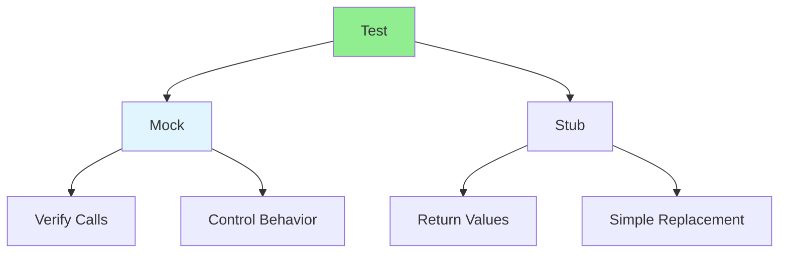

# 07.03 Mock & Stub / Mock & Stub

## Table of Contents / Mục lục
1. [Introduction / Giới thiệu](#introduction--giới-thiệu)
2. [Mocks / Mock](#mocks--mock)
3. [Stubs / Stub](#stubs--stub)
4. [Comparison / So sánh](#comparison--so-sánh)
5. [Best Practices / Thực hành tốt nhất](#best-practices--thực-hành-tốt-nhất)
6. [Summary / Tóm tắt](#summary--tóm-tắt)

---

## Introduction / Giới thiệu

### Overview / Tổng quan

**English**: Mocks and stubs isolate units under test by replacing dependencies. Learn to use mocks and stubs for effective unit testing.

**Vietnamese**: Mock và stub cô lập đơn vị cần test bằng cách thay thế phụ thuộc. Học cách sử dụng mock và stub cho unit test hiệu quả.

### Mock and Stub / Mock và Stub



---

## Mocks / Mock

### Example 1: Mocking with Jest / Ví dụ 1: Mock với Jest

```typescript
// Function with dependency / Hàm có phụ thuộc
class EmailService {
  async sendEmail(to: string, subject: string, body: string): Promise<void> {
    // Send email logic / Logic gửi email
  }
}

class UserService {
  constructor(private emailService: EmailService) {}
  
  async registerUser(email: string, name: string): Promise<User> {
    const user = await prisma.user.create({ email, name });
    await this.emailService.sendEmail(email, 'Welcome', 'Welcome message');
    return user;
  }
}

// Test with mock / Test với mock
describe('UserService', () => {
  let emailService: jest.Mocked<EmailService>;
  let userService: UserService;
  
  beforeEach(() => {
    emailService = {
      sendEmail: jest.fn().mockResolvedValue(undefined)
    } as any;
    userService = new UserService(emailService);
  });
  
  it('should send welcome email after registration', async () => {
    const user = await userService.registerUser('test@example.com', 'Test');
    
    // Verify mock was called / Xác minh mock được gọi
    expect(emailService.sendEmail).toHaveBeenCalledWith(
      'test@example.com',
      'Welcome',
      'Welcome message'
    );
    expect(emailService.sendEmail).toHaveBeenCalledTimes(1);
  });
});
```

---

## Stubs / Stub

### Example 2: Stubbing / Ví dụ 2: Stub

```typescript
// Stub example / Ví dụ stub
class DatabaseService {
  async findUser(id: string): Promise<User | null> {
    // Database query / Truy vấn database
  }
}

// Stub for testing / Stub cho test
const stubDatabaseService = {
  findUser: async (id: string) => {
    if (id === '1') {
      return { id: '1', email: 'test@example.com', name: 'Test' };
    }
    return null;
  }
};

// Use stub in test / Sử dụng stub trong test
describe('UserService with stub', () => {
  it('should return user when found', async () => {
    const userService = new UserService(stubDatabaseService);
    const user = await userService.getUserById('1');
    expect(user).not.toBeNull();
    expect(user?.email).toBe('test@example.com');
  });
});
```

---

## Comparison / So sánh

### Example 3: Mock vs Stub / Ví dụ 3: Mock vs Stub

```typescript
// Mock: Verifies interactions / Mock: Xác minh tương tác
const mockEmailService = {
  sendEmail: jest.fn()
};
// Later verify: expect(mockEmailService.sendEmail).toHaveBeenCalled()

// Stub: Provides predefined responses / Stub: Cung cấp phản hồi định sẵn
const stubEmailService = {
  sendEmail: async () => { /* predefined behavior */ }
};
// No verification needed / Không cần xác minh
```

---

## Best Practices / Thực hành tốt nhất

1. **Mock external dependencies** - Database, APIs, file system
2. **Use stubs for simple replacements** - When you just need return values
3. **Verify mocks** - Check that mocks were called correctly
4. **Keep mocks simple** - Don't over-complicate
5. **Reset between tests** - Clear mocks in beforeEach

---

## Summary / Tóm tắt

### Key Takeaways / Điểm chính

- **Mock**: Verifies interactions, controls behavior
- **Stub**: Provides predefined responses
- **Isolation**: Both isolate units under test
- **Choose**: Mock for verification, stub for simple replacement
- **Reset**: Clear mocks/stubs between tests

### Next Steps / Bước tiếp theo

- [07.04 Test Coverage](./07.04_Test_Coverage.md) - Next: Test Coverage

---

**Last Updated / Cập nhật lần cuối**: 2024


