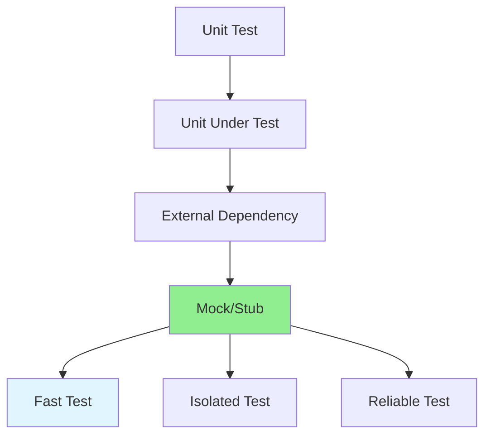

# 07.03 Mock and Stub / Mock và Stub - Giả lập dependencies

## Table of Contents / Mục lục
1. [Introduction / Giới thiệu](#introduction--giới-thiệu)
2. [Mock vs Stub / Mock vs Stub](#mock-vs-stub--mock-vs-stub)
3. [Mocking Dependencies / Giả lập dependencies](#mocking-dependencies--giả-lập-dependencies)
4. [Best Practices / Thực hành tốt nhất](#best-practices--thực-hành-tốt-nhất)
5. [Summary / Tóm tắt](#summary--tóm-tắt)

---

## Introduction / Giới thiệu

### Overview / Tổng quan

**English**: Mocks and stubs isolate units under test by replacing external dependencies. This enables fast, reliable unit tests that don't depend on external systems.

**Vietnamese**: Mock và stub cô lập đơn vị đang test bằng cách thay thế dependencies bên ngoài. Điều này cho phép unit test nhanh, đáng tin cậy không phụ thuộc vào hệ thống bên ngoài.

### Mocking Strategy / Chiến lược Mock



---

## Mock vs Stub / Mock vs Stub

### Example 1: Mock vs Stub / Ví dụ 1: Mock vs Stub

```typescript
// Stub: Returns predefined values / Stub: Trả về giá trị định trước
const stubUserRepository = {
  findById: jest.fn().mockResolvedValue({
    id: 1,
    email: 'test@example.com',
    name: 'Test User'
  })
};

// Mock: Verifies interactions / Mock: Xác minh tương tác
const mockEmailService = {
  sendEmail: jest.fn().mockResolvedValue(true)
};

// Usage / Sử dụng
describe('UserService', () => {
  it('should send welcome email when creating user', async () => {
    const service = new UserService(stubUserRepository, mockEmailService);
    
    await service.createUser({
      email: 'new@example.com',
      name: 'New User'
    });
    
    // Verify mock was called / Xác minh mock đã được gọi
    expect(mockEmailService.sendEmail).toHaveBeenCalledWith(
      'new@example.com',
      'Welcome!'
    );
  });
});
```

---

## Mocking Dependencies / Giả lập dependencies

### Example 2: Common Mocking Scenarios / Ví dụ 2: Scenario mock phổ biến

```typescript
// Mock database / Mock database
const mockPrisma = {
  user: {
    create: jest.fn().mockResolvedValue({ id: 1, email: 'test@example.com' }),
    findUnique: jest.fn().mockResolvedValue({ id: 1, email: 'test@example.com' }),
    update: jest.fn().mockResolvedValue({ id: 1, email: 'updated@example.com' })
  }
};

// Mock API calls / Mock API calls
const mockAxios = {
  get: jest.fn().mockResolvedValue({ data: { result: 'success' } }),
  post: jest.fn().mockResolvedValue({ data: { id: 1 } })
};

// Mock file system / Mock file system
const mockFs = {
  readFile: jest.fn().mockResolvedValue('file content'),
  writeFile: jest.fn().mockResolvedValue(undefined)
};

// Mock time / Mock thời gian
jest.useFakeTimers();
jest.setSystemTime(new Date('2024-01-01'));

// After test / Sau test
jest.useRealTimers();
```

---

## Best Practices / Thực hành tốt nhất

1. **Mock external dependencies** - Database, APIs, file system
2. **Use mocks for verification** - Check interactions
3. **Use stubs for data** - Return test data
4. **Reset mocks** - Between tests
5. **Don't over-mock** - Only mock what's necessary

---

## Summary / Tóm tắt

### Key Takeaways / Điểm chính

- **Mock**: Verify interactions
- **Stub**: Return test data
- **Isolate**: Test units independently
- **Fast**: No external dependencies

### Next Steps / Bước tiếp theo

- [07.04 Test Coverage](./07.04_Test_Coverage.md) - Next: Test Coverage

---

**Last Updated / Cập nhật lần cuối**: 2024

