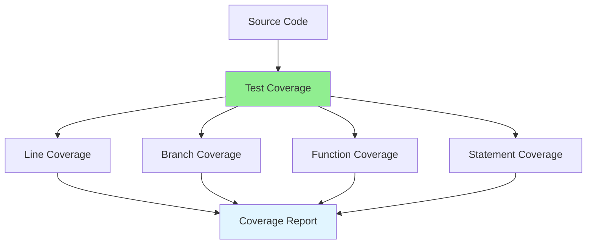

# 07.04 Test Coverage / Đo lường coverage

## Table of Contents / Mục lục
1. [Introduction / Giới thiệu](#introduction--giới-thiệu)
2. [Coverage Metrics / Chỉ số coverage](#coverage-metrics--chỉ-số-coverage)
3. [Coverage Tools / Công cụ coverage](#coverage-tools--công-cụ-coverage)
4. [Best Practices / Thực hành tốt nhất](#best-practices--thực-hành-tốt-nhất)
5. [Summary / Tóm tắt](#summary--tóm-tắt)

---

## Introduction / Giới thiệu

### Overview / Tổng quan

**English**: Test coverage measures how much of your code is tested. Understanding coverage metrics helps identify untested code and improve test quality.

**Vietnamese**: Test coverage đo lường bao nhiêu code được test. Hiểu chỉ số coverage giúp xác định code chưa được test và cải thiện chất lượng test.

### Coverage Types / Loại coverage



---

## Coverage Metrics / Chỉ số coverage

### Example 1: Coverage Examples / Ví dụ 1: Ví dụ coverage

```typescript
// Function to test / Hàm cần test
function processOrder(order: Order): string {
  if (order.total > 1000) {
    return 'VIP';
  } else if (order.total > 500) {
    return 'Premium';
  }
  return 'Standard';
}

// Test with 100% line coverage / Test với 100% line coverage
describe('processOrder', () => {
  it('should return VIP', () => {
    expect(processOrder({ total: 1500 })).toBe('VIP');
  });
  
  it('should return Premium', () => {
    expect(processOrder({ total: 750 })).toBe('Premium');
  });
  
  it('should return Standard', () => {
    expect(processOrder({ total: 300 })).toBe('Standard');
  });
});

// Coverage report example / Ví dụ báo cáo coverage
// Line coverage: 100% (all lines executed)
// Branch coverage: 100% (all branches tested)
// Function coverage: 100% (function tested)
```

---

## Coverage Tools / Công cụ coverage

### Example 2: Coverage Setup / Ví dụ 2: Thiết lập coverage

```json
// package.json (Jest) / package.json (Jest)
{
  "scripts": {
    "test": "jest",
    "test:coverage": "jest --coverage"
  },
  "jest": {
    "collectCoverageFrom": [
      "src/**/*.{ts,tsx}",
      "!src/**/*.d.ts",
      "!src/**/*.test.{ts,tsx}"
    ],
    "coverageThreshold": {
      "global": {
        "branches": 80,
        "functions": 80,
        "lines": 80,
        "statements": 80
      }
    }
  }
}
```

```typescript
// Coverage report interpretation / Giải thích báo cáo coverage
interface CoverageReport {
  statements: { covered: number; total: number; percentage: number };
  branches: { covered: number; total: number; percentage: number };
  functions: { covered: number; total: number; percentage: number };
  lines: { covered: number; total: number; percentage: number };
}

// Example report / Ví dụ báo cáo
const report: CoverageReport = {
  statements: { covered: 450, total: 500, percentage: 90 },
  branches: { covered: 120, total: 150, percentage: 80 },
  functions: { covered: 45, total: 50, percentage: 90 },
  lines: { covered: 440, total: 500, percentage: 88 }
};
```

---

## Best Practices / Thực hành tốt nhất

1. **Aim for high coverage** - But don't obsess over 100%
2. **Focus on important code** - Business logic, critical paths
3. **Use coverage to find gaps** - Identify untested code
4. **Set thresholds** - Minimum coverage requirements
5. **Review coverage reports** - Regularly check coverage

---

## Summary / Tóm tắt

### Key Takeaways / Điểm chính

- **Metrics**: Line, branch, function, statement coverage
- **Tools**: Jest, Istanbul, Coverage.py
- **Goal**: High coverage, but focus on quality
- **Use**: Identify untested code

### Next Steps / Bước tiếp theo

- [07.05 Integration Test](./07.05_Integration_Test.md) - Next: Integration Testing

---

**Last Updated / Cập nhật lần cuối**: 2024

