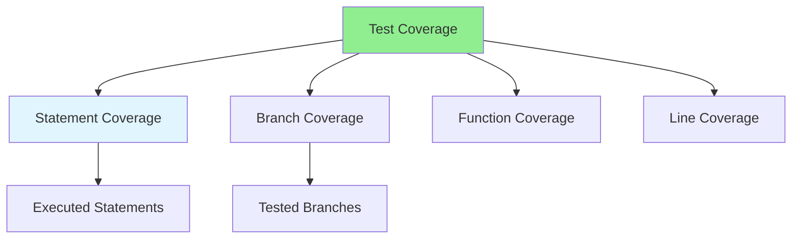

# 07.04 Test Coverage / Độ phủ test

## Table of Contents / Mục lục
1. [Introduction / Giới thiệu](#introduction--giới-thiệu)
2. [Coverage Metrics / Chỉ số phủ](#coverage-metrics--chỉ-số-phủ)
3. [Measuring Coverage / Đo độ phủ](#measuring-coverage--đo-độ-phủ)
4. [Best Practices / Thực hành tốt nhất](#best-practices--thực-hành-tốt-nhất)
5. [Summary / Tóm tắt](#summary--tóm-tắt)

---

## Introduction / Giới thiệu

### Overview / Tổng quan

**English**: Test coverage measures how much code is tested. Learn to measure and improve test coverage for better code quality.

**Vietnamese**: Độ phủ test đo lường bao nhiêu code được test. Học cách đo và cải thiện độ phủ test để có chất lượng code tốt hơn.

### Test Coverage Metrics / Chỉ số phủ test



---

## Coverage Metrics / Chỉ số phủ

### Example 1: Coverage Types / Ví dụ 1: Loại phủ

```typescript
// Function to test / Hàm cần test
function calculateDiscount(total: number, isPremium: boolean): number {
  if (isPremium) {
    return total * 0.1;  // 10% discount
  }
  if (total > 100) {
    return total * 0.05;  // 5% discount
  }
  return 0;
}

// Test cases for coverage / Test case cho độ phủ
describe('calculateDiscount', () => {
  // Statement coverage: All statements executed / Phủ câu lệnh: Tất cả câu lệnh được thực thi
  it('should return 10% for premium users', () => {
    expect(calculateDiscount(100, true)).toBe(10);
  });
  
  it('should return 5% for orders over 100', () => {
    expect(calculateDiscount(150, false)).toBe(7.5);
  });
  
  it('should return 0 for regular users under 100', () => {
    expect(calculateDiscount(50, false)).toBe(0);
  });
  
  // Branch coverage: All branches tested / Phủ nhánh: Tất cả nhánh được test
  // ✓ isPremium = true
  // ✓ isPremium = false && total > 100
  // ✓ isPremium = false && total <= 100
});
```

### Example 2: Coverage Tools / Ví dụ 2: Công cụ phủ

```json
// Jest coverage configuration / Cấu hình coverage Jest
{
  "jest": {
    "collectCoverage": true,
    "coverageThreshold": {
      "global": {
        "branches": 80,
        "functions": 80,
        "lines": 80,
        "statements": 80
      }
    },
    "coveragePathIgnorePatterns": [
      "/node_modules/",
      "/dist/",
      "*.test.ts"
    ]
  }
}
```

```bash
# Run tests with coverage / Chạy test với coverage
npm test -- --coverage

# Coverage report shows: / Báo cáo coverage hiển thị:
# - Statement coverage / Phủ câu lệnh
# - Branch coverage / Phủ nhánh
# - Function coverage / Phủ hàm
# - Line coverage / Phủ dòng
```

---

## Best Practices / Thực hành tốt nhất

1. **Aim for 80%+** - Good coverage target
2. **Focus on critical code** - Test important paths
3. **Don't chase 100%** - Some code doesn't need testing
4. **Review coverage reports** - Identify untested code
5. **Improve incrementally** - Increase coverage over time

---

## Summary / Tóm tắt

### Key Takeaways / Điểm chính

- **Coverage metrics**: Statement, branch, function, line
- **Target**: Aim for 80%+ coverage
- **Tools**: Use coverage tools (Jest, Istanbul)
- **Review**: Regularly review coverage reports
- **Balance**: Don't obsess over 100%

### Next Steps / Bước tiếp theo

- [07.05 Integration Test](./07.05_Integration_Test.md) - Next: Integration Test

---

**Last Updated / Cập nhật lần cuối**: 2024

