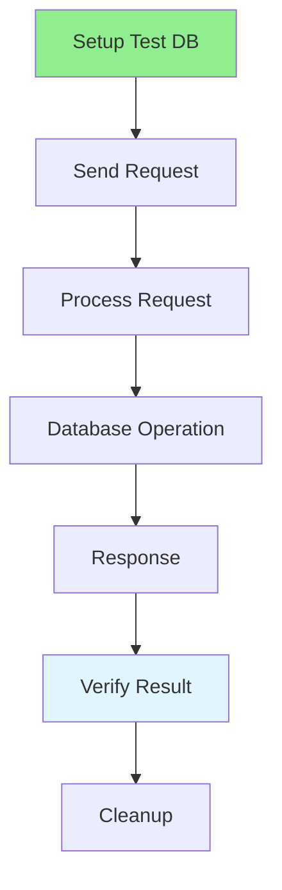

# 07.05 Integration Test / Integration Test

## Table of Contents / Mục lục
1. [Introduction / Giới thiệu](#introduction--giới-thiệu)
2. [Integration Test Flow / Luồng Integration Test](#integration-test-flow--luồng-integration-test)
3. [Writing Integration Tests / Viết Integration Test](#writing-integration-tests--viết-integration-test)
4. [Best Practices / Thực hành tốt nhất](#best-practices--thực-hành-tốt-nhất)
5. [Summary / Tóm tắt](#summary--tóm-tắt)

---

## Introduction / Giới thiệu

### Overview / Tổng quan

**English**: Integration tests verify that multiple components work together. Learn to write integration tests for API endpoints and database interactions.

**Vietnamese**: Integration test xác minh nhiều component hoạt động cùng nhau. Học cách viết integration test cho API endpoints và tương tác database.

### Integration Test Flow / Luồng Integration Test



---

## Integration Test Flow / Luồng Integration Test

### Example 1: API Integration Test / Ví dụ 1: Integration Test API

```typescript
// Integration test for API / Integration test cho API
import request from 'supertest';
import { app } from '../src/app';
import { prisma } from '../src/prisma';

describe('User API Integration Tests', () => {
  beforeEach(async () => {
    // Clean database / Làm sạch database
    await prisma.user.deleteMany();
  });
  
  afterAll(async () => {
    await prisma.$disconnect();
  });
  
  describe('POST /users', () => {
    it('should create user and return 201', async () => {
      const userData = {
        email: 'test@example.com',
        name: 'Test User',
        password: 'SecurePass123'
      };
      
      const response = await request(app)
        .post('/users')
        .send(userData)
        .expect(201);
      
      expect(response.body).toHaveProperty('id');
      expect(response.body.email).toBe(userData.email);
      
      // Verify in database / Xác minh trong database
      const user = await prisma.user.findUnique({
        where: { email: userData.email }
      });
      expect(user).not.toBeNull();
    });
  });
  
  describe('GET /users/:id', () => {
    it('should return user when found', async () => {
      // Create user first / Tạo user trước
      const user = await prisma.user.create({
        data: { email: 'test@example.com', name: 'Test' }
      });
      
      const response = await request(app)
        .get(`/users/${user.id}`)
        .expect(200);
      
      expect(response.body.id).toBe(user.id);
      expect(response.body.email).toBe(user.email);
    });
  });
});
```

---

## Best Practices / Thực hành tốt nhất

1. **Use test database** - Separate test database
2. **Clean up** - Reset database between tests
3. **Test real flows** - Test actual user flows
4. **Isolate tests** - Tests should be independent
5. **Fast execution** - Keep tests fast

---

## Summary / Tóm tắt

### Key Takeaways / Điểm chính

- **Integration tests**: Test multiple components together
- **Real database**: Use test database
- **Clean up**: Reset between tests
- **Real flows**: Test actual user scenarios
- **Isolation**: Tests should be independent

### Next Steps / Bước tiếp theo

- [07.06 Debug Techniques](./07.06_Debug_Techniques.md) - Next: Debug Techniques

---

**Last Updated / Cập nhật lần cuối**: 2024


