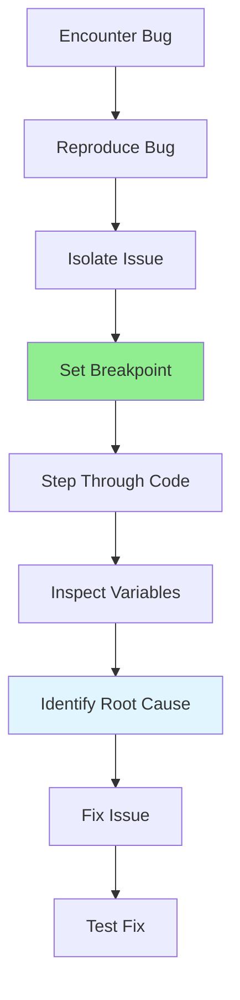

# 07.06 Debug Techniques / Kỹ thuật debug

## Table of Contents / Mục lục
1. [Introduction / Giới thiệu](#introduction--giới-thiệu)
2. [Debugging Tools / Công cụ debug](#debugging-tools--công-cụ-debug)
3. [Debugging Techniques / Kỹ thuật debug](#debugging-techniques--kỹ-thuật-debug)
4. [Best Practices / Thực hành tốt nhất](#best-practices--thực-hành-tốt-nhất)
5. [Summary / Tóm tắt](#summary--tóm-tắt)

---

## Introduction / Giới thiệu

### Overview / Tổng quan

**English**: Effective debugging techniques help identify and fix issues quickly. Mastering debugging tools and techniques is essential for efficient problem-solving.

**Vietnamese**: Kỹ thuật debug hiệu quả giúp xác định và sửa lỗi nhanh chóng. Thành thạo công cụ và kỹ thuật debug rất quan trọng cho giải quyết vấn đề hiệu quả.

### Debugging Process / Quy trình debug



---

## Debugging Tools / Công cụ debug

### Example 1: Debugger Usage / Ví dụ 1: Sử dụng debugger

```typescript
// VS Code Debugger / Debugger VS Code
// .vscode/launch.json
{
  "version": "0.2.0",
  "configurations": [
    {
      "type": "node",
      "request": "launch",
      "name": "Debug Jest Tests",
      "program": "${workspaceFolder}/node_modules/.bin/jest",
      "args": ["--runInBand"],
      "console": "integratedTerminal"
    }
  ]
}

// Chrome DevTools / Chrome DevTools
// Set breakpoint in browser / Đặt breakpoint trong browser
// Use debugger statement / Sử dụng câu lệnh debugger
function processOrder(order: Order) {
  debugger; // Execution pauses here / Thực thi dừng ở đây
  const total = calculateTotal(order.items);
  return total;
}

// Node.js debugger / Debugger Node.js
// node --inspect app.js
// Connect with Chrome DevTools / Kết nối với Chrome DevTools
```

---

## Debugging Techniques / Kỹ thuật debug

### Example 2: Common Techniques / Ví dụ 2: Kỹ thuật phổ biến

```typescript
// 1. Breakpoints / Breakpoint
function calculateTotal(items: CartItem[]): number {
  let total = 0; // Set breakpoint here / Đặt breakpoint ở đây
  for (const item of items) {
    total += item.price * item.quantity;
  }
  return total;
}

// 2. Conditional breakpoints / Breakpoint có điều kiện
// Break only when total > 1000 / Chỉ dừng khi total > 1000
// Condition: total > 1000

// 3. Watch variables / Theo dõi biến
// Watch: items, total, item.price

// 4. Step through code / Bước qua code
// Step Over (F10): Execute current line / Thực thi dòng hiện tại
// Step Into (F11): Enter function / Vào trong hàm
// Step Out (Shift+F11): Exit function / Thoát khỏi hàm

// 5. Call stack analysis / Phân tích call stack
// View call stack to understand execution flow / Xem call stack để hiểu luồng thực thi
```

---

## Best Practices / Thực hành tốt nhất

1. **Reproduce first** - Consistently reproduce the bug
2. **Isolate issue** - Narrow down the problem area
3. **Use breakpoints** - Set strategic breakpoints
4. **Inspect variables** - Check variable values
5. **Read stack trace** - Understand execution flow

---

## Summary / Tóm tắt

### Key Takeaways / Điểm chính

- **Tools**: IDE debuggers, DevTools, command-line
- **Techniques**: Breakpoints, stepping, watching
- **Process**: Reproduce → Isolate → Fix

### Next Steps / Bước tiếp theo

- [07.07 Error Messages](./07.07_Error_Messages.md) - Next: Error Messages

---

**Last Updated / Cập nhật lần cuối**: 2024

