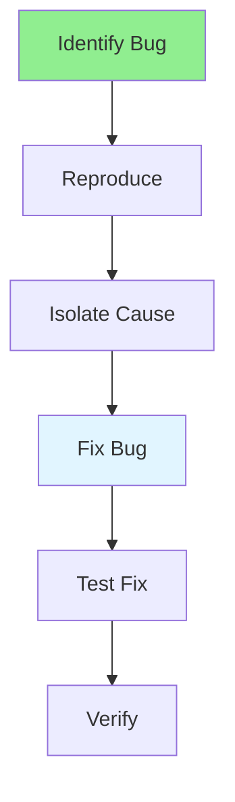

# 07.06 Debug Techniques / Kỹ thuật Debug

## Table of Contents / Mục lục
1. [Introduction / Giới thiệu](#introduction--giới-thiệu)
2. [Debugging Process / Quy trình Debug](#debugging-process--quy-trình-debug)
3. [Debugging Techniques / Kỹ thuật Debug](#debugging-techniques--kỹ-thuật-debug)
4. [Best Practices / Thực hành tốt nhất](#best-practices--thực-hành-tốt-nhất)
5. [Summary / Tóm tắt](#summary--tóm-tắt)

---

## Introduction / Giới thiệu

### Overview / Tổng quan

**English**: Debugging identifies and fixes bugs. Learn effective debugging techniques including breakpoints, logging, and systematic problem-solving.

**Vietnamese**: Debug xác định và sửa bug. Học kỹ thuật debug hiệu quả bao gồm breakpoint, logging và giải quyết vấn đề có hệ thống.

### Debugging Process / Quy trình Debug



---

## Debugging Process / Quy trình Debug

### Example 1: Debugging Steps / Ví dụ 1: Các bước Debug

```typescript
// Debugging systematic approach / Cách tiếp cận debug có hệ thống

// 1. Reproduce the bug / Tái tạo bug
// - Identify steps to reproduce / Xác định các bước tái tạo
// - Note environment / Ghi chú môi trường
// - Check error messages / Kiểm tra thông báo lỗi

// 2. Add logging / Thêm logging
function processOrder(orderId: string) {
  console.log('Processing order:', orderId);
  console.log('Order data:', order);
  
  const result = calculateTotal(order);
  console.log('Calculated total:', result);
  
  return result;
}

// 3. Use breakpoints / Sử dụng breakpoint
// Set breakpoint in debugger / Đặt breakpoint trong debugger
// Inspect variables / Kiểm tra biến
// Step through code / Đi từng bước qua code

// 4. Isolate the problem / Cô lập vấn đề
// Comment out code / Comment code
// Test parts separately / Test từng phần riêng biệt
// Simplify the problem / Đơn giản hóa vấn đề
```

### Example 2: Debugging Tools / Ví dụ 2: Công cụ Debug

```typescript
// VS Code debugging / Debug VS Code
// .vscode/launch.json
{
  "version": "0.2.0",
  "configurations": [
    {
      "type": "node",
      "request": "launch",
      "name": "Debug Node",
      "program": "${workspaceFolder}/src/index.ts",
      "outFiles": ["${workspaceFolder}/dist/**/*.js"],
      "sourceMaps": true
    }
  ]
}

// Chrome DevTools for frontend / Chrome DevTools cho frontend
// - Set breakpoints / Đặt breakpoint
// - Inspect variables / Kiểm tra biến
// - Watch expressions / Theo dõi biểu thức
// - Call stack / Ngăn xếp cuộc gọi
```

---

## Best Practices / Thực hành tốt nhất

1. **Reproduce first** - Always reproduce before debugging
2. **Use debugger** - Don't just use console.log
3. **Isolate problem** - Narrow down the issue
4. **Read error messages** - Error messages provide clues
5. **Take breaks** - Fresh perspective helps

---

## Summary / Tóm tắt

### Key Takeaways / Điểm chính

- **Reproduce**: Always reproduce bug first
- **Systematic**: Follow structured approach
- **Tools**: Use debugger, not just logging
- **Isolate**: Narrow down the problem
- **Test**: Verify fix works

### Next Steps / Bước tiếp theo

- [07.07 Error Messages](./07.07_Error_Messages.md) - Next: Error Messages

---

**Last Updated / Cập nhật lần cuối**: 2024


