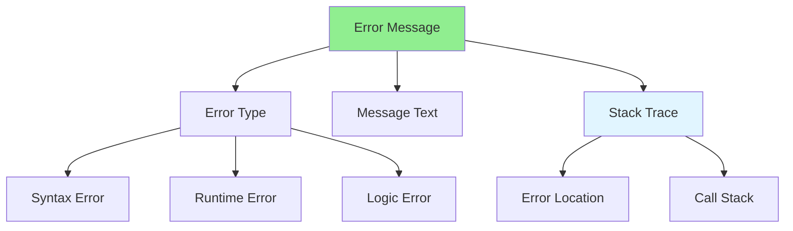

# 07.07 Error Messages / Thông báo lỗi

## Table of Contents / Mục lục
1. [Introduction / Giới thiệu](#introduction--giới-thiệu)
2. [Understanding Error Messages / Hiểu thông báo lỗi](#understanding-error-messages--hiểu-thông-báo-lỗi)
3. [Error Message Analysis / Phân tích thông báo lỗi](#error-message-analysis--phân-tích-thông-báo-lỗi)
4. [Best Practices / Thực hành tốt nhất](#best-practices--thực-hành-tốt-nhất)
5. [Summary / Tóm tắt](#summary--tóm-tắt)

---

## Introduction / Giới thiệu

### Overview / Tổng quan

**English**: Error messages provide clues about what went wrong. Learn to read and interpret error messages to debug effectively.

**Vietnamese**: Thông báo lỗi cung cấp manh mối về điều gì đã xảy ra sai. Học cách đọc và diễn giải thông báo lỗi để debug hiệu quả.

### Error Message Analysis / Phân tích thông báo lỗi



---

## Understanding Error Messages / Hiểu thông báo lỗi

### Example 1: Common Error Types / Ví dụ 1: Loại lỗi phổ biến

```typescript
// TypeError: Cannot read property 'x' of undefined
const user = null;
console.log(user.name); // TypeError

// Fix: Check for null/undefined / Sửa: Kiểm tra null/undefined
if (user) {
  console.log(user.name);
}

// ReferenceError: variable is not defined
console.log(undefinedVar); // ReferenceError

// Fix: Declare variable / Sửa: Khai báo biến
const undefinedVar = 'value';

// SyntaxError: Unexpected token
const obj = { name: 'test' // Missing closing brace / Thiếu dấu đóng

// Fix: Complete syntax / Sửa: Hoàn thiện cú pháp
const obj = { name: 'test' };

// RangeError: Invalid array length
const arr = new Array(-1); // RangeError

// Fix: Use valid length / Sửa: Sử dụng độ dài hợp lệ
const arr = new Array(10);
```

### Example 2: Stack Trace Analysis / Ví dụ 2: Phân tích Stack Trace

```typescript
// Error with stack trace / Lỗi với stack trace
function processUser(user: User) {
  return user.profile.name; // Error here / Lỗi ở đây
}

function getUserData(id: string) {
  const user = getUserById(id);
  return processUser(user); // Called from here / Được gọi từ đây
}

// Stack trace shows: / Stack trace hiển thị:
// TypeError: Cannot read property 'name' of undefined
//   at processUser (UserService.ts:15:23)
//   at getUserData (UserService.ts:20:12)
//   at Object.<anonymous> (test.ts:5:1)

// Analysis: / Phân tích:
// - Error at line 15 in processUser / Lỗi ở dòng 15 trong processUser
// - Called from getUserData line 20 / Được gọi từ getUserData dòng 20
// - user.profile is undefined / user.profile là undefined
```

---

## Best Practices / Thực hành tốt nhất

1. **Read carefully** - Error messages contain clues
2. **Check stack trace** - Shows where error occurred
3. **Look for patterns** - Similar errors may have same cause
4. **Search online** - Error messages often have solutions online
5. **Understand context** - Error location helps identify cause

---

## Summary / Tóm tắt

### Key Takeaways / Điểm chính

- **Error types**: TypeError, ReferenceError, SyntaxError
- **Stack trace**: Shows error location and call stack
- **Read carefully**: Error messages provide clues
- **Context**: Error location helps identify cause
- **Search**: Look up error messages online

### Next Steps / Bước tiếp theo

- [07.08 Logging](./07.08_Logging.md) - Next: Logging

---

**Last Updated / Cập nhật lần cuối**: 2024

