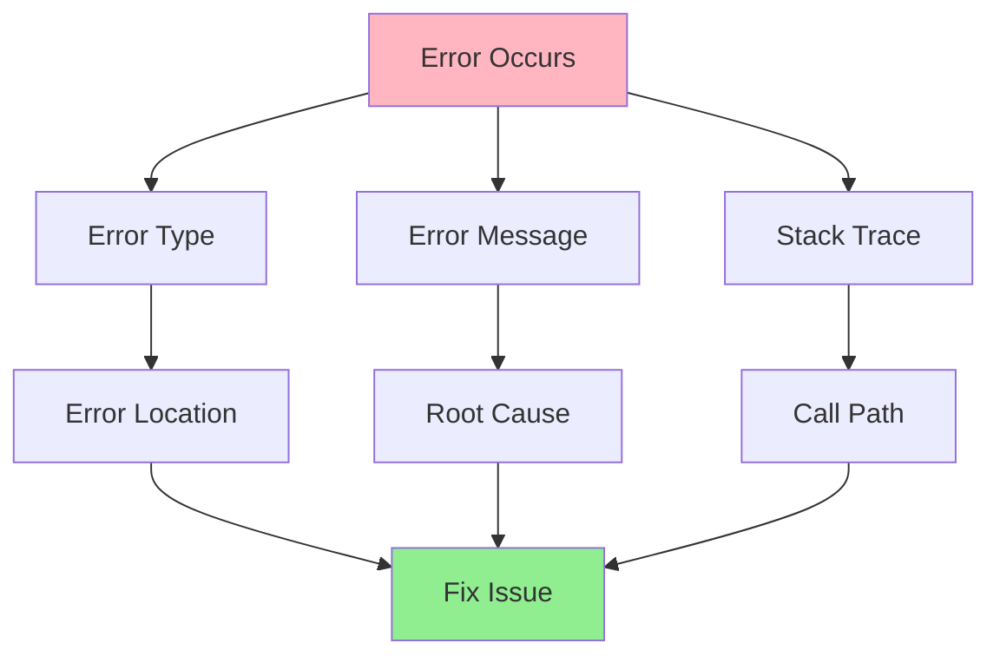

# 07.07 Error Messages / Đọc và hiểu Error Messages

## Table of Contents / Mục lục
1. [Introduction / Giới thiệu](#introduction--giới-thiệu)
2. [Understanding Stack Traces / Hiểu Stack Trace](#understanding-stack-traces--hiểu-stack-trace)
3. [Common Error Types / Loại lỗi phổ biến](#common-error-types--loại-lỗi-phổ-biến)
4. [Reading Error Messages / Đọc thông báo lỗi](#reading-error-messages--đọc-thông-báo-lỗi)
5. [Best Practices / Thực hành tốt nhất](#best-practices--thực-hành-tốt-nhất)
6. [Summary / Tóm tắt](#summary--tóm-tắt)

---

## Introduction / Giới thiệu

### Overview / Tổng quan

**English**: Understanding error messages and stack traces is crucial for debugging. Learning to read errors effectively speeds up problem resolution.

**Vietnamese**: Hiểu thông báo lỗi và stack trace rất quan trọng cho debug. Học cách đọc lỗi hiệu quả tăng tốc giải quyết vấn đề.

### Error Message Structure / Cấu trúc thông báo lỗi



---

## Understanding Stack Traces / Hiểu Stack Trace

### Example 1: Stack Trace Analysis / Ví dụ 1: Phân tích Stack Trace

```typescript
// Error example / Ví dụ lỗi
TypeError: Cannot read property 'name' of undefined
    at UserService.getUserProfile (user.service.ts:25:12)
    at UserController.getProfile (user.controller.ts:15:8)
    at Object.<anonymous> (user.controller.spec.ts:30:5)

// Stack trace reading / Đọc stack trace
// 1. Error type: TypeError
// 2. Error message: Cannot read property 'name' of undefined
// 3. Error location: user.service.ts:25:12
// 4. Call path:
//    - user.controller.spec.ts:30 (test)
//    → user.controller.ts:15 (controller)
//    → user.service.ts:25 (service - error here)

// Code at error location / Code tại vị trí lỗi
// user.service.ts:25
async getUserProfile(userId: string) {
  const user = await this.repository.findById(userId);
  return user.name; // Error: user is undefined / Lỗi: user là undefined
}

// Fix / Sửa
async getUserProfile(userId: string) {
  const user = await this.repository.findById(userId);
  if (!user) {
    throw new NotFoundError('User not found');
  }
  return user.name;
}
```

---

## Common Error Types / Loại lỗi phổ biến

### Example 2: Error Type Examples / Ví dụ 2: Ví dụ loại lỗi

```typescript
// TypeError: Cannot read property of undefined / TypeError
const user = undefined;
console.log(user.name); // TypeError: Cannot read property 'name' of undefined

// ReferenceError: Variable not defined / ReferenceError
console.log(nonExistentVar); // ReferenceError: nonExistentVar is not defined

// SyntaxError: Invalid syntax / SyntaxError
const obj = { name: 'test'; } // SyntaxError: Unexpected token

// RangeError: Value out of range / RangeError
const arr = new Array(-1); // RangeError: Invalid array length

// HTTP Errors / Lỗi HTTP
// 404: Not Found
// 500: Internal Server Error
// 400: Bad Request
// 401: Unauthorized
// 403: Forbidden
```

---

## Reading Error Messages / Đọc thông báo lỗi

### Example 3: Error Analysis / Ví dụ 3: Phân tích lỗi

```typescript
// Error message breakdown / Phân tích thông báo lỗi
interface ErrorAnalysis {
  errorType: string;
  message: string;
  location: {
    file: string;
    line: number;
    column: number;
  };
  callStack: string[];
  rootCause: string;
  solution: string;
}

// Example analysis / Ví dụ phân tích
const analysis: ErrorAnalysis = {
  errorType: 'TypeError',
  message: 'Cannot read property \'map\' of undefined',
  location: {
    file: 'order.service.ts',
    line: 42,
    column: 15
  },
  callStack: [
    'order.service.ts:42',
    'order.controller.ts:18',
    'app.module.ts:10'
  ],
  rootCause: 'orders variable is undefined when trying to call .map()',
  solution: 'Add null check or ensure orders is initialized'
};
```

---

## Best Practices / Thực hành tốt nhất

1. **Read carefully** - Understand error type and message
2. **Follow stack trace** - Trace back to root cause
3. **Check location** - Look at the exact line
4. **Search solutions** - Use error message to search
5. **Learn patterns** - Common errors have common solutions

---

## Summary / Tóm tắt

### Key Takeaways / Điểm chính

- **Error type**: Identifies the category
- **Message**: Describes what went wrong
- **Stack trace**: Shows where and how
- **Location**: Exact file and line

### Next Steps / Bước tiếp theo

- [07.08 Logging](./07.08_Logging.md) - Next: Logging

---

**Last Updated / Cập nhật lần cuối**: 2024

