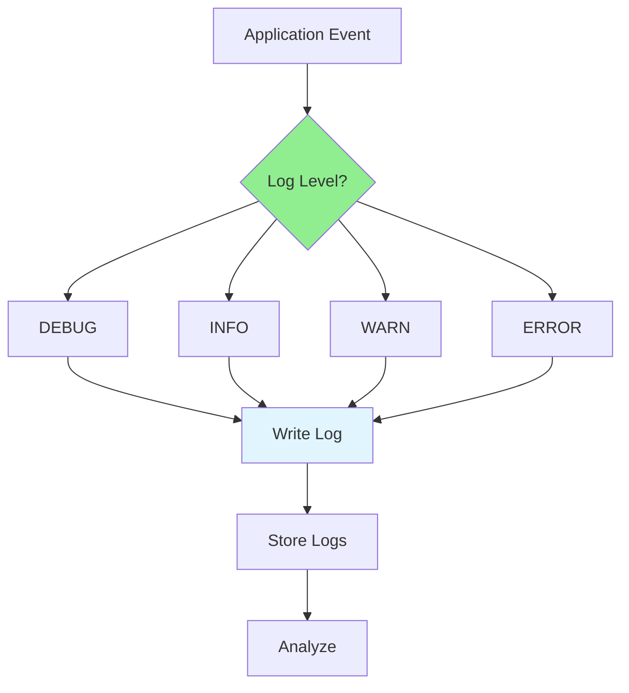

# 07.08 Logging / Ghi log để debug

## Table of Contents / Mục lục
1. [Introduction / Giới thiệu](#introduction--giới-thiệu)
2. [Log Levels / Mức log](#log-levels--mức-log)
3. [Structured Logging / Log có cấu trúc](#structured-logging--log-có-cấu-trúc)
4. [Best Practices / Thực hành tốt nhất](#best-practices--thực-hành-tốt-nhất)
5. [Summary / Tóm tắt](#summary--tóm-tắt)

---

## Introduction / Giới thiệu

### Overview / Tổng quan

**English**: Logging helps debug issues and monitor application behavior. Proper logging provides visibility into system operations and helps identify problems.

**Vietnamese**: Logging giúp debug vấn đề và giám sát hành vi ứng dụng. Logging đúng cách cung cấp khả năng hiển thị vào hoạt động hệ thống và giúp xác định vấn đề.

### Logging Strategy / Chiến lược logging



---

## Log Levels / Mức log

### Example 1: Log Levels / Ví dụ 1: Mức log

```typescript
// Log levels / Mức log
import { Logger } from '@nestjs/common';

const logger = new Logger('UserService');

// DEBUG: Detailed information for debugging / Thông tin chi tiết cho debug
logger.debug('Processing user request', { userId: 123, action: 'login' });

// INFO: General informational messages / Thông báo thông tin chung
logger.log('User logged in successfully', { userId: 123 });

// WARN: Warning messages / Thông báo cảnh báo
logger.warn('Failed login attempt', { email: 'user@example.com', attempts: 3 });

// ERROR: Error messages / Thông báo lỗi
logger.error('Database connection failed', error.stack, { database: 'users' });

// Winston example / Ví dụ Winston
import winston from 'winston';

const logger = winston.createLogger({
  level: 'info',
  format: winston.format.json(),
  transports: [
    new winston.transports.File({ filename: 'error.log', level: 'error' }),
    new winston.transports.File({ filename: 'combined.log' })
  ]
});
```

---

## Structured Logging / Log có cấu trúc

### Example 2: Structured Logs / Ví dụ 2: Log có cấu trúc

```typescript
// Structured logging / Log có cấu trúc
interface LogEntry {
  timestamp: string;
  level: 'DEBUG' | 'INFO' | 'WARN' | 'ERROR';
  message: string;
  context: {
    userId?: string;
    requestId?: string;
    [key: string]: any;
  };
  error?: {
    name: string;
    message: string;
    stack?: string;
  };
}

// Example structured log / Ví dụ log có cấu trúc
const logEntry: LogEntry = {
  timestamp: new Date().toISOString(),
  level: 'ERROR',
  message: 'Failed to process order',
  context: {
    userId: '123',
    orderId: '456',
    requestId: 'req-789'
  },
  error: {
    name: 'ValidationError',
    message: 'Invalid order total',
    stack: error.stack
  }
};

logger.error(logEntry);
```

---

## Best Practices / Thực hành tốt nhất

1. **Use appropriate levels** - DEBUG, INFO, WARN, ERROR
2. **Structured logging** - JSON format for parsing
3. **Include context** - User ID, request ID, etc.
4. **Don't log sensitive data** - Passwords, tokens
5. **Log important events** - Business events, errors

---

## Summary / Tóm tắt

### Key Takeaways / Điểm chính

- **Levels**: DEBUG, INFO, WARN, ERROR
- **Structured**: JSON format for analysis
- **Context**: Include relevant information
- **Security**: Don't log sensitive data

### Next Steps / Bước tiếp theo

- [07.09 Bug Lifecycle](./07.09_Bug_Lifecycle.md) - Next: Bug Lifecycle

---

**Last Updated / Cập nhật lần cuối**: 2024

