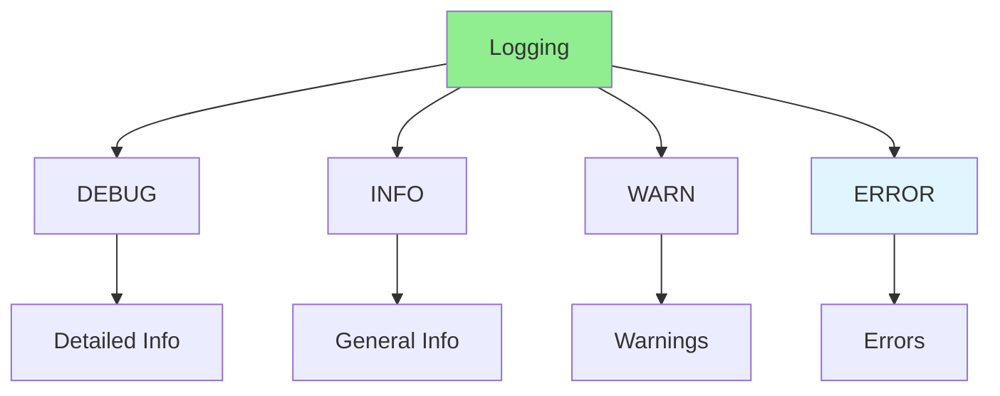

# 07.08 Logging / Ghi log

## Table of Contents / Mục lục
1. [Introduction / Giới thiệu](#introduction--giới-thiệu)
2. [Logging Levels / Mức log](#logging-levels--mức-log)
3. [Logging Implementation / Triển khai logging](#logging-implementation--triển-khai-logging)
4. [Best Practices / Thực hành tốt nhất](#best-practices--thực-hành-tốt-nhất)
5. [Summary / Tóm tắt](#summary--tóm-tắt)

---

## Introduction / Giới thiệu

### Overview / Tổng quan

**English**: Logging records application events for debugging and monitoring. Learn to implement effective logging with appropriate levels and formats.

**Vietnamese**: Logging ghi lại sự kiện ứng dụng để debug và giám sát. Học cách triển khai logging hiệu quả với mức và định dạng phù hợp.

### Logging Levels / Mức log



---

## Logging Levels / Mức log

### Example 1: Logging with Winston / Ví dụ 1: Logging với Winston

```typescript
// Winston logger configuration / Cấu hình logger Winston
import winston from 'winston';

const logger = winston.createLogger({
  level: process.env.LOG_LEVEL || 'info',
  format: winston.format.combine(
    winston.format.timestamp(),
    winston.format.errors({ stack: true }),
    winston.format.json()
  ),
  transports: [
    new winston.transports.File({ filename: 'error.log', level: 'error' }),
    new winston.transports.File({ filename: 'combined.log' }),
    new winston.transports.Console({
      format: winston.format.simple()
    })
  ]
});

// Usage / Sử dụng
logger.debug('Debug message');  // Detailed debugging info
logger.info('User logged in', { userId: '123' });  // General info
logger.warn('Rate limit approaching', { count: 95 });  // Warning
logger.error('Failed to process order', { error, orderId });  // Error
```

### Example 2: Structured Logging / Ví dụ 2: Logging có cấu trúc

```typescript
// Structured logging / Logging có cấu trúc
logger.info('Order created', {
  orderId: 'order-123',
  userId: 'user-456',
  amount: 100.50,
  timestamp: new Date().toISOString()
});

// Error logging with context / Logging lỗi với ngữ cảnh
try {
  await processOrder(order);
} catch (error) {
  logger.error('Order processing failed', {
    error: error.message,
    stack: error.stack,
    orderId: order.id,
    userId: order.userId,
    context: 'order-processing'
  });
  throw error;
}
```

---

## Best Practices / Thực hành tốt nhất

1. **Use appropriate levels** - DEBUG, INFO, WARN, ERROR
2. **Include context** - Add relevant data to logs
3. **Structured format** - Use JSON for parsing
4. **Don't log sensitive data** - No passwords, tokens
5. **Centralize logs** - Use log aggregation tools

---

## Summary / Tóm tắt

### Key Takeaways / Điểm chính

- **Log levels**: DEBUG, INFO, WARN, ERROR
- **Structured**: Use structured logging (JSON)
- **Context**: Include relevant context
- **Security**: Don't log sensitive data
- **Tools**: Use logging libraries (Winston, Pino)

### Next Steps / Bước tiếp theo

- [07.09 Bug Lifecycle](./07.09_Bug_Lifecycle.md) - Next: Bug Lifecycle

---

**Last Updated / Cập nhật lần cuối**: 2024


