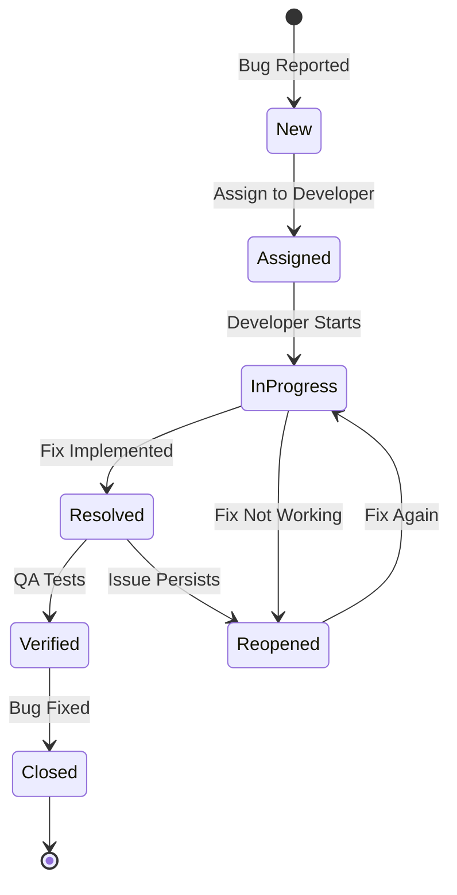

# 07.09 Bug Lifecycle / Vòng đời của bug

## Table of Contents / Mục lục
1. [Introduction / Giới thiệu](#introduction--giới-thiệu)
2. [Bug States / Trạng thái bug](#bug-states--trạng-thái-bug)
3. [State Transitions / Chuyển đổi trạng thái](#state-transitions--chuyển-đổi-trạng-thái)
4. [Bug Tracking Tools / Công cụ theo dõi bug](#bug-tracking-tools--công-cụ-theo-dõi-bug)
5. [Best Practices / Thực hành tốt nhất](#best-practices--thực-hành-tốt-nhất)
6. [Summary / Tóm tắt](#summary--tóm-tắt)

---

## Introduction / Giới thiệu

### Overview / Tổng quan

**English**: Understanding bug lifecycle helps manage bugs professionally. Tracking bugs through their lifecycle ensures proper resolution and team communication.

**Vietnamese**: Hiểu vòng đời bug giúp quản lý bug chuyên nghiệp. Theo dõi bug qua vòng đời đảm bảo giải quyết đúng cách và giao tiếp nhóm.

### Bug Lifecycle Flow / Luồng vòng đời bug



---

## Bug States / Trạng thái bug

### Example 1: Bug State Management / Ví dụ 1: Quản lý trạng thái bug

```typescript
interface Bug {
  id: string;
  title: string;
  description: string;
  state: BugState;
  priority: 'Low' | 'Medium' | 'High' | 'Critical';
  severity: 'Low' | 'Medium' | 'High' | 'Critical';
  assignedTo?: string;
  reportedBy: string;
  createdAt: Date;
  updatedAt: Date;
}

type BugState = 
  | 'New'
  | 'Assigned'
  | 'In Progress'
  | 'Resolved'
  | 'Verified'
  | 'Reopened'
  | 'Closed';

// Example bug / Ví dụ bug
const bug: Bug = {
  id: 'BUG-001',
  title: 'User login fails with valid credentials',
  description: 'Users cannot log in even with correct email and password',
  state: 'New',
  priority: 'High',
  severity: 'High',
  reportedBy: 'QA Team',
  createdAt: new Date('2024-01-15'),
  updatedAt: new Date('2024-01-15')
};
```

---

## State Transitions / Chuyển đổi trạng thái

### Example 2: Transition Rules / Ví dụ 2: Quy tắc chuyển đổi

```typescript
// Valid state transitions / Chuyển đổi trạng thái hợp lệ
const validTransitions: Record<BugState, BugState[]> = {
  'New': ['Assigned', 'Closed'],
  'Assigned': ['In Progress', 'New'],
  'In Progress': ['Resolved', 'Reopened'],
  'Resolved': ['Verified', 'Reopened'],
  'Verified': ['Closed', 'Reopened'],
  'Reopened': ['In Progress'],
  'Closed': [] // Terminal state / Trạng thái kết thúc
};

function canTransition(from: BugState, to: BugState): boolean {
  return validTransitions[from]?.includes(to) ?? false;
}

// Transition bug / Chuyển đổi bug
function transitionBug(bug: Bug, newState: BugState): Bug {
  if (!canTransition(bug.state, newState)) {
    throw new Error(`Invalid transition from ${bug.state} to ${newState}`);
  }
  
  return {
    ...bug,
    state: newState,
    updatedAt: new Date()
  };
}
```

---

## Bug Tracking Tools / Công cụ theo dõi bug

### Example 3: Tool Integration / Ví dụ 3: Tích hợp công cụ

```typescript
// Jira integration example / Ví dụ tích hợp Jira
interface JiraBug {
  key: string; // BUG-001
  fields: {
    summary: string;
    description: string;
    status: {
      name: string; // New, In Progress, etc.
    };
    priority: {
      name: string;
    };
    assignee?: {
      displayName: string;
    };
  };
}

// GitHub Issues example / Ví dụ GitHub Issues
// Bug tracking with labels / Theo dõi bug với labels
const bugLabels = [
  'bug',
  'priority:high',
  'severity:high',
  'status:new'
];
```

---

## Best Practices / Thực hành tốt nhất

1. **Update status** - Keep bug status current
2. **Clear communication** - Comment on progress
3. **Assign properly** - Assign to right person
4. **Track changes** - Document all updates
5. **Close properly** - Verify before closing

---

## Summary / Tóm tắt

### Key Takeaways / Điểm chính

- **States**: New → Assigned → In Progress → Resolved → Verified → Closed
- **Transitions**: Follow valid state transitions
- **Tools**: Jira, GitHub Issues, Bugzilla
- **Communication**: Update status regularly

### Next Steps / Bước tiếp theo

- [07.10 Bug Reporting](./07.10_Bug_Reporting.md) - Next: Bug Reporting

---

**Last Updated / Cập nhật lần cuối**: 2024

