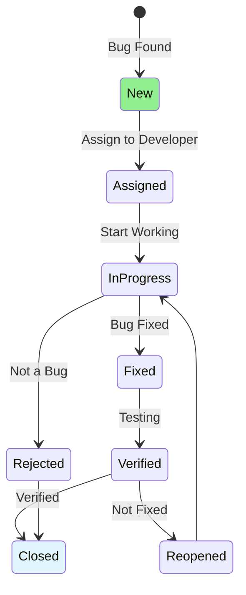

# 07.09 Bug Lifecycle / Vòng đời Bug

## Table of Contents / Mục lục
1. [Introduction / Giới thiệu](#introduction--giới-thiệu)
2. [Bug Lifecycle States / Trạng thái vòng đời Bug](#bug-lifecycle-states--trạng-thái-vòng-đời-bug)
3. [State Transitions / Chuyển đổi trạng thái](#state-transitions--chuyển-đổi-trạng-thái)
4. [Best Practices / Thực hành tốt nhất](#best-practices--thực-hành-tốt-nhất)
5. [Summary / Tóm tắt](#summary--tóm-tắt)

---

## Introduction / Giới thiệu

### Overview / Tổng quan

**English**: Bugs go through a lifecycle from discovery to resolution. Learn bug lifecycle states and how to manage bugs effectively.

**Vietnamese**: Bug trải qua vòng đời từ phát hiện đến giải quyết. Học trạng thái vòng đời bug và cách quản lý bug hiệu quả.

### Bug Lifecycle / Vòng đời Bug



---

## Bug Lifecycle States / Trạng thái vòng đời Bug

### Example 1: Bug States / Ví dụ 1: Trạng thái Bug

```typescript
// Bug lifecycle states / Trạng thái vòng đời bug
enum BugStatus {
  NEW = 'new',                    // Just discovered / Vừa phát hiện
  ASSIGNED = 'assigned',          // Assigned to developer / Giao cho developer
  IN_PROGRESS = 'in_progress',    // Being worked on / Đang được xử lý
  FIXED = 'fixed',                  // Bug fixed / Bug đã sửa
  VERIFIED = 'verified',         // Tested and verified / Đã test và xác minh
  REOPENED = 'reopened',         // Bug reappeared / Bug xuất hiện lại
  REJECTED = 'rejected',         // Not a bug / Không phải bug
  CLOSED = 'closed'              // Resolved / Đã giải quyết
}

interface Bug {
  id: string;
  title: string;
  description: string;
  status: BugStatus;
  priority: 'low' | 'medium' | 'high' | 'critical';
  assignedTo?: string;
  reportedBy: string;
  createdAt: Date;
  updatedAt: Date;
}
```

---

## Best Practices / Thực hành tốt nhất

1. **Track status** - Update bug status regularly
2. **Clear descriptions** - Provide detailed bug descriptions
3. **Assign priority** - Set appropriate priority
4. **Verify fixes** - Always verify bugs are fixed
5. **Document** - Document resolution steps

---

## Summary / Tóm tắt

### Key Takeaways / Điểm chính

- **Lifecycle**: New → Assigned → In Progress → Fixed → Verified → Closed
- **States**: Track bug through lifecycle
- **Transitions**: Update status as bug progresses
- **Verification**: Always verify fixes
- **Documentation**: Document resolution

### Next Steps / Bước tiếp theo

- [07.10 Bug Reporting](./07.10_Bug_Reporting.md) - Next: Bug Reporting

---

**Last Updated / Cập nhật lần cuối**: 2024


