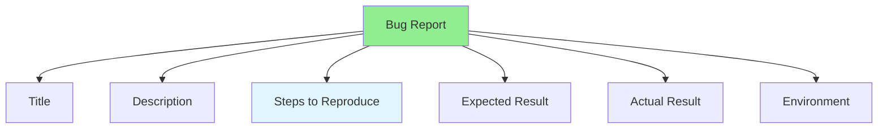

# 07.10 Bug Reporting / Báo cáo Bug

## Table of Contents / Mục lục
1. [Introduction / Giới thiệu](#introduction--giới-thiệu)
2. [Bug Report Components / Thành phần báo cáo Bug](#bug-report-components--thành-phần-báo-cáo-bug)
3. [Writing Bug Reports / Viết báo cáo Bug](#writing-bug-reports--viết-báo-cáo-bug)
4. [Best Practices / Thực hành tốt nhất](#best-practices--thực-hành-tốt-nhất)
5. [Summary / Tóm tắt](#summary--tóm-tắt)

---

## Introduction / Giới thiệu

### Overview / Tổng quan

**English**: Good bug reports help developers fix issues quickly. Learn to write clear, detailed bug reports with steps to reproduce.

**Vietnamese**: Báo cáo bug tốt giúp developer sửa vấn đề nhanh chóng. Học cách viết báo cáo bug rõ ràng, chi tiết với các bước tái tạo.

### Bug Report Components / Thành phần báo cáo Bug



---

## Bug Report Components / Thành phần báo cáo Bug

### Example 1: Bug Report Template / Ví dụ 1: Mẫu báo cáo Bug

```markdown
# Bug Report Template

## Title
[Brief description of the bug]

## Description
[Detailed description of what the bug is]

## Steps to Reproduce
1. [Step 1]
2. [Step 2]
3. [Step 3]

## Expected Result
[What should happen]

## Actual Result
[What actually happens]

## Environment
- OS: [Operating system]
- Browser: [Browser and version]
- App Version: [Application version]

## Screenshots/Logs
[Attach screenshots or error logs]

## Priority
[Low/Medium/High/Critical]

## Example Bug Report

## Title
User registration fails with valid email

## Description
When attempting to register a new user with a valid email address, the registration fails with an error message "Invalid email format" even though the email is correctly formatted.

## Steps to Reproduce
1. Navigate to registration page
2. Enter email: "user@example.com"
3. Enter password: "SecurePass123"
4. Click "Register" button

## Expected Result
User account should be created successfully and confirmation email sent.

## Actual Result
Error message displayed: "Invalid email format" and registration fails.

## Environment
- OS: macOS 14.0
- Browser: Chrome 120.0
- App Version: 1.2.3

## Screenshots
[Attach screenshot of error]

## Priority
High - Blocks user registration
```

---

## Best Practices / Thực hành tốt nhất

1. **Clear title** - Brief, descriptive title
2. **Detailed steps** - Exact steps to reproduce
3. **Include screenshots** - Visual evidence
4. **Environment info** - OS, browser, version
5. **Set priority** - Indicate bug severity

---

## Summary / Tóm tắt

### Key Takeaways / Điểm chính

- **Clear title**: Brief, descriptive
- **Steps to reproduce**: Exact, detailed steps
- **Expected vs actual**: Clear comparison
- **Environment**: Include all relevant info
- **Evidence**: Screenshots, logs, error messages

### Next Steps / Bước tiếp theo

- [07.11 Bug Reproduction](./07.11_Bug_Reproduction.md) - Next: Bug Reproduction

---

**Last Updated / Cập nhật lần cuối**: 2024


