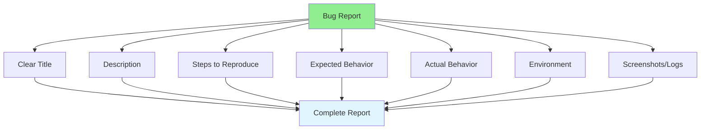

# 07.10 Bug Reporting / Viết Bug Report - Báo cáo lỗi chuyên nghiệp

## Table of Contents / Mục lục
1. [Introduction / Giới thiệu](#introduction--giới-thiệu)
2. [Bug Report Structure / Cấu trúc báo cáo bug](#bug-report-structure--cấu-trúc-báo-cáo-bug)
3. [Writing Effective Reports / Viết báo cáo hiệu quả](#writing-effective-reports--viết-báo-cáo-hiệu-quả)
4. [Best Practices / Thực hành tốt nhất](#best-practices--thực-hành-tốt-nhất)
5. [Summary / Tóm tắt](#summary--tóm-tắt)

---

## Introduction / Giới thiệu

### Overview / Tổng quan

**English**: Well-written bug reports help developers fix issues quickly. A good bug report includes all necessary information for reproduction and resolution.

**Vietnamese**: Báo cáo bug được viết tốt giúp developer sửa lỗi nhanh chóng. Báo cáo bug tốt bao gồm tất cả thông tin cần thiết để tái tạo và giải quyết.

### Bug Report Components / Thành phần báo cáo bug



---

## Bug Report Structure / Cấu trúc báo cáo bug

### Example 1: Bug Report Template / Ví dụ 1: Mẫu báo cáo bug

```typescript
interface BugReport {
  title: string; // Clear, concise / Rõ ràng, ngắn gọn
  description: string; // What happened / Điều gì xảy ra
  stepsToReproduce: string[]; // Step-by-step / Từng bước
  expectedBehavior: string; // What should happen / Điều nên xảy ra
  actualBehavior: string; // What actually happened / Điều thực sự xảy ra
  environment: {
    os: string;
    browser?: string;
    version: string;
    device?: string;
  };
  priority: 'Low' | 'Medium' | 'High' | 'Critical';
  severity: 'Low' | 'Medium' | 'High' | 'Critical';
  screenshots?: string[]; // URLs or paths / URL hoặc đường dẫn
  logs?: string; // Error logs / Log lỗi
  additionalInfo?: string; // Any other relevant info / Thông tin liên quan khác
}

// Example bug report / Ví dụ báo cáo bug
const bugReport: BugReport = {
  title: 'User cannot log in with valid credentials',
  description: 'When attempting to log in with a valid email and password, the system shows "Invalid credentials" error even though the credentials are correct.',
  stepsToReproduce: [
    '1. Navigate to login page',
    '2. Enter email: test@example.com',
    '3. Enter password: Password123!',
    '4. Click "Login" button',
    '5. Observe error message'
  ],
  expectedBehavior: 'User should be logged in and redirected to dashboard',
  actualBehavior: 'Error message "Invalid credentials" is displayed',
  environment: {
    os: 'Windows 11',
    browser: 'Chrome',
    version: '120.0.0.0',
    device: 'Desktop'
  },
  priority: 'High',
  severity: 'High',
  logs: `
Error: Authentication failed
at AuthService.login (auth.service.ts:45)
at AuthController.login (auth.controller.ts:23)
  `
};
```

---

## Writing Effective Reports / Viết báo cáo hiệu quả

### Example 2: Good vs Bad Reports / Ví dụ 2: Báo cáo tốt vs xấu

```typescript
// ❌ Bad bug report / Báo cáo bug xấu
const badReport = {
  title: 'It doesn\'t work',
  description: 'Something is broken',
  stepsToReproduce: ['Try it']
};

// ✅ Good bug report / Báo cáo bug tốt
const goodReport = {
  title: 'Login fails with valid credentials after password reset',
  description: 'Users who reset their password cannot log in with the new password. The system returns "Invalid credentials" error.',
  stepsToReproduce: [
    '1. Request password reset for account test@example.com',
    '2. Click reset link in email',
    '3. Set new password: NewPass123!',
    '4. Attempt to log in with email and new password',
    '5. Observe "Invalid credentials" error'
  ],
  expectedBehavior: 'User should be able to log in with new password',
  actualBehavior: 'Login fails with error message',
  environment: {
    os: 'macOS 14.0',
    browser: 'Safari 17.0',
    version: '1.2.3'
  },
  priority: 'High',
  severity: 'High',
  logs: 'Full error stack trace...',
  screenshots: ['screenshot1.png', 'screenshot2.png']
};
```

---

## Best Practices / Thực hành tốt nhất

1. **Be specific** - Clear title and description
2. **Include steps** - Reproducible steps
3. **Provide context** - Environment, logs, screenshots
4. **Set priority** - Help prioritize work
5. **Update status** - Keep report current

---

## Summary / Tóm tắt

### Key Takeaways / Điểm chính

- **Structure**: Title, description, steps, expected/actual
- **Details**: Environment, logs, screenshots
- **Clear**: Specific, reproducible, complete

### Next Steps / Bước tiếp theo

- [07.11 Bug Reproduction](./07.11_Bug_Reproduction.md) - Next: Bug Reproduction

---

**Last Updated / Cập nhật lần cuối**: 2024

