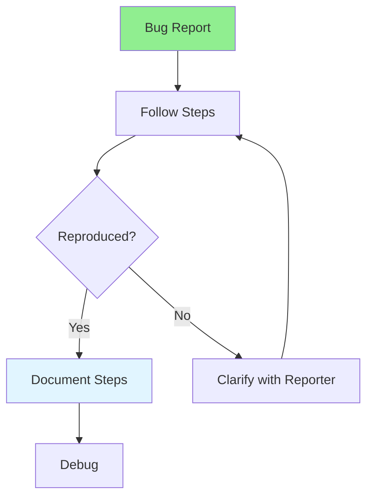

# 07.11 Bug Reproduction / Tái tạo Bug

## Table of Contents / Mục lục
1. [Introduction / Giới thiệu](#introduction--giới-thiệu)
2. [Bug Reproduction Process / Quy trình tái tạo Bug](#bug-reproduction-process--quy-trình-tái-tạo-bug)
3. [Techniques / Kỹ thuật](#techniques--kỹ-thuật)
4. [Best Practices / Thực hành tốt nhất](#best-practices--thực-hành-tốt-nhất)
5. [Summary / Tóm tắt](#summary--tóm-tắt)

---

## Introduction / Giới thiệu

### Overview / Tổng quan

**English**: Reproducing bugs is essential for fixing them. Learn techniques to consistently reproduce bugs for effective debugging.

**Vietnamese**: Tái tạo bug rất quan trọng để sửa chúng. Học kỹ thuật tái tạo bug một cách nhất quán để debug hiệu quả.

### Bug Reproduction Process / Quy trình tái tạo Bug



---

## Bug Reproduction Process / Quy trình tái tạo Bug

### Example 1: Reproduction Steps / Ví dụ 1: Các bước tái tạo

```markdown
# Bug Reproduction Checklist

## 1. Read Bug Report
- Understand the issue / Hiểu vấn đề
- Note environment details / Ghi chú chi tiết môi trường
- Identify key steps / Xác định bước chính

## 2. Set Up Environment
- Match reported environment / Khớp môi trường được báo cáo
- Use same version / Sử dụng cùng phiên bản
- Clear cache/data if needed / Xóa cache/dữ liệu nếu cần

## 3. Follow Steps Exactly
- Follow steps precisely / Làm theo các bước chính xác
- Don't skip steps / Không bỏ qua bước
- Note any differences / Ghi chú bất kỳ khác biệt

## 4. Document Findings
- Can you reproduce? / Bạn có thể tái tạo không?
- Any variations? / Có biến thể nào không?
- Additional steps needed? / Cần thêm bước nào không?
```

### Example 2: Reproduction Techniques / Ví dụ 2: Kỹ thuật tái tạo

```typescript
// Reproduce bug systematically / Tái tạo bug có hệ thống

// 1. Isolate the problem / Cô lập vấn đề
// - Remove unrelated code / Xóa code không liên quan
// - Test minimal case / Test trường hợp tối thiểu
// - Simplify inputs / Đơn giản hóa đầu vào

// 2. Check environment / Kiểm tra môi trường
const environment = {
  nodeVersion: process.version,
  os: process.platform,
  dependencies: Object.keys(require('./package.json').dependencies)
};
console.log('Environment:', environment);

// 3. Use same data / Sử dụng cùng dữ liệu
// - Use exact same inputs / Sử dụng đầu vào chính xác
// - Check database state / Kiểm tra trạng thái database
// - Verify configuration / Xác minh cấu hình

// 4. Add logging / Thêm logging
console.log('Step 1: Starting reproduction');
console.log('Input:', inputData);
console.log('Step 2: Processing...');
console.log('Result:', result);
```

---

## Best Practices / Thực hành tốt nhất

1. **Follow steps exactly** - Don't skip or modify steps
2. **Match environment** - Use same environment as reported
3. **Document variations** - Note any differences
4. **Isolate problem** - Simplify to minimal case
5. **Ask for clarification** - If can't reproduce, ask reporter

---

## Summary / Tóm tắt

### Key Takeaways / Điểm chính

- **Follow steps**: Reproduce exactly as described
- **Environment**: Match reported environment
- **Document**: Record reproduction steps
- **Isolate**: Simplify to minimal case
- **Clarify**: Ask if can't reproduce

### Next Steps / Bước tiếp theo

- [07.12 Bug Fixing](./07.12_Bug_Fixing.md) - Next: Bug Fixing

---

**Last Updated / Cập nhật lần cuối**: 2024


