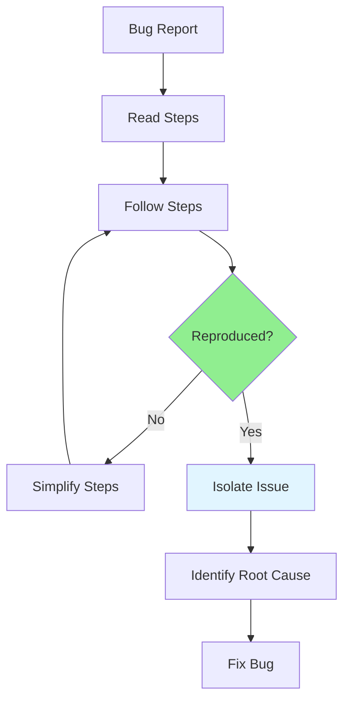

# 07.11 Bug Reproduction / Bug Reproduction

## Table of Contents / Mục lục
1. [Introduction / Giới thiệu](#introduction--giới-thiệu)
2. [Reproduction Steps / Các bước tái tạo](#reproduction-steps--các-bước-tái-tạo)
3. [Isolating the Issue / Cô lập vấn đề](#isolating-the-issue--cô-lập-vấn-đề)
4. [Best Practices / Thực hành tốt nhất](#best-practices--thực-hành-tốt-nhất)
5. [Summary / Tóm tắt](#summary--tóm-tắt)

---

## Introduction / Giới thiệu

### Overview / Tổng quan

**English**: Reproducing bugs consistently is the first step to fixing them. Learning to reproduce bugs helps understand root causes and verify fixes.

**Vietnamese**: Tái tạo bug một cách nhất quán là bước đầu tiên để sửa chúng. Học cách tái tạo bug giúp hiểu nguyên nhân gốc và xác minh sửa chữa.

### Reproduction Process / Quy trình tái tạo



---

## Reproduction Steps / Các bước tái tạo

### Example 1: Reproduction Checklist / Ví dụ 1: Danh sách tái tạo

```typescript
interface ReproductionChecklist {
  environment: {
    setup: boolean;
    items: string[];
  };
  steps: {
    followed: boolean;
    steps: string[];
  };
  data: {
    prepared: boolean;
    items: string[];
  };
  verification: {
    reproduced: boolean;
    frequency: 'Always' | 'Sometimes' | 'Rarely';
  };
}

const checklist: ReproductionChecklist = {
  environment: {
    setup: false,
    items: [
      'Match exact environment (OS, browser, version)',
      'Use same test data',
      'Clear cache and cookies',
      'Check database state'
    ]
  },
  steps: {
    followed: false,
    steps: [
      'Follow steps exactly as reported',
      'Note any deviations',
      'Record all actions taken'
    ]
  },
  data: {
    prepared: false,
    items: [
      'Use same test accounts',
      'Same input data',
      'Same database state'
    ]
  },
  verification: {
    reproduced: false,
    frequency: 'Always' // or 'Sometimes', 'Rarely' / hoặc 'Sometimes', 'Rarely'
  }
};
```

---

## Isolating the Issue / Cô lập vấn đề

### Example 2: Isolation Techniques / Ví dụ 2: Kỹ thuật cô lập

```typescript
// Technique 1: Minimal reproduction / Kỹ thuật 1: Tái tạo tối thiểu
// Start with minimal steps / Bắt đầu với các bước tối thiểu
const minimalSteps = [
  '1. Open application',
  '2. Navigate to specific page',
  '3. Perform single action that triggers bug'
];

// Technique 2: Remove variables / Kỹ thuật 2: Loại bỏ biến
// Test with different data / Test với dữ liệu khác nhau
async function testWithDifferentData() {
  // Test case 1: Empty data / Test case 1: Dữ liệu rỗng
  await testBug({ data: null });
  
  // Test case 2: Valid data / Test case 2: Dữ liệu hợp lệ
  await testBug({ data: validData });
  
  // Test case 3: Edge case data / Test case 3: Dữ liệu edge case
  await testBug({ data: edgeCaseData });
}

// Technique 3: Binary search / Kỹ thuật 3: Tìm kiếm nhị phân
// Narrow down the problematic area / Thu hẹp khu vực có vấn đề
// Test half of the functionality / Test một nửa chức năng
// If bug occurs, test that half / Nếu bug xảy ra, test nửa đó
// Repeat until isolated / Lặp lại cho đến khi cô lập
```

---

## Best Practices / Thực hành tốt nhất

1. **Follow steps exactly** - Reproduce as reported
2. **Document deviations** - Note any differences
3. **Simplify steps** - Find minimal reproduction
4. **Isolate issue** - Narrow down problem area
5. **Verify consistently** - Ensure reproducible

---

## Summary / Tóm tắt

### Key Takeaways / Điểm chính

- **Reproduce**: Follow steps exactly
- **Simplify**: Find minimal reproduction
- **Isolate**: Narrow down problem
- **Document**: Record findings

### Next Steps / Bước tiếp theo

- [07.12 Bug Fixing](./07.12_Bug_Fixing.md) - Next: Bug Fixing

---

**Last Updated / Cập nhật lần cuối**: 2024

