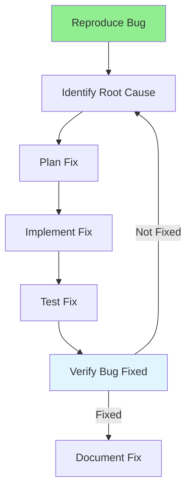

# 07.12 Bug Fixing / Sửa Bug

## Table of Contents / Mục lục
1. [Introduction / Giới thiệu](#introduction--giới-thiệu)
2. [Bug Fixing Process / Quy trình sửa Bug](#bug-fixing-process--quy-trình-sửa-bug)
3. [Fixing Techniques / Kỹ thuật sửa](#fixing-techniques--kỹ-thuật-sửa)
4. [Best Practices / Thực hành tốt nhất](#best-practices--thực-hành-tốt-nhất)
5. [Summary / Tóm tắt](#summary--tóm-tắt)

---

## Introduction / Giới thiệu

### Overview / Tổng quan

**English**: Bug fixing requires systematic approach to identify root cause and implement correct solution. Learn effective bug fixing techniques.

**Vietnamese**: Sửa bug yêu cầu cách tiếp cận có hệ thống để xác định nguyên nhân gốc và triển khai giải pháp đúng. Học kỹ thuật sửa bug hiệu quả.

### Bug Fixing Process / Quy trình sửa Bug



---

## Bug Fixing Process / Quy trình sửa Bug

### Example 1: Fixing Process / Ví dụ 1: Quy trình sửa

```typescript
// Bug: User registration fails with valid email
// Bug: Đăng ký user thất bại với email hợp lệ

// 1. Reproduce / Tái tạo
// - Follow bug report steps / Làm theo các bước báo cáo bug
// - Confirm bug exists / Xác nhận bug tồn tại

// 2. Identify root cause / Xác định nguyên nhân gốc
// Original code / Code gốc
function validateEmail(email: string): boolean {
  const regex = /^[^\s@]+@[^\s@]+\.[^\s@]+$/;
  return regex.test(email.toLowerCase()); // Bug: toLowerCase() not called on input
}

// Issue: Email validation fails because input not lowercased
// Vấn đề: Xác thực email thất bại vì đầu vào không được chuyển thành chữ thường

// 3. Implement fix / Triển khai sửa chữa
function validateEmail(email: string): boolean {
  const regex = /^[^\s@]+@[^\s@]+\.[^\s@]+$/;
  return regex.test(email.toLowerCase()); // Fixed: Lowercase input first
}

// 4. Test fix / Test sửa chữa
describe('validateEmail', () => {
  it('should validate email with uppercase', () => {
    expect(validateEmail('USER@EXAMPLE.COM')).toBe(true);
  });
  
  it('should validate email with mixed case', () => {
    expect(validateEmail('User@Example.com')).toBe(true);
  });
});

// 5. Verify / Xác minh
// - Run all tests / Chạy tất cả test
// - Test bug scenario / Test kịch bản bug
// - Check for regressions / Kiểm tra regression
```

---

## Best Practices / Thực hành tốt nhất

1. **Understand root cause** - Don't just fix symptoms
2. **Test thoroughly** - Test fix and related code
3. **Check for regressions** - Ensure no new bugs
4. **Document fix** - Explain what was fixed and why
5. **Review code** - Get code review before merging

---

## Summary / Tóm tắt

### Key Takeaways / Điểm chính

- **Root cause**: Identify underlying issue
- **Fix properly**: Don't just patch symptoms
- **Test**: Verify fix works
- **Regression**: Check for new issues
- **Document**: Explain the fix

### Next Steps / Bước tiếp theo

- [07.13 Regression Testing](./07.13_Regression_Testing.md) - Next: Regression Testing

---

**Last Updated / Cập nhật lần cuối**: 2024

