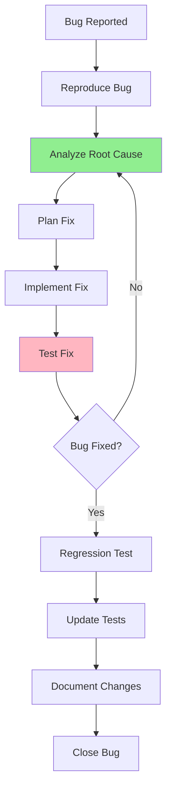

# 07.12 Bug Fixing / Fix Bug - Quy trình sửa lỗi

## Table of Contents / Mục lục
1. [Introduction / Giới thiệu](#introduction--giới-thiệu)
2. [Fixing Process / Quy trình sửa](#fixing-process--quy-trình-sửa)
3. [Root Cause Analysis / Phân tích nguyên nhân gốc](#root-cause-analysis--phân-tích-nguyên-nhân-gốc)
4. [Best Practices / Thực hành tốt nhất](#best-practices--thực-hành-tốt-nhất)
5. [Summary / Tóm tắt](#summary--tóm-tắt)

---

## Introduction / Giới thiệu

### Overview / Tổng quan

**English**: Fixing bugs systematically ensures proper resolution and prevents regressions. Understanding the fixing process helps resolve issues effectively.

**Vietnamese**: Sửa bug một cách có hệ thống đảm bảo giải quyết đúng cách và ngăn chặn regression. Hiểu quy trình sửa giúp giải quyết vấn đề hiệu quả.

### Bug Fixing Process / Quy trình sửa bug



---

## Fixing Process / Quy trình sửa

### Example 1: Fixing Workflow / Ví dụ 1: Quy trình sửa

```typescript
// Step 1: Reproduce / Bước 1: Tái tạo
async function reproduceBug() {
  const user = await createUser({ email: 'test@example.com' });
  const result = await login('test@example.com', 'password');
  // Bug: Login fails / Lỗi: Đăng nhập thất bại
  expect(result.success).toBe(false); // Reproduced / Đã tái tạo
}

// Step 2: Analyze root cause / Bước 2: Phân tích nguyên nhân gốc
// Found: Password hash comparison issue / Tìm thấy: Vấn đề so sánh hash mật khẩu
function analyzeRootCause() {
  // Issue: Using == instead of bcrypt.compare / Vấn đề: Dùng == thay vì bcrypt.compare
  const buggyCode = `
    if (user.password_hash == inputPassword) { // Wrong / Sai
      return success;
    }
  `;
}

// Step 3: Plan fix / Bước 3: Lập kế hoạch sửa
const fixPlan = {
  issue: 'Password comparison using == instead of bcrypt.compare',
  fix: 'Use bcrypt.compare for secure password comparison',
  affectedFiles: ['auth.service.ts'],
  tests: ['Add test for password comparison']
};

// Step 4: Implement fix / Bước 4: Triển khai sửa
async function login(email: string, password: string) {
  const user = await userRepository.findByEmail(email);
  if (!user) {
    throw new Error('User not found');
  }
  
  // ✅ Fixed: Use bcrypt.compare / Đã sửa: Dùng bcrypt.compare
  const isValid = await bcrypt.compare(password, user.password_hash);
  if (!isValid) {
    throw new Error('Invalid credentials');
  }
  
  return { success: true, user };
}

// Step 5: Test fix / Bước 5: Test sửa chữa
describe('Login fix', () => {
  it('should login with correct password', async () => {
    const result = await login('test@example.com', 'password');
    expect(result.success).toBe(true);
  });
});
```

---

## Root Cause Analysis / Phân tích nguyên nhân gốc

### Example 2: Root Cause Techniques / Ví dụ 2: Kỹ thuật nguyên nhân gốc

```typescript
// Technique: 5 Whys / Kỹ thuật: 5 Tại sao
interface RootCauseAnalysis {
  problem: string;
  whys: {
    why1: string;
    why2: string;
    why3: string;
    why4: string;
    why5: string;
  };
  rootCause: string;
}

const analysis: RootCauseAnalysis = {
  problem: 'User login fails',
  whys: {
    why1: 'Why? Password comparison fails',
    why2: 'Why? Using == instead of bcrypt.compare',
    why3: 'Why? Developer didn\'t know about bcrypt.compare',
    why4: 'Why? No code review caught the issue',
    why5: 'Why? Missing test coverage for authentication'
  },
  rootCause: 'Missing test coverage and code review process'
};

// Fix root cause, not symptoms / Sửa nguyên nhân gốc, không phải triệu chứng
// Symptom: Login fails / Triệu chứng: Đăng nhập thất bại
// Root cause: Missing secure password comparison / Nguyên nhân gốc: Thiếu so sánh mật khẩu an toàn
```

---

## Best Practices / Thực hành tốt nhất

1. **Fix root cause** - Not just symptoms
2. **Test thoroughly** - Verify fix works
3. **Regression test** - Ensure no new bugs
4. **Update tests** - Add tests for the bug
5. **Document changes** - Record what was fixed

---

## Summary / Tóm tắt

### Key Takeaways / Điểm chính

- **Process**: Reproduce → Analyze → Fix → Test
- **Root cause**: Fix the cause, not symptoms
- **Test**: Verify fix and prevent regression
- **Document**: Record changes

### Next Steps / Bước tiếp theo

- [07.13 Regression Testing](./07.13_Regression_Testing.md) - Next: Regression Testing

---

**Last Updated / Cập nhật lần cuối**: 2024

