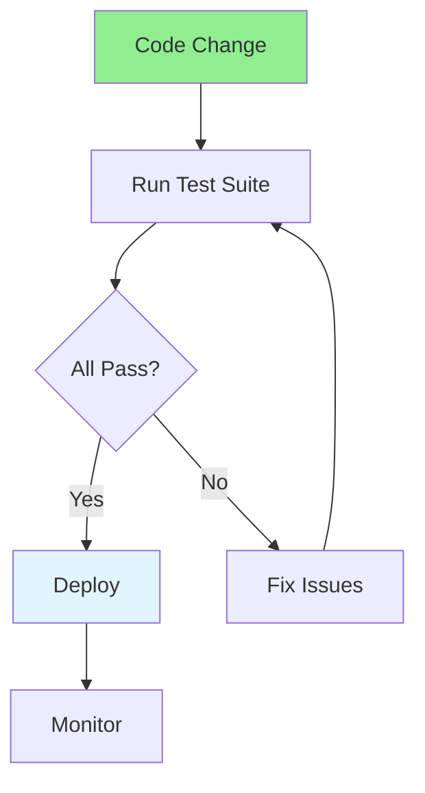

# 07.13 Regression Testing / Regression Testing

## Table of Contents / Mục lục
1. [Introduction / Giới thiệu](#introduction--giới-thiệu)
2. [Regression Testing Process / Quy trình Regression Testing](#regression-testing-process--quy-trình-regression-testing)
3. [Test Strategy / Chiến lược test](#test-strategy--chiến-lược-test)
4. [Best Practices / Thực hành tốt nhất](#best-practices--thực-hành-tốt-nhất)
5. [Summary / Tóm tắt](#summary--tóm-tắt)

---

## Introduction / Giới thiệu

### Overview / Tổng quan

**English**: Regression testing ensures fixes don't break existing functionality. Learn to perform regression testing after bug fixes and new features.

**Vietnamese**: Regression testing đảm bảo sửa chữa không làm hỏng chức năng hiện có. Học cách thực hiện regression testing sau khi sửa bug và tính năng mới.

### Regression Testing Process / Quy trình Regression Testing



---

## Regression Testing Process / Quy trình Regression Testing

### Example 1: Regression Test Suite / Ví dụ 1: Bộ test Regression

```typescript
// Regression test suite / Bộ test regression
describe('Regression Tests', () => {
  describe('User Registration', () => {
    it('should register user with valid email (regression)', async () => {
      // This test ensures the email validation bug doesn't return
      // Test này đảm bảo bug xác thực email không quay lại
      const user = await userService.registerUser(
        'USER@EXAMPLE.COM',  // Uppercase email
        'Test User',
        'Password123'
      );
      expect(user).not.toBeNull();
    });
  });
  
  describe('Order Processing', () => {
    it('should calculate discount correctly (regression)', async () => {
      // Regression test for discount calculation bug
      // Test regression cho bug tính toán discount
      const order = await orderService.createOrder({
        userId: 'user-1',
        items: [{ productId: 'prod-1', quantity: 2, price: 50 }]
      });
      expect(order.discount).toBe(5); // 5% for orders over 100
    });
  });
});
```

---

## Best Practices / Thực hành tốt nhất

1. **Automate** - Automate regression tests
2. **Run regularly** - Run after each change
3. **Cover critical paths** - Test important functionality
4. **Keep updated** - Update tests with code changes
5. **Fast execution** - Keep tests fast for quick feedback

---

## Summary / Tóm tắt

### Key Takeaways / Điểm chính

- **Regression tests**: Ensure fixes don't break existing features
- **Automate**: Automate regression test suite
- **Run regularly**: After each code change
- **Cover critical**: Test important functionality
- **Fast**: Keep tests fast for quick feedback

### Next Steps / Bước tiếp theo

- [07.14 Test Automation](./07.14_Test_Automation.md) - Next: Test Automation

---

**Last Updated / Cập nhật lần cuối**: 2024

