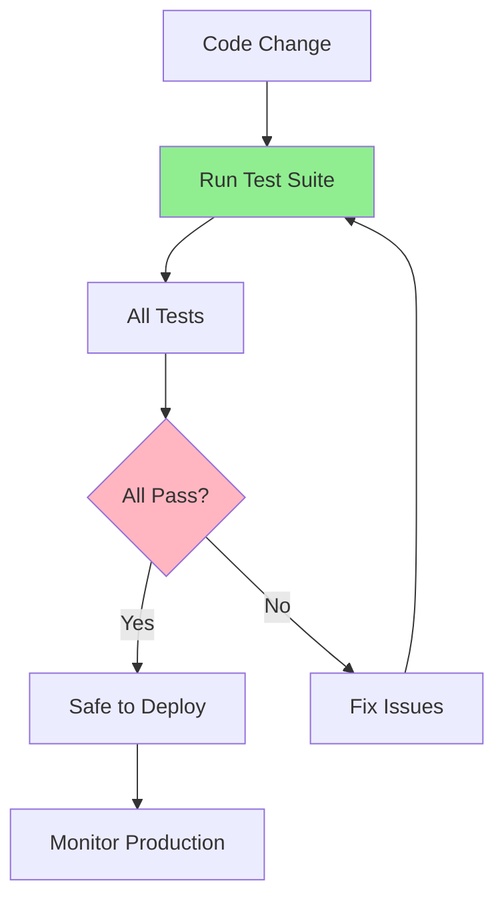

# 07.13 Regression Testing / Test hồi quy

## Table of Contents / Mục lục
1. [Introduction / Giới thiệu](#introduction--giới-thiệu)
2. [Regression Test Concepts / Khái niệm Regression Test](#regression-test-concepts--khái-niệm-regression-test)
3. [Test Suite Management / Quản lý test suite](#test-suite-management--quản-lý-test-suite)
4. [Best Practices / Thực hành tốt nhất](#best-practices--thực-hành-tốt-nhất)
5. [Summary / Tóm tắt](#summary--tóm-tắt)

---

## Introduction / Giới thiệu

### Overview / Tổng quan

**English**: Regression testing ensures that bug fixes and new features don't break existing functionality. Running regression tests prevents introducing new bugs.

**Vietnamese**: Regression test đảm bảo rằng sửa bug và tính năng mới không phá vỡ chức năng hiện có. Chạy regression test ngăn chặn giới thiệu bug mới.

### Regression Testing Flow / Luồng Regression Testing



---

## Regression Test Concepts / Khái niệm Regression Test

### Example 1: Regression Test Strategy / Ví dụ 1: Chiến lược Regression Test

```typescript
// Regression test suite / Test suite regression
describe('Regression Tests', () => {
  // Test previously fixed bugs / Test bug đã sửa trước đó
  describe('Previously Fixed Bugs', () => {
    it('BUG-001: Login should work with valid credentials', async () => {
      const result = await login('test@example.com', 'password');
      expect(result.success).toBe(true);
    });
    
    it('BUG-002: Password reset should work', async () => {
      await requestPasswordReset('test@example.com');
      const resetLink = await getResetLink('test@example.com');
      await resetPassword(resetLink, 'newPassword');
      const result = await login('test@example.com', 'newPassword');
      expect(result.success).toBe(true);
    });
  });
  
  // Test critical functionality / Test chức năng quan trọng
  describe('Critical Features', () => {
    it('User registration should work', async () => {
      const user = await registerUser({
        email: 'new@example.com',
        password: 'password123'
      });
      expect(user).toHaveProperty('id');
    });
    
    it('Order processing should work', async () => {
      const order = await createOrder({
        userId: 1,
        items: [{ productId: 1, quantity: 2 }]
      });
      expect(order.status).toBe('pending');
    });
  });
});
```

---

## Test Suite Management / Quản lý test suite

### Example 2: Test Organization / Ví dụ 2: Tổ chức test

```typescript
// Test suite structure / Cấu trúc test suite
interface TestSuite {
  name: string;
  tests: Test[];
  priority: 'Critical' | 'High' | 'Medium' | 'Low';
  runOn: 'Every Commit' | 'Before Deploy' | 'Nightly';
}

const testSuites: TestSuite[] = [
  {
    name: 'Smoke Tests',
    priority: 'Critical',
    runOn: 'Every Commit',
    tests: [
      'User login',
      'User registration',
      'Create order'
    ]
  },
  {
    name: 'Regression Tests',
    priority: 'High',
    runOn: 'Before Deploy',
    tests: [
      'All previously fixed bugs',
      'Critical user flows',
      'API endpoints'
    ]
  },
  {
    name: 'Full Test Suite',
    priority: 'Medium',
    runOn: 'Nightly',
    tests: [
      'All unit tests',
      'All integration tests',
      'All E2E tests'
    ]
  }
];
```

---

## Best Practices / Thực hành tốt nhất

1. **Run full suite** - Before deploying changes
2. **Test related features** - When fixing bugs
3. **Automate** - Run in CI/CD pipeline
4. **Monitor results** - Track test failures
5. **Update suite** - Add tests for new bugs

---

## Summary / Tóm tắt

### Key Takeaways / Điểm chính

- **Purpose**: Prevent breaking existing functionality
- **Run**: Before every deployment
- **Coverage**: All critical features
- **Automate**: CI/CD integration

### Next Steps / Bước tiếp theo

- [07.14 Test Automation](./07.14_Test_Automation.md) - Next: Test Automation

---

**Last Updated / Cập nhật lần cuối**: 2024

