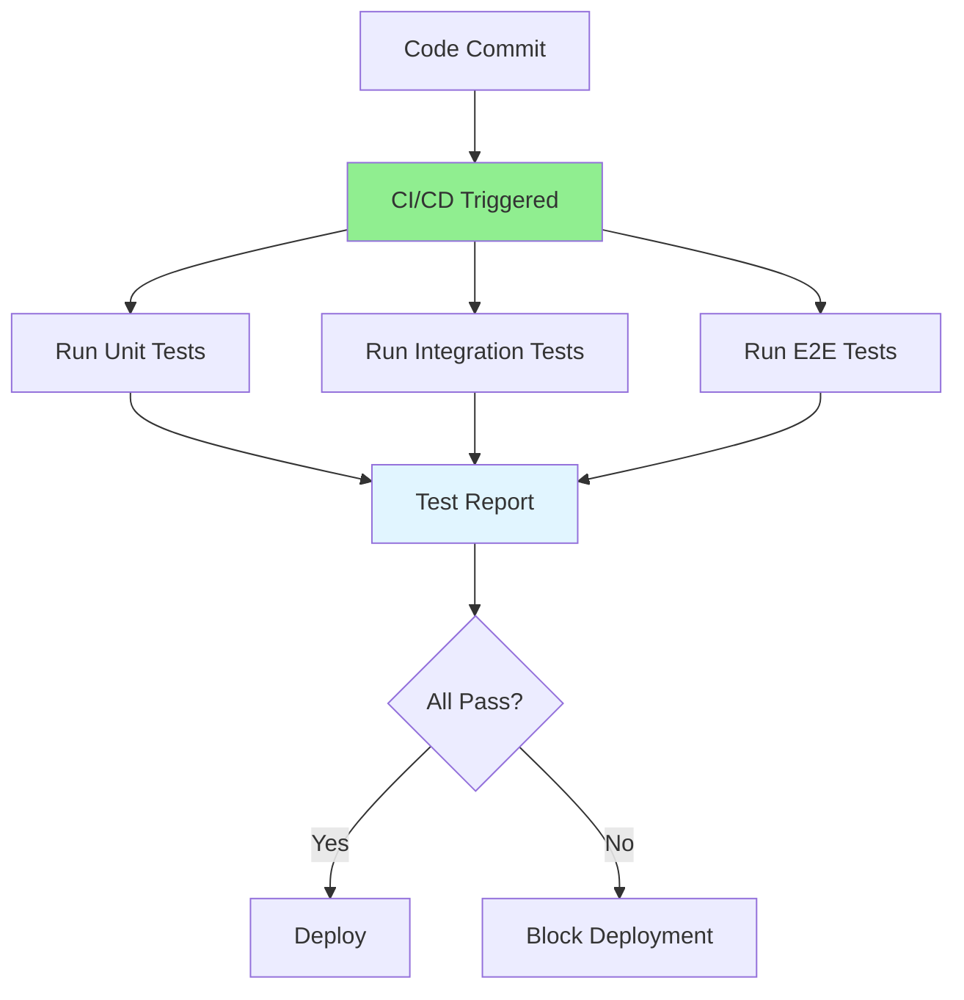

# 07.14 Test Automation / Tự động hóa testing

## Table of Contents / Mục lục
1. [Introduction / Giới thiệu](#introduction--giới-thiệu)
2. [Automation Levels / Mức tự động hóa](#automation-levels--mức-tự-động-hóa)
3. [CI/CD Integration / Tích hợp CI/CD](#cicd-integration--tích-hợp-cicd)
4. [Best Practices / Thực hành tốt nhất](#best-practices--thực-hành-tốt-nhất)
5. [Summary / Tóm tắt](#summary--tóm-tắt)

---

## Introduction / Giới thiệu

### Overview / Tổng quan

**English**: Test automation runs tests automatically, providing fast feedback and ensuring code quality. Integrating tests into CI/CD pipelines enables continuous quality assurance.

**Vietnamese**: Tự động hóa test chạy test tự động, cung cấp phản hồi nhanh và đảm bảo chất lượng code. Tích hợp test vào pipeline CI/CD cho phép đảm bảo chất lượng liên tục.

### Test Automation Flow / Luồng tự động hóa test



---

## Automation Levels / Mức tự động hóa

### Example 1: Automation Setup / Ví dụ 1: Thiết lập tự động hóa

```yaml
# GitHub Actions CI/CD / GitHub Actions CI/CD
# .github/workflows/test.yml
name: Test Suite

on:
  push:
    branches: [main, develop]
  pull_request:
    branches: [main]

jobs:
  test:
    runs-on: ubuntu-latest
    
    steps:
      - uses: actions/checkout@v3
      
      - name: Setup Node.js
        uses: actions/setup-node@v3
        with:
          node-version: '18'
      
      - name: Install dependencies
        run: npm ci
      
      - name: Run unit tests
        run: npm run test:unit
      
      - name: Run integration tests
        run: npm run test:integration
        env:
          DATABASE_URL: ${{ secrets.TEST_DATABASE_URL }}
      
      - name: Generate coverage
        run: npm run test:coverage
      
      - name: Upload coverage
        uses: codecov/codecov-action@v3
```

---

## CI/CD Integration / Tích hợp CI/CD

### Example 2: CI/CD Pipeline / Ví dụ 2: Pipeline CI/CD

```typescript
// CI/CD pipeline stages / Các giai đoạn pipeline CI/CD
interface CICDPipeline {
  stages: PipelineStage[];
}

interface PipelineStage {
  name: string;
  type: 'Build' | 'Test' | 'Deploy';
  commands: string[];
  onFailure: 'Stop' | 'Continue';
}

const pipeline: CICDPipeline = {
  stages: [
    {
      name: 'Build',
      type: 'Build',
      commands: ['npm ci', 'npm run build'],
      onFailure: 'Stop'
    },
    {
      name: 'Unit Tests',
      type: 'Test',
      commands: ['npm run test:unit'],
      onFailure: 'Stop'
    },
    {
      name: 'Integration Tests',
      type: 'Test',
      commands: ['npm run test:integration'],
      onFailure: 'Stop'
    },
    {
      name: 'Deploy to Staging',
      type: 'Deploy',
      commands: ['npm run deploy:staging'],
      onFailure: 'Stop'
    }
  ]
};
```

---

## Best Practices / Thực hành tốt nhất

1. **Fast feedback** - Run tests quickly
2. **Reliable tests** - Stable, deterministic
3. **Maintainable** - Easy to update
4. **Parallel execution** - Run tests in parallel
5. **Fail fast** - Stop on first failure

---

## Summary / Tóm tắt

### Key Takeaways / Điểm chính

- **Automate**: Unit, integration, E2E tests
- **CI/CD**: Integrate into pipeline
- **Fast**: Quick feedback
- **Reliable**: Stable tests

### Next Steps / Bước tiếp theo

- [07.15 Debugging Tools](./07.15_Debugging_Tools.md) - Next: Debugging Tools

---

**Last Updated / Cập nhật lần cuối**: 2024

