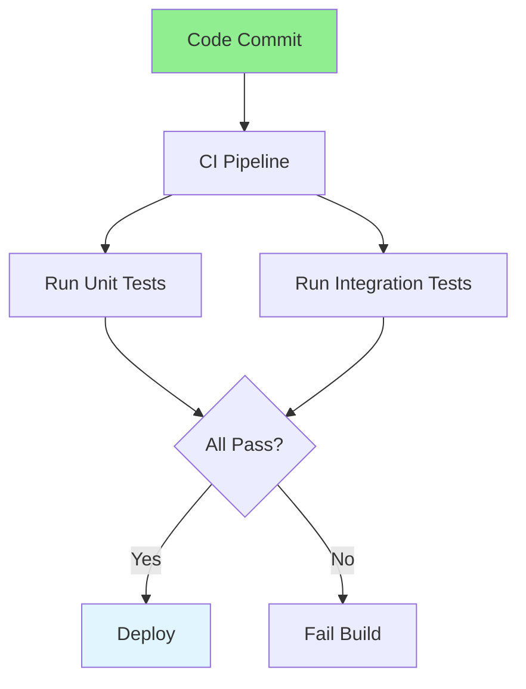

# 07.14 Test Automation / Tự động hóa Test

## Table of Contents / Mục lục
1. [Introduction / Giới thiệu](#introduction--giới-thiệu)
2. [Test Automation Flow / Luồng tự động hóa Test](#test-automation-flow--luồng-tự-động-hóa-test)
3. [Automation Tools / Công cụ tự động hóa](#automation-tools--công-cụ-tự-động-hóa)
4. [Best Practices / Thực hành tốt nhất](#best-practices--thực-hành-tốt-nhất)
5. [Summary / Tóm tắt](#summary--tóm-tắt)

---

## Introduction / Giới thiệu

### Overview / Tổng quan

**English**: Test automation runs tests automatically in CI/CD pipelines. Learn to set up automated testing for continuous quality assurance.

**Vietnamese**: Tự động hóa test chạy test tự động trong pipeline CI/CD. Học cách thiết lập test tự động để đảm bảo chất lượng liên tục.

### Test Automation Flow / Luồng tự động hóa Test



---

## Test Automation Flow / Luồng tự động hóa Test

### Example 1: CI/CD Test Automation / Ví dụ 1: Tự động hóa Test CI/CD

```yaml
# GitHub Actions CI/CD / CI/CD GitHub Actions
# .github/workflows/test.yml
name: Tests

on:
  push:
    branches: [main, develop]
  pull_request:
    branches: [main, develop]

jobs:
  test:
    runs-on: ubuntu-latest
    
    steps:
      - uses: actions/checkout@v3
      
      - name: Setup Node.js
        uses: actions/setup-node@v3
        with:
          node-version: '18'
      
      - name: Install dependencies
        run: npm ci
      
      - name: Run unit tests
        run: npm run test:unit
      
      - name: Run integration tests
        run: npm run test:integration
        env:
          DATABASE_URL: ${{ secrets.TEST_DATABASE_URL }}
      
      - name: Generate coverage
        run: npm run test:coverage
      
      - name: Upload coverage
        uses: codecov/codecov-action@v3
```

### Example 2: Test Scripts / Ví dụ 2: Script test

```json
// package.json test scripts / Script test package.json
{
  "scripts": {
    "test": "jest",
    "test:unit": "jest --testPathPattern=unit",
    "test:integration": "jest --testPathPattern=integration",
    "test:watch": "jest --watch",
    "test:coverage": "jest --coverage",
    "test:ci": "jest --ci --coverage --maxWorkers=2"
  }
}
```

---

## Best Practices / Thực hành tốt nhất

1. **Automate early** - Set up automation from start
2. **Run on every commit** - Catch issues early
3. **Fast feedback** - Keep tests fast
4. **Parallel execution** - Run tests in parallel
5. **Monitor results** - Track test results over time

---

## Summary / Tóm tắt

### Key Takeaways / Điểm chính

- **Automation**: Run tests automatically
- **CI/CD**: Integrate with CI/CD pipelines
- **Fast feedback**: Quick test results
- **Parallel**: Run tests in parallel
- **Monitor**: Track test results

### Next Steps / Bước tiếp theo

- [07.15 Debugging Tools](./07.15_Debugging_Tools.md) - Next: Debugging Tools

---

**Last Updated / Cập nhật lần cuối**: 2024

