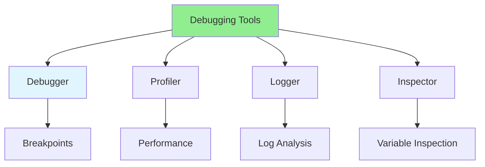

# 07.15 Debugging Tools / Công cụ Debug

## Table of Contents / Mục lục
1. [Introduction / Giới thiệu](#introduction--giới-thiệu)
2. [Debugging Tools / Công cụ Debug](#debugging-tools--công-cụ-debug)
3. [Tool Comparison / So sánh công cụ](#tool-comparison--so-sánh-công-cụ)
4. [Best Practices / Thực hành tốt nhất](#best-practices--thực-hành-tốt-nhất)
5. [Summary / Tóm tắt](#summary--tóm-tắt)

---

## Introduction / Giới thiệu

### Overview / Tổng quan

**English**: Debugging tools help identify and fix bugs efficiently. Learn to use debuggers, profilers, and other debugging tools.

**Vietnamese**: Công cụ debug giúp xác định và sửa bug hiệu quả. Học cách sử dụng debugger, profiler và các công cụ debug khác.

### Debugging Tools / Công cụ Debug



---

## Debugging Tools / Công cụ Debug

### Example 1: VS Code Debugger / Ví dụ 1: Debugger VS Code

```json
// VS Code debug configuration / Cấu hình debug VS Code
// .vscode/launch.json
{
  "version": "0.2.0",
  "configurations": [
    {
      "type": "node",
      "request": "launch",
      "name": "Debug Node.js",
      "program": "${workspaceFolder}/src/index.ts",
      "outFiles": ["${workspaceFolder}/dist/**/*.js"],
      "sourceMaps": true,
      "env": {
        "NODE_ENV": "development"
      },
      "console": "integratedTerminal"
    },
    {
      "type": "node",
      "request": "attach",
      "name": "Attach to Process",
      "port": 9229
    }
  ]
}
```

### Example 2: Chrome DevTools / Ví dụ 2: Chrome DevTools

```typescript
// Using Chrome DevTools / Sử dụng Chrome DevTools
// 1. Open Chrome DevTools (F12)
// 2. Go to Sources tab
// 3. Set breakpoints
// 4. Inspect variables
// 5. Step through code

// Debugger statement / Câu lệnh debugger
function processData(data: any[]) {
  debugger; // Pauses execution / Tạm dừng thực thi
  return data.map(item => item.value * 2);
}
```

---

## Best Practices / Thực hành tốt nhất

1. **Learn your tools** - Master your IDE debugger
2. **Use breakpoints** - Set strategic breakpoints
3. **Inspect variables** - Check variable values
4. **Step through code** - Understand execution flow
5. **Use profilers** - For performance issues

---

## Summary / Tóm tắt

### Key Takeaways / Điểm chính

- **Debuggers**: VS Code, Chrome DevTools, etc.
- **Breakpoints**: Set strategic breakpoints
- **Inspection**: Check variable values
- **Stepping**: Step through code execution
- **Profilers**: For performance debugging

### Next Steps / Bước tiếp theo

- [07.16 Bug Tracking](./07.16_Bug_Tracking.md) - Next: Bug Tracking

---

**Last Updated / Cập nhật lần cuối**: 2024


