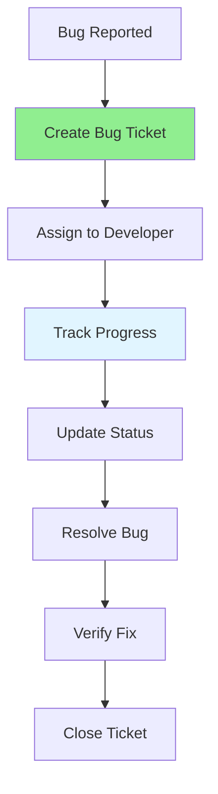

# 07.16 Bug Tracking / Bug Tracking

## Table of Contents / Mục lục
1. [Introduction / Giới thiệu](#introduction--giới-thiệu)
2. [Bug Tracking Concepts / Khái niệm Bug Tracking](#bug-tracking-concepts--khái-niệm-bug-tracking)
3. [Tracking Tools / Công cụ theo dõi](#tracking-tools--công-cụ-theo-dõi)
4. [Best Practices / Thực hành tốt nhất](#best-practices--thực-hành-tốt-nhất)
5. [Summary / Tóm tắt](#summary--tóm-tắt)

---

## Introduction / Giới thiệu

### Overview / Tổng quan

**English**: Bug tracking systems help manage bugs throughout their lifecycle. Using bug tracking tools ensures proper bug management and team collaboration.

**Vietnamese**: Hệ thống theo dõi bug giúp quản lý bug trong suốt vòng đời. Sử dụng công cụ theo dõi bug đảm bảo quản lý bug đúng cách và hợp tác nhóm.

### Bug Tracking Flow / Luồng theo dõi bug



---

## Bug Tracking Concepts / Khái niệm Bug Tracking

### Example 1: Bug Ticket Structure / Ví dụ 1: Cấu trúc ticket bug

```typescript
interface BugTicket {
  id: string; // BUG-001
  title: string;
  description: string;
  status: BugState;
  priority: 'Low' | 'Medium' | 'High' | 'Critical';
  severity: 'Low' | 'Medium' | 'High' | 'Critical';
  assignee?: string;
  reporter: string;
  labels: string[];
  comments: Comment[];
  attachments?: string[];
  createdAt: Date;
  updatedAt: Date;
  resolvedAt?: Date;
}

interface Comment {
  author: string;
  content: string;
  timestamp: Date;
}

// Example ticket / Ví dụ ticket
const bugTicket: BugTicket = {
  id: 'BUG-001',
  title: 'User login fails with valid credentials',
  description: 'Detailed description...',
  status: 'New',
  priority: 'High',
  severity: 'High',
  reporter: 'QA Team',
  labels: ['authentication', 'login', 'bug'],
  comments: [],
  createdAt: new Date('2024-01-15'),
  updatedAt: new Date('2024-01-15')
};
```

---

## Tracking Tools / Công cụ theo dõi

### Example 2: Tool Examples / Ví dụ 2: Ví dụ công cụ

```typescript
// Jira integration / Tích hợp Jira
interface JiraBug {
  key: string; // PROJ-123
  fields: {
    summary: string;
    description: string;
    status: { name: string };
    priority: { name: string };
    assignee?: { displayName: string };
  };
}

// GitHub Issues / GitHub Issues
const githubIssue = {
  title: 'Bug: Login fails',
  body: 'Description...',
  labels: ['bug', 'high-priority'],
  assignees: ['developer1']
};

// Linear / Linear
const linearIssue = {
  title: 'Login authentication bug',
  description: '...',
  priority: 1, // 1-4 scale
  assigneeId: 'user-id'
};
```

---

## Best Practices / Thực hành tốt nhất

1. **Create tickets** - For all bugs
2. **Update status** - Keep current
3. **Add comments** - Document progress
4. **Use labels** - Organize bugs
5. **Link related** - Connect related issues

---

## Summary / Tóm tắt

### Key Takeaways / Điểm chính

- **Track**: All bugs in tracking system
- **Update**: Status regularly
- **Communicate**: Through comments
- **Organize**: With labels and priorities

### Next Steps / Bước tiếp theo

- Complete Group 07: Unit Test, Debug ✅
- Move to [Group 08: Code Review](../Group-08-Code-Review/) - Coming soon

---

**Last Updated / Cập nhật lần cuối**: 2024

