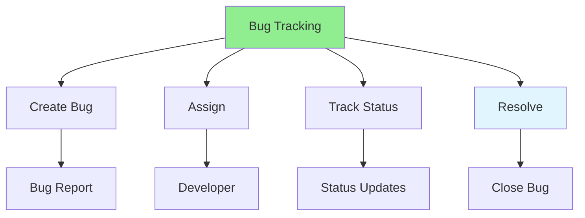

# 07.16 Bug Tracking / Theo dõi Bug

## Table of Contents / Mục lục
1. [Introduction / Giới thiệu](#introduction--giới-thiệu)
2. [Bug Tracking System / Hệ thống theo dõi Bug](#bug-tracking-system--hệ-thống-theo-dõi-bug)
3. [Bug Tracking Tools / Công cụ theo dõi Bug](#bug-tracking-tools--công-cụ-theo-dõi-bug)
4. [Best Practices / Thực hành tốt nhất](#best-practices--thực-hành-tốt-nhất)
5. [Summary / Tóm tắt](#summary--tóm-tắt)

---

## Introduction / Giới thiệu

### Overview / Tổng quan

**English**: Bug tracking systems manage bugs throughout their lifecycle. Learn to use bug tracking tools like Jira, GitHub Issues, and Linear.

**Vietnamese**: Hệ thống theo dõi bug quản lý bug trong suốt vòng đời. Học cách sử dụng công cụ theo dõi bug như Jira, GitHub Issues và Linear.

### Bug Tracking System / Hệ thống theo dõi Bug



---

## Bug Tracking System / Hệ thống theo dõi Bug

### Example 1: Bug Tracking Fields / Ví dụ 1: Trường theo dõi Bug

```typescript
// Bug tracking interface / Interface theo dõi bug
interface Bug {
  id: string;
  title: string;
  description: string;
  status: 'new' | 'assigned' | 'in_progress' | 'fixed' | 'verified' | 'closed';
  priority: 'low' | 'medium' | 'high' | 'critical';
  severity: 'low' | 'medium' | 'high' | 'critical';
  assignedTo?: string;
  reportedBy: string;
  stepsToReproduce: string[];
  expectedResult: string;
  actualResult: string;
  environment: {
    os: string;
    browser?: string;
    version: string;
  };
  attachments?: string[];
  comments: Comment[];
  createdAt: Date;
  updatedAt: Date;
  resolvedAt?: Date;
}
```

### Example 2: Bug Tracking Workflow / Ví dụ 2: Quy trình theo dõi Bug

```markdown
# Bug Tracking Workflow

## 1. Bug Reported
- Reporter creates bug ticket / Người báo cáo tạo ticket bug
- System assigns unique ID / Hệ thống gán ID duy nhất
- Status: New / Trạng thái: Mới

## 2. Bug Triage
- Review bug report / Xem xét báo cáo bug
- Assign priority / Gán mức độ ưu tiên
- Assign to developer / Giao cho developer
- Status: Assigned / Trạng thái: Đã giao

## 3. Bug Fixing
- Developer works on bug / Developer làm việc với bug
- Status: In Progress / Trạng thái: Đang xử lý
- Update progress / Cập nhật tiến độ

## 4. Bug Verification
- Tester verifies fix / Tester xác minh sửa chữa
- Status: Fixed → Verified / Trạng thái: Đã sửa → Đã xác minh

## 5. Bug Closure
- Bug verified and closed / Bug đã xác minh và đóng
- Status: Closed / Trạng thái: Đã đóng
```

---

## Best Practices / Thực hành tốt nhất

1. **Use tracking system** - Don't track bugs in email/chat
2. **Update regularly** - Keep status current
3. **Link to code** - Link bugs to commits/PRs
4. **Prioritize** - Set appropriate priorities
5. **Close properly** - Document resolution before closing

---

## Summary / Tóm tắt

### Key Takeaways / Điểm chính

- **Tracking system**: Use dedicated bug tracking tool
- **Lifecycle**: Track bugs through all states
- **Prioritization**: Set priority and severity
- **Documentation**: Keep bug reports detailed
- **Linking**: Link bugs to code changes

### Next Steps / Bước tiếp theo

- ✅ Complete Group 07: Unit Test & Debug
- Move to [Group 08: Code Review](../Group-08-Code-Review/) - Coming next

---

**Last Updated / Cập nhật lần cuối**: 2024

