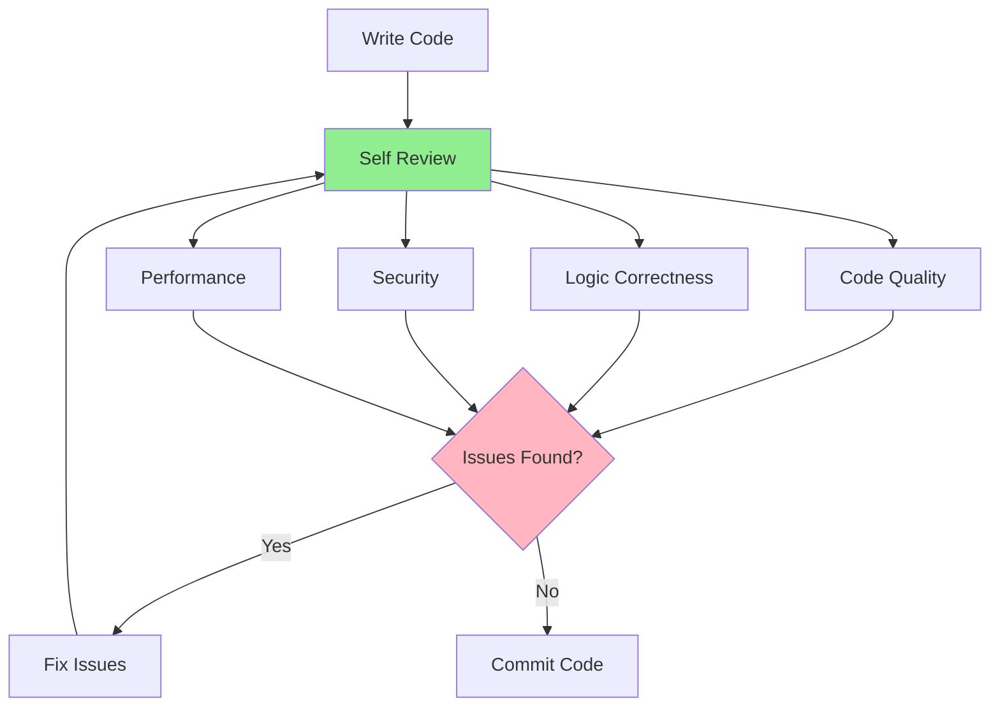

# 08.01 Self Code Review / Tự Review Code của mình

## Table of Contents / Mục lục
1. [Introduction / Giới thiệu](#introduction--giới-thiệu)
2. [Self Review Checklist / Danh sách tự review](#self-review-checklist--danh-sách-tự-review)
3. [Review Process / Quy trình review](#review-process--quy-trình-review)
4. [Best Practices / Thực hành tốt nhất](#best-practices--thực-hành-tốt-nhất)
5. [Summary / Tóm tắt](#summary--tóm-tắt)

---

## Introduction / Giới thiệu

### Overview / Tổng quan

**English**: Self-reviewing your code before committing catches issues early and improves code quality. Developing self-review habits leads to better code and fewer bugs.

**Vietnamese**: Tự review code trước khi commit phát hiện vấn đề sớm và cải thiện chất lượng code. Phát triển thói quen tự review dẫn đến code tốt hơn và ít bug hơn.

### Self Review Process / Quy trình tự review



---

## Self Review Checklist / Danh sách tự review

### Example 1: Self Review Checklist / Ví dụ 1: Danh sách tự review

```typescript
interface SelfReviewChecklist {
  codeQuality: {
    checked: boolean;
    items: string[];
  };
  logic: {
    checked: boolean;
    items: string[];
  };
  errorHandling: {
    checked: boolean;
    items: string[];
  };
  performance: {
    checked: boolean;
    items: string[];
  };
  security: {
    checked: boolean;
    items: string[];
  };
  documentation: {
    checked: boolean;
    items: string[];
  };
  tests: {
    checked: boolean;
    items: string[];
  };
}

const selfReviewChecklist: SelfReviewChecklist = {
  codeQuality: {
    checked: false,
    items: [
      'Code follows project conventions',
      'No code duplication',
      'Clear variable names',
      'Functions are focused and small'
    ]
  },
  logic: {
    checked: false,
    items: [
      'Logic is correct',
      'Edge cases handled',
      'Boundary values checked',
      'No obvious bugs'
    ]
  },
  errorHandling: {
    checked: false,
    items: [
      'Errors are handled',
      'Appropriate error types',
      'Error messages are clear',
      'No silent failures'
    ]
  },
  performance: {
    checked: false,
    items: [
      'No N+1 queries',
      'Efficient algorithms',
      'No unnecessary operations',
      'Proper caching'
    ]
  },
  security: {
    checked: false,
    items: [
      'No SQL injection',
      'Input validation',
      'No sensitive data exposure',
      'Proper authentication'
    ]
  },
  documentation: {
    checked: false,
    items: [
      'Code is self-documenting',
      'Complex logic commented',
      'Function documentation',
      'README updated if needed'
    ]
  },
  tests: {
    checked: false,
    items: [
      'Tests written',
      'Good test coverage',
      'Tests are passing',
      'Edge cases tested'
    ]
  }
};
```

---

## Review Process / Quy trình review

### Example 2: Self Review Workflow / Ví dụ 2: Quy trình tự review

```typescript
// Self review workflow / Quy trình tự review
async function selfReview(code: string): Promise<ReviewResult> {
  // Step 1: Read code carefully / Bước 1: Đọc code cẩn thận
  const issues: Issue[] = [];
  
  // Step 2: Check code quality / Bước 2: Kiểm tra chất lượng code
  if (hasCodeSmells(code)) {
    issues.push({
      type: 'Code Quality',
      severity: 'Medium',
      message: 'Code has quality issues',
      suggestion: 'Refactor to improve readability'
    });
  }
  
  // Step 3: Check logic / Bước 3: Kiểm tra logic
  if (hasLogicErrors(code)) {
    issues.push({
      type: 'Logic Error',
      severity: 'High',
      message: 'Potential logic error',
      suggestion: 'Review logic flow'
    });
  }
  
  // Step 4: Check security / Bước 4: Kiểm tra bảo mật
  if (hasSecurityIssues(code)) {
    issues.push({
      type: 'Security',
      severity: 'Critical',
      message: 'Security vulnerability detected',
      suggestion: 'Fix security issue before commit'
    });
  }
  
  // Step 5: Check performance / Bước 5: Kiểm tra hiệu năng
  if (hasPerformanceIssues(code)) {
    issues.push({
      type: 'Performance',
      severity: 'Medium',
      message: 'Performance issue detected',
      suggestion: 'Optimize for better performance'
    });
  }
  
  return {
    issues,
    canCommit: issues.filter(i => i.severity === 'Critical').length === 0
  };
}
```

---

## Best Practices / Thực hành tốt nhất

1. **Review before commit** - Always review before pushing
2. **Use tools** - Linters, formatters, static analysis
3. **Take time** - Don't rush the review
4. **Be critical** - Question your own code
5. **Fix issues** - Address problems before commit

---

## Summary / Tóm tắt

### Key Takeaways / Điểm chính

- **Checklist**: Code quality, logic, security, performance
- **Process**: Systematic review before commit
- **Tools**: Use linters and static analysis
- **Habit**: Make self-review a routine

### Next Steps / Bước tiếp theo

- [08.02 Code Review Checklist](./08.02_Code_Review_Checklist.md) - Next: Review Checklist

---

**Last Updated / Cập nhật lần cuối**: 2024

