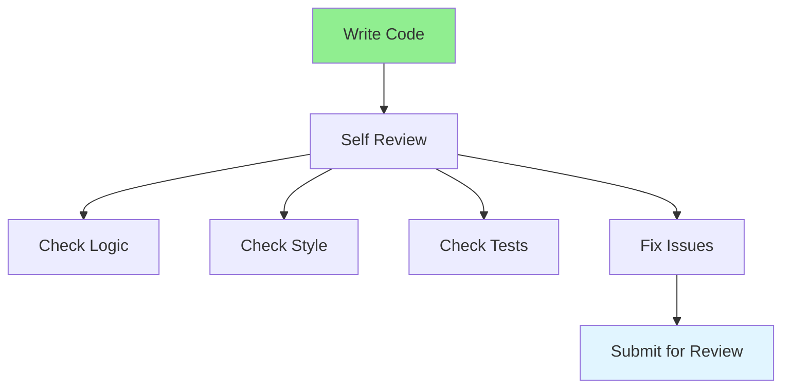

# 08.01 Self Code Review / Tự review code

## Table of Contents / Mục lục
1. [Introduction / Giới thiệu](#introduction--giới-thiệu)
2. [Self Review Process / Quy trình tự review](#self-review-process--quy-trình-tự-review)
3. [Review Checklist / Checklist review](#review-checklist--checklist-review)
4. [Best Practices / Thực hành tốt nhất](#best-practices--thực-hành-tốt-nhất)
5. [Summary / Tóm tắt](#summary--tóm-tắt)

---

## Introduction / Giới thiệu

### Overview / Tổng quan

**English**: Self code review improves code quality before submitting. Learn to review your own code systematically before requesting peer review.

**Vietnamese**: Tự review code cải thiện chất lượng code trước khi submit. Học cách review code của chính mình có hệ thống trước khi yêu cầu peer review.

### Self Code Review Process / Quy trình tự review code



---

## Self Review Process / Quy trình tự review

### Example 1: Self Review Checklist / Ví dụ 1: Checklist tự review

```typescript
// Before submitting code, review: / Trước khi submit code, review:

// 1. Code Logic / Logic code
function calculateTotal(items: OrderItem[]): number {
  // ✓ Does it work correctly? / Nó hoạt động đúng không?
  // ✓ Handle edge cases? / Xử lý edge case không?
  // ✓ Error handling? / Xử lý lỗi không?
  return items.reduce((sum, item) => sum + item.price * item.quantity, 0);
}

// 2. Code Style / Phong cách code
// ✓ Follow naming conventions? / Tuân theo quy ước đặt tên?
// ✓ Consistent formatting? / Định dạng nhất quán?
// ✓ No commented code? / Không có code đã comment?

// 3. Performance / Hiệu suất
// ✓ Efficient algorithm? / Thuật toán hiệu quả?
// ✓ No unnecessary operations? / Không có thao tác không cần thiết?

// 4. Tests / Test
// ✓ Tests written? / Đã viết test?
// ✓ Edge cases covered? / Đã bao phủ edge case?
// ✓ Tests pass? / Test pass không?
```

### Example 2: Self Review Questions / Ví dụ 2: Câu hỏi tự review

```markdown
# Self Review Questions

## Functionality
- Does the code do what it's supposed to do?
- Are edge cases handled?
- Is error handling appropriate?

## Code Quality
- Is the code readable?
- Are variable names descriptive?
- Is there code duplication?
- Can this be simplified?

## Performance
- Is the code efficient?
- Are there any bottlenecks?
- Can this be optimized?

## Security
- Are inputs validated?
- Is sensitive data protected?
- Are there security vulnerabilities?

## Testing
- Are there tests?
- Do tests cover edge cases?
- Do all tests pass?
```

---

## Best Practices / Thực hành tốt nhất

1. **Review before commit** - Check code before committing
2. **Use checklist** - Follow systematic checklist
3. **Take breaks** - Fresh eyes catch more issues
4. **Read as reviewer** - Read code as if reviewing others
5. **Fix issues** - Address issues before submitting

---

## Summary / Tóm tắt

### Key Takeaways / Điểm chính

- **Self review**: Review your own code first
- **Systematic**: Use checklist approach
- **Quality**: Improve code before submitting
- **Time**: Saves reviewer time
- **Learning**: Helps identify own mistakes

### Next Steps / Bước tiếp theo

- [08.02 Code Review Checklist](./08.02_Code_Review_Checklist.md) - Next: Review Checklist

---

**Last Updated / Cập nhật lần cuối**: 2024

