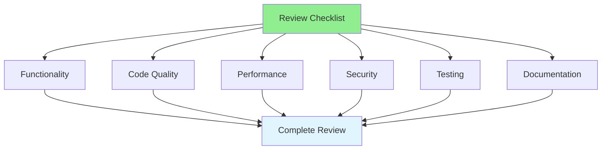

# 08.02 Code Review Checklist / 20 điểm review

## Table of Contents / Mục lục
1. [Introduction / Giới thiệu](#introduction--giới-thiệu)
2. [Comprehensive Checklist / Danh sách toàn diện](#comprehensive-checklist--danh-sách-toàn-diện)
3. [Using the Checklist / Sử dụng danh sách](#using-the-checklist--sử-dụng-danh-sách)
4. [Best Practices / Thực hành tốt nhất](#best-practices--thực-hành-tốt-nhất)
5. [Summary / Tóm tắt](#summary--tóm-tắt)

---

## Introduction / Giới thiệu

### Overview / Tổng quan

**English**: A comprehensive code review checklist ensures thorough reviews and consistent quality. Using a systematic checklist prevents missing important issues.

**Vietnamese**: Danh sách review code toàn diện đảm bảo review kỹ lưỡng và chất lượng nhất quán. Sử dụng danh sách có hệ thống ngăn chặn bỏ sót vấn đề quan trọng.

### Review Checklist Categories / Phân loại danh sách review



---

## Comprehensive Checklist / Danh sách toàn diện

### Example 1: 20-Point Checklist / Ví dụ 1: Danh sách 20 điểm

```typescript
interface CodeReviewChecklist {
  functionality: {
    works: boolean;
    requirements: boolean;
    edgeCases: boolean;
  };
  codeQuality: {
    readable: boolean;
    maintainable: boolean;
    followsConventions: boolean;
    noDuplication: boolean;
  };
  performance: {
    efficient: boolean;
    noNPlus1: boolean;
    optimized: boolean;
  };
  security: {
    noInjection: boolean;
    validated: boolean;
    authenticated: boolean;
    noSensitiveData: boolean;
  };
  testing: {
    hasTests: boolean;
    goodCoverage: boolean;
    testsPass: boolean;
  };
  documentation: {
    documented: boolean;
    comments: boolean;
    readme: boolean;
  };
  errorHandling: {
    handled: boolean;
    appropriate: boolean;
    logged: boolean;
  };
  naming: {
    clear: boolean;
    consistent: boolean;
    descriptive: boolean;
  };
}

// Example checklist usage / Ví dụ sử dụng danh sách
const reviewChecklist: CodeReviewChecklist = {
  functionality: {
    works: true,
    requirements: true,
    edgeCases: true
  },
  codeQuality: {
    readable: true,
    maintainable: true,
    followsConventions: true,
    noDuplication: true
  },
  performance: {
    efficient: true,
    noNPlus1: true,
    optimized: true
  },
  security: {
    noInjection: true,
    validated: true,
    authenticated: true,
    noSensitiveData: true
  },
  testing: {
    hasTests: true,
    goodCoverage: true,
    testsPass: true
  },
  documentation: {
    documented: true,
    comments: true,
    readme: true
  },
  errorHandling: {
    handled: true,
    appropriate: true,
    logged: true
  },
  naming: {
    clear: true,
    consistent: true,
    descriptive: true
  }
};
```

---

## Using the Checklist / Sử dụng danh sách

### Example 2: Checklist Workflow / Ví dụ 2: Quy trình danh sách

```typescript
// Review workflow with checklist / Quy trình review với danh sách
async function reviewCode(code: CodeChange, checklist: CodeReviewChecklist): Promise<ReviewResult> {
  const findings: Finding[] = [];
  
  // Go through checklist systematically / Đi qua danh sách có hệ thống
  if (!checklist.functionality.works) {
    findings.push({
      category: 'Functionality',
      issue: 'Code does not work as expected',
      severity: 'Critical'
    });
  }
  
  if (!checklist.security.noInjection) {
    findings.push({
      category: 'Security',
      issue: 'Potential SQL injection vulnerability',
      severity: 'Critical'
    });
  }
  
  if (!checklist.performance.efficient) {
    findings.push({
      category: 'Performance',
      issue: 'Performance optimization needed',
      severity: 'Medium'
    });
  }
  
  return {
    approved: findings.filter(f => f.severity === 'Critical').length === 0,
    findings
  };
}
```

---

## Best Practices / Thực hành tốt nhất

1. **Use systematically** - Go through all items
2. **Don't skip** - Check every category
3. **Be thorough** - Take time for each item
4. **Document findings** - Record issues found
5. **Update checklist** - Refine based on experience

---

## Summary / Tóm tắt

### Key Takeaways / Điểm chính

- **20 points**: Comprehensive coverage
- **Categories**: Functionality, quality, security, performance
- **Systematic**: Use checklist methodically
- **Complete**: Don't skip items

### Next Steps / Bước tiếp theo

- [08.03 Reviewing Others' Code](./08.03_Reviewing_Others_Code.md) - Next: Peer Review

---

**Last Updated / Cập nhật lần cuối**: 2024

