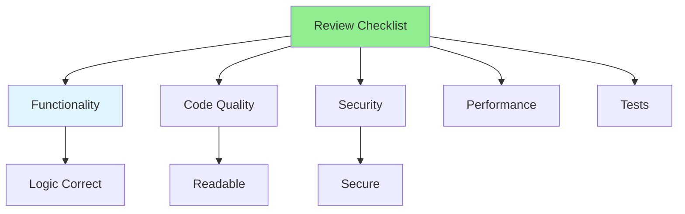

# 08.02 Code Review Checklist / Checklist review code

## Table of Contents / Mục lục
1. [Introduction / Giới thiệu](#introduction--giới-thiệu)
2. [Review Checklist / Checklist review](#review-checklist--checklist-review)
3. [Checklist Categories / Danh mục checklist](#checklist-categories--danh-mục-checklist)
4. [Best Practices / Thực hành tốt nhất](#best-practices--thực-hành-tốt-nhất)
5. [Summary / Tóm tắt](#summary--tóm-tắt)

---

## Introduction / Giới thiệu

### Overview / Tổng quan

**English**: Code review checklists ensure consistent and thorough reviews. Learn to use comprehensive checklists for effective code reviews.

**Vietnamese**: Checklist review code đảm bảo review nhất quán và toàn diện. Học cách sử dụng checklist toàn diện cho review code hiệu quả.

### Code Review Checklist / Checklist review code



---

## Review Checklist / Checklist review

### Example 1: Comprehensive Checklist / Ví dụ 1: Checklist toàn diện

```markdown
# Code Review Checklist

## Functionality ✓
- [ ] Code works as intended
- [ ] Edge cases handled
- [ ] Error handling appropriate
- [ ] No obvious bugs

## Code Quality ✓
- [ ] Code is readable
- [ ] Variable names are descriptive
- [ ] No code duplication (DRY)
- [ ] Functions are focused (single responsibility)
- [ ] Comments are clear and necessary

## Security ✓
- [ ] Input validation present
- [ ] No SQL injection risks
- [ ] No XSS vulnerabilities
- [ ] Sensitive data protected
- [ ] Authentication/authorization correct

## Performance ✓
- [ ] No N+1 queries
- [ ] Efficient algorithms
- [ ] Proper indexing
- [ ] No memory leaks
- [ ] Caching used appropriately

## Testing ✓
- [ ] Tests written
- [ ] Tests cover edge cases
- [ ] All tests pass
- [ ] Test coverage adequate

## Documentation ✓
- [ ] Code is self-documenting
- [ ] Complex logic explained
- [ ] API documentation updated
- [ ] README updated if needed
```

---

## Best Practices / Thực hành tốt nhất

1. **Use checklist** - Don't skip checklist items
2. **Be thorough** - Check all categories
3. **Customize** - Adapt checklist to project needs
4. **Update** - Keep checklist current
5. **Document** - Note findings in review

---

## Summary / Tóm tắt

### Key Takeaways / Điểm chính

- **Checklist**: Systematic review approach
- **Categories**: Functionality, quality, security, performance, tests
- **Thorough**: Check all items
- **Consistent**: Same standards for all reviews
- **Effective**: Improves review quality

### Next Steps / Bước tiếp theo

- [08.03 Reviewing Others' Code](./08.03_Reviewing_Others_Code.md) - Next: Reviewing Others

---

**Last Updated / Cập nhật lần cuối**: 2024


