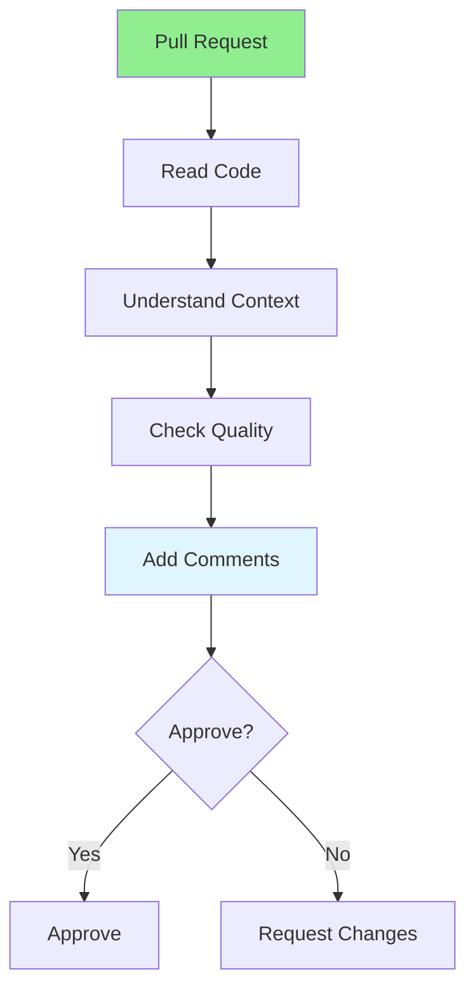

# 08.03 Reviewing Others' Code / Review code người khác

## Table of Contents / Mục lục
1. [Introduction / Giới thiệu](#introduction--giới-thiệu)
2. [Review Process / Quy trình review](#review-process--quy-trình-review)
3. [Review Guidelines / Hướng dẫn review](#review-guidelines--hướng-dẫn-review)
4. [Best Practices / Thực hành tốt nhất](#best-practices--thực-hành-tốt-nhất)
5. [Summary / Tóm tắt](#summary--tóm-tắt)

---

## Introduction / Giới thiệu

### Overview / Tổng quan

**English**: Reviewing others' code requires constructive feedback and clear communication. Learn to provide helpful, respectful code reviews.

**Vietnamese**: Review code người khác yêu cầu phản hồi mang tính xây dựng và giao tiếp rõ ràng. Học cách cung cấp review code hữu ích, tôn trọng.

### Review Process / Quy trình review



---

## Review Process / Quy trình review

### Example 1: Review Guidelines / Ví dụ 1: Hướng dẫn review

```markdown
# Code Review Guidelines

## Be Constructive
- Focus on code, not person / Tập trung vào code, không phải người
- Explain why, not just what / Giải thích tại sao, không chỉ là gì
- Suggest improvements / Đề xuất cải thiện
- Be respectful / Tôn trọng

## Good Review Comments
✓ "Consider extracting this logic into a separate function for reusability"
✓ "This might cause a performance issue with large datasets. Consider pagination."
✓ "Great solution! One suggestion: we could also handle this edge case..."

## Avoid
✗ "This is wrong"
✗ "Why did you do this?"
✗ "This code is bad"
```

### Example 2: Review Example / Ví dụ 2: Ví dụ review

```typescript
// Code to review / Code cần review
async function getUserOrders(userId: string) {
  const user = await prisma.user.findUnique({ where: { id: userId } });
  const orders = [];
  for (const order of await prisma.order.findMany()) {
    if (order.userId === userId) {
      orders.push(order);
    }
  }
  return orders;
}

// Review comments / Comment review
// 1. Performance issue: N+1 query problem
//    Suggestion: Use WHERE clause instead of filtering in code
//    Fixed: await prisma.order.findMany({ where: { userId } })

// 2. Unused variable: 'user' is fetched but never used
//    Suggestion: Remove if not needed, or use it for validation

// 3. Missing error handling
//    Suggestion: Handle case when user doesn't exist

// Improved version / Phiên bản cải thiện
async function getUserOrders(userId: string) {
  const user = await prisma.user.findUnique({ where: { id: userId } });
  if (!user) {
    throw new Error('User not found');
  }
  return await prisma.order.findMany({ where: { userId } });
}
```

---

## Best Practices / Thực hành tốt nhất

1. **Be respectful** - Focus on code, not person
2. **Explain why** - Provide reasoning for suggestions
3. **Be specific** - Point to exact lines/issues
4. **Suggest solutions** - Don't just point out problems
5. **Approve when ready** - Don't block on minor issues

---

## Summary / Tóm tắt

### Key Takeaways / Điểm chính

- **Constructive**: Provide helpful feedback
- **Respectful**: Focus on code, be professional
- **Specific**: Point to exact issues
- **Solutions**: Suggest improvements
- **Timely**: Review promptly

### Next Steps / Bước tiếp theo

- [08.04 Code Quality Standards](./08.04_Code_Quality_Standards.md) - Next: Quality Standards

---

**Last Updated / Cập nhật lần cuối**: 2024


