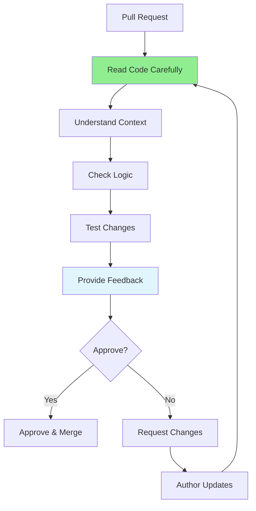

# 08.03 Reviewing Others' Code / Peer Review - Review code đồng nghiệp

## Table of Contents / Mục lục
1. [Introduction / Giới thiệu](#introduction--giới-thiệu)
2. [Review Process / Quy trình review](#review-process--quy-trình-review)
3. [Providing Feedback / Đưa ra phản hồi](#providing-feedback--đưa-ra-phản-hồi)
4. [Best Practices / Thực hành tốt nhất](#best-practices--thực-hành-tốt-nhất)
5. [Summary / Tóm tắt](#summary--tóm-tắt)

---

## Introduction / Giới thiệu

### Overview / Tổng quan

**English**: Reviewing others' code requires understanding context, checking logic, and providing constructive feedback. Professional code reviews improve code quality and team collaboration.

**Vietnamese**: Review code người khác yêu cầu hiểu ngữ cảnh, kiểm tra logic và đưa ra phản hồi mang tính xây dựng. Review code chuyên nghiệp cải thiện chất lượng code và hợp tác nhóm.

### Peer Review Process / Quy trình peer review



---

## Review Process / Quy trình review

### Example 1: Review Steps / Ví dụ 1: Các bước review

```typescript
interface ReviewProcess {
  steps: ReviewStep[];
}

interface ReviewStep {
  step: number;
  action: string;
  checklist: string[];
}

const reviewProcess: ReviewProcess = {
  steps: [
    {
      step: 1,
      action: 'Read the code',
      checklist: [
        'Understand what the code does',
        'Read related files for context',
        'Check the PR description'
      ]
    },
    {
      step: 2,
      action: 'Check functionality',
      checklist: [
        'Does it solve the problem?',
        'Are edge cases handled?',
        'Does it meet requirements?'
      ]
    },
    {
      step: 3,
      action: 'Review code quality',
      checklist: [
        'Is code readable?',
        'Follows conventions?',
        'No duplication?',
        'Good naming?'
      ]
    },
    {
      step: 4,
      action: 'Check security',
      checklist: [
        'No vulnerabilities?',
        'Input validated?',
        'No sensitive data exposure?'
      ]
    },
    {
      step: 5,
      action: 'Check performance',
      checklist: [
        'Efficient algorithms?',
        'No N+1 queries?',
        'Proper caching?'
      ]
    },
    {
      step: 6,
      action: 'Review tests',
      checklist: [
        'Tests written?',
        'Good coverage?',
        'Tests pass?'
      ]
    }
  ]
};
```

---

## Providing Feedback / Đưa ra phản hồi

### Example 2: Feedback Examples / Ví dụ 2: Ví dụ phản hồi

```typescript
// ✅ Good feedback / Phản hồi tốt
interface GoodFeedback {
  type: 'Suggestion' | 'Question' | 'Approval' | 'Blocking';
  message: string;
  location: string;
  suggestion?: string;
  example?: string;
}

const goodFeedback: GoodFeedback[] = [
  {
    type: 'Suggestion',
    message: 'Consider extracting this logic into a separate function for better readability',
    location: 'user.service.ts:45',
    suggestion: 'Extract to calculateTotalPrice() method',
    example: `
// Suggested refactoring / Refactoring đề xuất
function calculateTotalPrice(items: CartItem[]): number {
  return items.reduce((sum, item) => sum + (item.price * item.quantity), 0);
}
    `
  },
  {
    type: 'Question',
    message: 'Why is this using a loop instead of a database query?',
    location: 'order.service.ts:30',
    suggestion: 'Consider using a JOIN query to avoid N+1 problem'
  },
  {
    type: 'Blocking',
    message: 'Security issue: SQL injection vulnerability detected',
    location: 'user.service.ts:25',
    suggestion: 'Use parameterized queries instead of string concatenation'
  }
];

// ❌ Bad feedback / Phản hồi xấu
const badFeedback = [
  'This is wrong', // Too vague / Quá mơ hồ
  'Fix this', // No explanation / Không giải thích
  'This code is bad' // Not constructive / Không mang tính xây dựng
];
```

---

## Best Practices / Thực hành tốt nhất

1. **Be respectful** - Focus on code, not person
2. **Be constructive** - Provide helpful suggestions
3. **Explain why** - Give reasoning for feedback
4. **Be timely** - Review promptly
5. **Approve when ready** - Don't block unnecessarily

---

## Summary / Tóm tắt

### Key Takeaways / Điểm chính

- **Process**: Read → Understand → Check → Feedback
- **Feedback**: Constructive, specific, respectful
- **Focus**: Code quality, not personal criticism
- **Timely**: Review promptly

### Next Steps / Bước tiếp theo

- [08.04 Code Quality Standards](./08.04_Code_Quality_Standards.md) - Next: Quality Standards

---

**Last Updated / Cập nhật lần cuối**: 2024

