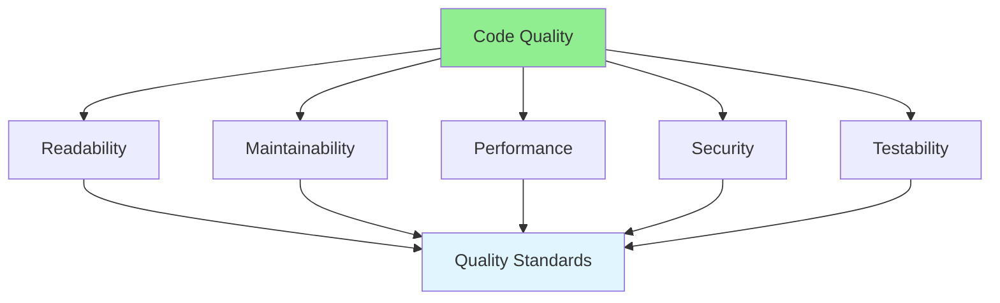

# 08.04 Code Quality Standards / Tiêu chuẩn chất lượng code

## Table of Contents / Mục lục
1. [Introduction / Giới thiệu](#introduction--giới-thiệu)
2. [Quality Dimensions / Chiều chất lượng](#quality-dimensions--chiều-chất-lượng)
3. [Quality Metrics / Chỉ số chất lượng](#quality-metrics--chỉ-số-chất-lượng)
4. [Best Practices / Thực hành tốt nhất](#best-practices--thực-hành-tốt-nhất)
5. [Summary / Tóm tắt](#summary--tóm-tắt)

---

## Introduction / Giới thiệu

### Overview / Tổng quan

**English**: Code quality standards define what makes code good. Understanding quality dimensions helps review code objectively and maintain consistent standards.

**Vietnamese**: Tiêu chuẩn chất lượng code xác định điều gì làm cho code tốt. Hiểu các chiều chất lượng giúp review code khách quan và duy trì tiêu chuẩn nhất quán.

### Code Quality Dimensions / Chiều chất lượng code



---

## Quality Dimensions / Chiều chất lượng

### Example 1: Quality Assessment / Ví dụ 1: Đánh giá chất lượng

```typescript
interface CodeQualityAssessment {
  readability: {
    score: number; // 1-10 / 1-10
    factors: string[];
  };
  maintainability: {
    score: number;
    factors: string[];
  };
  performance: {
    score: number;
    factors: string[];
  };
  security: {
    score: number;
    factors: string[];
  };
  testability: {
    score: number;
    factors: string[];
  };
}

// Example assessment / Ví dụ đánh giá
const assessment: CodeQualityAssessment = {
  readability: {
    score: 8,
    factors: [
      'Clear variable names',
      'Good function structure',
      'Appropriate comments'
    ]
  },
  maintainability: {
    score: 7,
    factors: [
      'Low complexity',
      'No duplication',
      'Good separation of concerns'
    ]
  },
  performance: {
    score: 9,
    factors: [
      'Efficient algorithms',
      'No N+1 queries',
      'Proper caching'
    ]
  },
  security: {
    score: 10,
    factors: [
      'Input validation',
      'Parameterized queries',
      'No sensitive data exposure'
    ]
  },
  testability: {
    score: 8,
    factors: [
      'Functions are testable',
      'Dependencies are injectable',
      'Good test coverage'
    ]
  }
};
```

---

## Quality Metrics / Chỉ số chất lượng

### Example 2: Metrics Examples / Ví dụ 2: Ví dụ chỉ số

```typescript
// Code quality metrics / Chỉ số chất lượng code
interface QualityMetrics {
  cyclomaticComplexity: number; // Should be < 10 / Nên < 10
  codeCoverage: number; // Percentage / Phần trăm
  codeDuplication: number; // Percentage / Phần trăm
  maintainabilityIndex: number; // 0-100 / 0-100
  technicalDebt: string; // Hours / Giờ
}

// Example metrics / Ví dụ chỉ số
const metrics: QualityMetrics = {
  cyclomaticComplexity: 8, // Good / Tốt
  codeCoverage: 85, // Good / Tốt
  codeDuplication: 5, // Good / Tốt
  maintainabilityIndex: 75, // Good / Tốt
  technicalDebt: '2 hours' // Acceptable / Chấp nhận được
};

// Quality thresholds / Ngưỡng chất lượng
const qualityThresholds = {
  cyclomaticComplexity: 10, // Max / Tối đa
  codeCoverage: 80, // Min / Tối thiểu
  codeDuplication: 5, // Max / Tối đa
  maintainabilityIndex: 70 // Min / Tối thiểu
};
```

---

## Best Practices / Thực hành tốt nhất

1. **Define standards** - Clear quality criteria
2. **Measure objectively** - Use metrics
3. **Review consistently** - Apply standards uniformly
4. **Improve continuously** - Raise the bar
5. **Document standards** - Share with team

---

## Summary / Tóm tắt

### Key Takeaways / Điểm chính

- **Dimensions**: Readability, maintainability, performance, security
- **Metrics**: Complexity, coverage, duplication
- **Standards**: Define and enforce consistently

### Next Steps / Bước tiếp theo

- [08.05 Security Review](./08.05_Security_Review.md) - Next: Security Review

---

**Last Updated / Cập nhật lần cuối**: 2024

