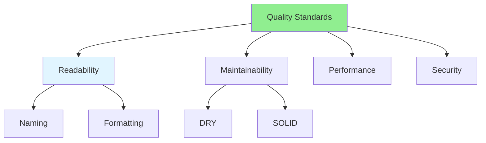

# 08.04 Code Quality Standards / Tiêu chuẩn chất lượng code

## Table of Contents / Mục lục
1. [Introduction / Giới thiệu](#introduction--giới-thiệu)
2. [Quality Standards / Tiêu chuẩn chất lượng](#quality-standards--tiêu-chuẩn-chất-lượng)
3. [Enforcement / Thực thi](#enforcement--thực-thi)
4. [Best Practices / Thực hành tốt nhất](#best-practices--thực-hành-tốt-nhất)
5. [Summary / Tóm tắt](#summary--tóm-tắt)

---

## Introduction / Giới thiệu

### Overview / Tổng quan

**English**: Code quality standards ensure consistent, maintainable code. Learn to define and enforce quality standards in code reviews.

**Vietnamese**: Tiêu chuẩn chất lượng code đảm bảo code nhất quán, dễ bảo trì. Học cách định nghĩa và thực thi tiêu chuẩn chất lượng trong review code.

### Code Quality Standards / Tiêu chuẩn chất lượng code



---

## Quality Standards / Tiêu chuẩn chất lượng

### Example 1: Quality Checklist / Ví dụ 1: Checklist chất lượng

```markdown
# Code Quality Standards

## Readability
- Descriptive variable names / Tên biến mô tả
- Consistent formatting / Định dạng nhất quán
- Clear function names / Tên hàm rõ ràng
- Appropriate comments / Comment phù hợp

## Maintainability
- DRY principle / Nguyên tắc DRY
- Single responsibility / Trách nhiệm đơn lẻ
- Low coupling / Kết hợp thấp
- High cohesion / Gắn kết cao

## Performance
- Efficient algorithms / Thuật toán hiệu quả
- No unnecessary operations / Không có thao tác không cần thiết
- Proper resource management / Quản lý tài nguyên đúng

## Security
- Input validation / Xác thực đầu vào
- Secure coding practices / Thực hành code an toàn
- No hardcoded secrets / Không có secret cứng
```

---

## Best Practices / Thực hành tốt nhất

1. **Define standards** - Document quality standards
2. **Enforce consistently** - Apply to all code
3. **Use tools** - Linters, formatters
4. **Review regularly** - Check adherence in reviews
5. **Update standards** - Evolve with team needs

---

## Summary / Tóm tắt

### Key Takeaways / Điểm chính

- **Standards**: Define clear quality standards
- **Consistency**: Apply standards consistently
- **Tools**: Use automated tools
- **Review**: Check in code reviews
- **Evolution**: Update standards as needed

### Next Steps / Bước tiếp theo

- [08.05 Security Review](./08.05_Security_Review.md) - Next: Security Review

---

**Last Updated / Cập nhật lần cuối**: 2024

