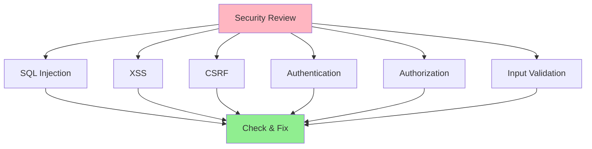

# 08.05 Security Review / Review Security Issues - Kiểm tra bảo mật

## Table of Contents / Mục lục
1. [Introduction / Giới thiệu](#introduction--giới-thiệu)
2. [Security Vulnerabilities / Lỗ hổng bảo mật](#security-vulnerabilities--lỗ-hổng-bảo-mật)
3. [Security Checklist / Danh sách bảo mật](#security-checklist--danh-sách-bảo-mật)
4. [Best Practices / Thực hành tốt nhất](#best-practices--thực-hành-tốt-nhất)
5. [Summary / Tóm tắt](#summary--tóm-tắt)

---

## Introduction / Giới thiệu

### Overview / Tổng quan

**English**: Security reviews identify vulnerabilities before they reach production. Understanding common security issues helps prevent attacks and protect sensitive data.

**Vietnamese**: Review bảo mật xác định lỗ hổng trước khi chúng đến production. Hiểu các vấn đề bảo mật phổ biến giúp ngăn chặn tấn công và bảo vệ dữ liệu nhạy cảm.

### Security Review Areas / Lĩnh vực review bảo mật



---

## Security Vulnerabilities / Lỗ hổng bảo mật

### Example 1: Common Vulnerabilities / Ví dụ 1: Lỗ hổng phổ biến

```typescript
// ❌ SQL Injection / SQL Injection
const badQuery = `
  SELECT * FROM users WHERE email = '${userInput}'
`;
// If userInput = "'; DROP TABLE users; --" / Nếu userInput = "'; DROP TABLE users; --"

// ✅ Fixed: Parameterized query / Đã sửa: Truy vấn tham số hóa
const goodQuery = prisma.user.findUnique({
  where: { email: userInput } // Parameterized / Tham số hóa
});

// ❌ XSS (Cross-Site Scripting) / XSS
const badRender = `<div>${userInput}</div>`;
// If userInput = "<script>alert('XSS')</script>" / Nếu userInput = "<script>alert('XSS')</script>"

// ✅ Fixed: Sanitize output / Đã sửa: Làm sạch đầu ra
import DOMPurify from 'dompurify';
const goodRender = `<div>${DOMPurify.sanitize(userInput)}</div>`;

// ❌ Weak authentication / Xác thực yếu
if (password === storedPassword) { // Plain text / Văn bản thuần
  login();
}

// ✅ Fixed: Secure comparison / Đã sửa: So sánh an toàn
const isValid = await bcrypt.compare(password, hashedPassword);
if (isValid) {
  login();
}
```

---

## Security Checklist / Danh sách bảo mật

### Example 2: Security Review Checklist / Ví dụ 2: Danh sách review bảo mật

```typescript
interface SecurityChecklist {
  injection: {
    sqlInjection: boolean;
    commandInjection: boolean;
    xss: boolean;
  };
  authentication: {
    strongPasswords: boolean;
    secureHashing: boolean;
    sessionManagement: boolean;
  };
  authorization: {
    accessControl: boolean;
    privilegeEscalation: boolean;
    roleBasedAccess: boolean;
  };
  dataProtection: {
    encryption: boolean;
    sensitiveData: boolean;
    dataExposure: boolean;
  };
  inputValidation: {
    validated: boolean;
    sanitized: boolean;
    typeChecked: boolean;
  };
}

const securityChecklist: SecurityChecklist = {
  injection: {
    sqlInjection: true, // Checked / Đã kiểm tra
    commandInjection: true,
    xss: true
  },
  authentication: {
    strongPasswords: true,
    secureHashing: true,
    sessionManagement: true
  },
  authorization: {
    accessControl: true,
    privilegeEscalation: true,
    roleBasedAccess: true
  },
  dataProtection: {
    encryption: true,
    sensitiveData: true,
    dataExposure: true
  },
  inputValidation: {
    validated: true,
    sanitized: true,
    typeChecked: true
  }
};
```

---

## Best Practices / Thực hành tốt nhất

1. **Check OWASP Top 10** - Common vulnerabilities
2. **Use security tools** - Static analysis, scanners
3. **Review authentication** - Password handling, sessions
4. **Check authorization** - Access control
5. **Validate input** - All user input

---

## Summary / Tóm tắt

### Key Takeaways / Điểm chính

- **Vulnerabilities**: SQL injection, XSS, CSRF, auth issues
- **Checklist**: Systematic security review
- **Tools**: OWASP, security scanners
- **Priority**: Security is critical

### Next Steps / Bước tiếp theo

- [08.06 Performance Review](./08.06_Performance_Review.md) - Next: Performance Review

---

**Last Updated / Cập nhật lần cuối**: 2024

