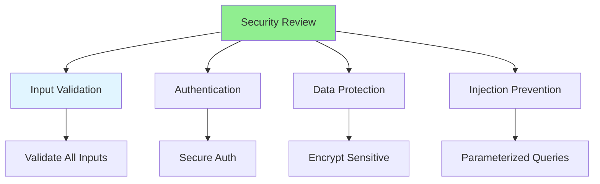

# 08.05 Security Review / Review bảo mật

## Table of Contents / Mục lục
1. [Introduction / Giới thiệu](#introduction--giới-thiệu)
2. [Security Review Checklist / Checklist review bảo mật](#security-review-checklist--checklist-review-bảo-mật)
3. [Common Vulnerabilities / Lỗ hổng phổ biến](#common-vulnerabilities--lỗ-hổng-phổ-biến)
4. [Best Practices / Thực hành tốt nhất](#best-practices--thực-hành-tốt-nhất)
5. [Summary / Tóm tắt](#summary--tóm-tắt)

---

## Introduction / Giới thiệu

### Overview / Tổng quan

**English**: Security reviews identify vulnerabilities before deployment. Learn to review code for security issues like SQL injection, XSS, and authentication flaws.

**Vietnamese**: Review bảo mật xác định lỗ hổng trước khi triển khai. Học cách review code để tìm vấn đề bảo mật như SQL injection, XSS và lỗ hổng xác thực.

### Security Review Checklist / Checklist review bảo mật



---

## Security Review Checklist / Checklist review bảo mật

### Example 1: Security Checklist / Ví dụ 1: Checklist bảo mật

```markdown
# Security Review Checklist

## Input Validation
- [ ] All inputs validated
- [ ] No SQL injection risks
- [ ] No XSS vulnerabilities
- [ ] File uploads validated
- [ ] Type checking performed

## Authentication & Authorization
- [ ] Secure password storage (hashing)
- [ ] JWT tokens properly secured
- [ ] Session management secure
- [ ] Authorization checks present
- [ ] No hardcoded credentials

## Data Protection
- [ ] Sensitive data encrypted
- [ ] HTTPS in production
- [ ] No sensitive data in logs
- [ ] Secure headers (CORS, CSP)
- [ ] Data sanitization

## Injection Prevention
- [ ] Parameterized queries
- [ ] No string concatenation in SQL
- [ ] Input sanitization
- [ ] Command injection prevention
```

### Example 2: Security Issues / Ví dụ 2: Vấn đề bảo mật

```typescript
// Security issue: SQL injection / Vấn đề bảo mật: SQL injection
// ❌ Bad / Xấu
app.get('/users', (req, res) => {
  const query = `SELECT * FROM users WHERE email = '${req.query.email}'`;
  db.query(query); // Vulnerable / Dễ bị tấn công
});

// ✅ Good / Tốt
app.get('/users', (req, res) => {
  const query = 'SELECT * FROM users WHERE email = $1';
  db.query(query, [req.query.email]); // Parameterized / Tham số hóa
});

// Security issue: XSS / Vấn đề bảo mật: XSS
// ❌ Bad
res.send(`<div>${userInput}</div>`); // XSS risk / Rủi ro XSS

// ✅ Good
res.send(`<div>${escapeHtml(userInput)}</div>`); // Sanitized / Đã làm sạch
```

---

## Best Practices / Thực hành tốt nhất

1. **Check OWASP Top 10** - Review against OWASP list
2. **Validate inputs** - All user inputs validated
3. **Secure authentication** - Proper auth implementation
4. **Encrypt sensitive data** - Protect sensitive information
5. **Regular reviews** - Security review for all changes

---

## Summary / Tóm tắt

### Key Takeaways / Điểm chính

- **Security review**: Check for vulnerabilities
- **OWASP Top 10**: Review against common vulnerabilities
- **Input validation**: Validate all inputs
- **Authentication**: Secure auth implementation
- **Regular**: Review security regularly

### Next Steps / Bước tiếp theo

- [08.06 Performance Review](./08.06_Performance_Review.md) - Next: Performance Review

---

**Last Updated / Cập nhật lần cuối**: 2024

