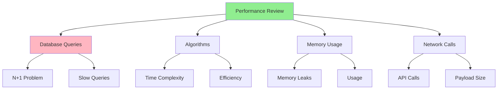

# 08.06 Performance Review / Review Performance - Kiểm tra hiệu năng

## Table of Contents / Mục lục
1. [Introduction / Giới thiệu](#introduction--giới-thiệu)
2. [Performance Issues / Vấn đề hiệu năng](#performance-issues--vấn-đề-hiệu-năng)
3. [Performance Checklist / Danh sách hiệu năng](#performance-checklist--danh-sách-hiệu-năng)
4. [Best Practices / Thực hành tốt nhất](#best-practices--thực-hành-tốt-nhất)
5. [Summary / Tóm tắt](#summary--tóm-tắt)

---

## Introduction / Giới thiệu

### Overview / Tổng quan

**English**: Performance reviews identify bottlenecks and optimization opportunities. Reviewing code for performance ensures efficient, scalable applications.

**Vietnamese**: Review hiệu năng xác định nút thắt và cơ hội tối ưu hóa. Review code về hiệu năng đảm bảo ứng dụng hiệu quả, có thể mở rộng.

### Performance Review Areas / Lĩnh vực review hiệu năng



---

## Performance Issues / Vấn đề hiệu năng

### Example 1: Common Performance Issues / Ví dụ 1: Vấn đề hiệu năng phổ biến

```typescript
// ❌ N+1 Query Problem / Vấn đề N+1 Query
async function getUsersWithOrders() {
  const users = await prisma.user.findMany(); // 1 query / 1 truy vấn
  
  for (const user of users) {
    // N queries / N truy vấn
    user.orders = await prisma.order.findMany({
      where: { userId: user.id }
    });
  }
  return users; // Total: 1 + N queries / Tổng: 1 + N truy vấn
}

// ✅ Fixed: Eager loading / Đã sửa: Tải sẵn
async function getUsersWithOrders() {
  return prisma.user.findMany({
    include: { orders: true } // 1 query with JOIN / 1 truy vấn với JOIN
  });
}

// ❌ Inefficient algorithm / Thuật toán không hiệu quả
function findCommon(arr1: number[], arr2: number[]): number[] {
  const common = [];
  for (const num1 of arr1) {
    for (const num2 of arr2) {
      if (num1 === num2 && !common.includes(num1)) {
        common.push(num1);
      }
    }
  }
  return common; // O(n²) / O(n²)
}

// ✅ Fixed: Efficient algorithm / Đã sửa: Thuật toán hiệu quả
function findCommon(arr1: number[], arr2: number[]): number[] {
  const set2 = new Set(arr2);
  const common = [];
  const seen = new Set();
  
  for (const num of arr1) {
    if (set2.has(num) && !seen.has(num)) {
      common.push(num);
      seen.add(num);
    }
  }
  return common; // O(n) / O(n)
}
```

---

## Performance Checklist / Danh sách hiệu năng

### Example 2: Performance Review Checklist / Ví dụ 2: Danh sách review hiệu năng

```typescript
interface PerformanceChecklist {
  database: {
    noNPlus1: boolean;
    indexesUsed: boolean;
    queriesOptimized: boolean;
  };
  algorithms: {
    efficient: boolean;
    complexity: boolean;
    optimized: boolean;
  };
  memory: {
    noLeaks: boolean;
    efficientUsage: boolean;
    cleanup: boolean;
  };
  network: {
    minimalCalls: boolean;
    payloadSize: boolean;
    caching: boolean;
  };
}

const performanceChecklist: PerformanceChecklist = {
  database: {
    noNPlus1: true,
    indexesUsed: true,
    queriesOptimized: true
  },
  algorithms: {
    efficient: true,
    complexity: true, // Checked time complexity / Đã kiểm tra độ phức tạp thời gian
    optimized: true
  },
  memory: {
    noLeaks: true,
    efficientUsage: true,
    cleanup: true
  },
  network: {
    minimalCalls: true,
    payloadSize: true,
    caching: true
  }
};
```

---

## Best Practices / Thực hành tốt nhất

1. **Check queries** - N+1 problems, slow queries
2. **Review algorithms** - Time complexity
3. **Check memory** - Leaks, usage
4. **Review network** - API calls, payload size
5. **Suggest optimizations** - When appropriate

---

## Summary / Tóm tắt

### Key Takeaways / Điểm chính

- **Issues**: N+1 queries, inefficient algorithms, memory leaks
- **Check**: Database, algorithms, memory, network
- **Optimize**: Suggest improvements

### Next Steps / Bước tiếp theo

- [08.07 Architecture Review](./08.07_Architecture_Review.md) - Next: Architecture Review

---

**Last Updated / Cập nhật lần cuối**: 2024

