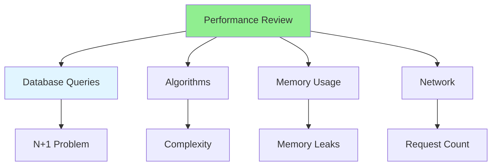

# 08.06 Performance Review / Review hiệu suất

## Table of Contents / Mục lục
1. [Introduction / Giới thiệu](#introduction--giới-thiệu)
2. [Performance Review Checklist / Checklist review hiệu suất](#performance-review-checklist--checklist-review-hiệu-suất)
3. [Performance Issues / Vấn đề hiệu suất](#performance-issues--vấn-đề-hiệu-suất)
4. [Best Practices / Thực hành tốt nhất](#best-practices--thực-hành-tốt-nhất)
5. [Summary / Tóm tắt](#summary--tóm-tắt)

---

## Introduction / Giới thiệu

### Overview / Tổng quan

**English**: Performance reviews identify bottlenecks and optimization opportunities. Learn to review code for performance issues.

**Vietnamese**: Review hiệu suất xác định điểm nghẽn và cơ hội tối ưu. Học cách review code để tìm vấn đề hiệu suất.

### Performance Review Checklist / Checklist review hiệu suất



---

## Performance Review Checklist / Checklist review hiệu suất

### Example 1: Performance Checklist / Ví dụ 1: Checklist hiệu suất

```markdown
# Performance Review Checklist

## Database
- [ ] No N+1 query problems
- [ ] Proper indexes used
- [ ] Queries optimized
- [ ] Connection pooling used
- [ ] Pagination for large datasets

## Algorithms
- [ ] Efficient algorithms used
- [ ] Appropriate data structures
- [ ] No unnecessary iterations
- [ ] Time complexity acceptable

## Memory
- [ ] No memory leaks
- [ ] Resources released properly
- [ ] Efficient memory usage
- [ ] Streaming for large files

## Network
- [ ] Minimal API calls
- [ ] Caching used appropriately
- [ ] Response sizes reasonable
- [ ] Compression where needed
```

### Example 2: Performance Issues / Ví dụ 2: Vấn đề hiệu suất

```typescript
// Performance issue: N+1 queries / Vấn đề hiệu suất: N+1 queries
// ❌ Bad
async function getUsersWithOrders() {
  const users = await prisma.user.findMany();
  for (const user of users) {
    user.orders = await prisma.order.findMany({ where: { userId: user.id } });
  } // N+1 queries / N+1 truy vấn
}

// ✅ Good
async function getUsersWithOrders() {
  return await prisma.user.findMany({
    include: { orders: true } // Single query / Một truy vấn
  });
}
```

---

## Best Practices / Thực hành tốt nhất

1. **Check queries** - Look for N+1 problems
2. **Review algorithms** - Check time complexity
3. **Monitor memory** - Watch for leaks
4. **Optimize early** - Fix performance issues early
5. **Profile** - Use profiling tools

---

## Summary / Tóm tắt

### Key Takeaways / Điểm chính

- **Performance review**: Check for bottlenecks
- **Database**: Watch for N+1 queries
- **Algorithms**: Check efficiency
- **Memory**: Monitor usage
- **Profile**: Use profiling tools

### Next Steps / Bước tiếp theo

- [08.07 Architecture Review](./08.07_Architecture_Review.md) - Next: Architecture Review

---

**Last Updated / Cập nhật lần cuối**: 2024

