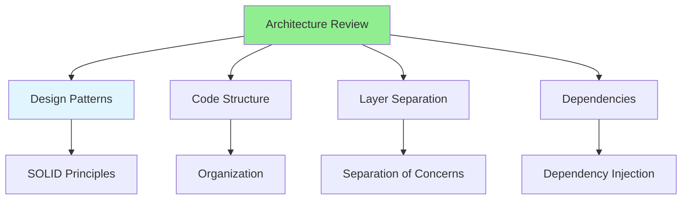

# 08.07 Architecture Review / Architecture Review

## Table of Contents / Mục lục
1. [Introduction / Giới thiệu](#introduction--giới-thiệu)
2. [Architecture Patterns / Mẫu kiến trúc](#architecture-patterns--mẫu-kiến-trúc)
3. [Reviewing Architecture / Review kiến trúc](#reviewing-architecture--review-kiến-trúc)
4. [Best Practices / Thực hành tốt nhất](#best-practices--thực-hành-tốt-nhất)
5. [Summary / Tóm tắt](#summary--tóm-tắt)

---

## Introduction / Giới thiệu

### Overview / Tổng quan

**English**: Architecture reviews ensure code follows design patterns and maintains system structure. Reviewing architecture helps maintain scalability and maintainability.

**Vietnamese**: Review kiến trúc đảm bảo code tuân theo design pattern và duy trì cấu trúc hệ thống. Review kiến trúc giúp duy trì khả năng mở rộng và bảo trì.

### Architecture Review Areas / Lĩnh vực review kiến trúc



---

## Architecture Patterns / Mẫu kiến trúc

### Example 1: Pattern Review / Ví dụ 1: Review pattern

```typescript
// ✅ Good: Layered architecture / Tốt: Kiến trúc phân lớp
// Controller Layer / Lớp Controller
@Controller('users')
export class UsersController {
  constructor(private userService: UserService) {}
  
  @Get(':id')
  async getUser(@Param('id') id: string) {
    return this.userService.findById(id);
  }
}

// Service Layer / Lớp Service
@Injectable()
export class UserService {
  constructor(private userRepository: UserRepository) {}
  
  async findById(id: string): Promise<User> {
    return this.userRepository.findById(id);
  }
}

// Repository Layer / Lớp Repository
@Injectable()
export class UserRepository {
  constructor(private prisma: PrismaService) {}
  
  async findById(id: string): Promise<User> {
    return this.prisma.user.findUnique({ where: { id } });
  }
}

// ❌ Bad: All logic in controller / Xấu: Tất cả logic trong controller
@Controller('users')
export class BadUsersController {
  @Get(':id')
  async getUser(@Param('id') id: string) {
    // Database query in controller / Truy vấn database trong controller
    return prisma.user.findUnique({ where: { id } });
  }
}
```

---

## Reviewing Architecture / Review kiến trúc

### Example 2: Architecture Checklist / Ví dụ 2: Danh sách kiến trúc

```typescript
interface ArchitectureChecklist {
  patterns: {
    followsPatterns: boolean;
    consistent: boolean;
    appropriate: boolean;
  };
  structure: {
    organized: boolean;
    clearLayers: boolean;
    properSeparation: boolean;
  };
  dependencies: {
    injected: boolean;
    minimal: boolean;
    clear: boolean;
  };
  scalability: {
    scalable: boolean;
    maintainable: boolean;
    extensible: boolean;
  };
}

const architectureChecklist: ArchitectureChecklist = {
  patterns: {
    followsPatterns: true,
    consistent: true,
    appropriate: true
  },
  structure: {
    organized: true,
    clearLayers: true,
    properSeparation: true
  },
  dependencies: {
    injected: true,
    minimal: true,
    clear: true
  },
  scalability: {
    scalable: true,
    maintainable: true,
    extensible: true
  }
};
```

---

## Best Practices / Thực hành tốt nhất

1. **Check patterns** - Follows design patterns
2. **Review structure** - Proper organization
3. **Check layers** - Clear separation
4. **Review dependencies** - Proper injection
5. **Consider scalability** - Future growth

---

## Summary / Tóm tắt

### Key Takeaways / Điểm chính

- **Patterns**: Follows design patterns
- **Structure**: Proper organization
- **Layers**: Clear separation
- **Scalability**: Future-proof design

### Next Steps / Bước tiếp theo

- [08.08 Providing Feedback](./08.08_Providing_Feedback.md) - Next: Providing Feedback

---

**Last Updated / Cập nhật lần cuối**: 2024

