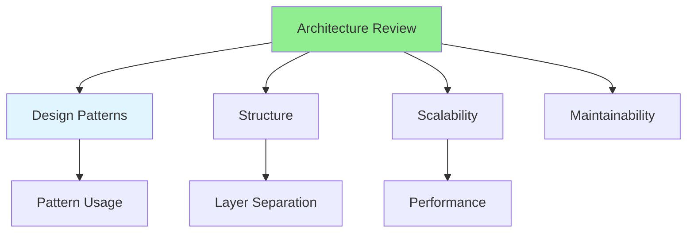

# 08.07 Architecture Review / Review kiến trúc

## Table of Contents / Mục lục
1. [Introduction / Giới thiệu](#introduction--giới-thiệu)
2. [Architecture Review Process / Quy trình review kiến trúc](#architecture-review-process--quy-trình-review-kiến-trúc)
3. [Review Areas / Lĩnh vực review](#review-areas--lĩnh-vực-review)
4. [Best Practices / Thực hành tốt nhất](#best-practices--thực-hành-tốt-nhất)
5. [Summary / Tóm tắt](#summary--tóm-tắt)

---

## Introduction / Giới thiệu

### Overview / Tổng quan

**English**: Architecture reviews evaluate design decisions and system structure. Learn to review architectural choices for scalability and maintainability.

**Vietnamese**: Review kiến trúc đánh giá quyết định thiết kế và cấu trúc hệ thống. Học cách review lựa chọn kiến trúc cho khả năng mở rộng và bảo trì.

### Architecture Review / Review kiến trúc



---

## Architecture Review Process / Quy trình review kiến trúc

### Example 1: Architecture Review Checklist / Ví dụ 1: Checklist review kiến trúc

```markdown
# Architecture Review Checklist

## Design Patterns
- [ ] Appropriate patterns used
- [ ] Patterns applied correctly
- [ ] No anti-patterns
- [ ] Consistent pattern usage

## Structure
- [ ] Clear separation of concerns
- [ ] Proper layering
- [ ] Module boundaries clear
- [ ] Dependencies managed

## Scalability
- [ ] Can handle growth
- [ ] Performance considerations
- [ ] Resource usage optimized
- [ ] Horizontal scaling possible

## Maintainability
- [ ] Code organization clear
- [ ] Easy to understand
- [ ] Easy to modify
- [ ] Well documented
```

---

## Best Practices / Thực hành tốt nhất

1. **Review early** - Review architecture early in design
2. **Consider scale** - Think about future growth
3. **Check patterns** - Verify pattern usage
4. **Document decisions** - Record architectural decisions
5. **Regular reviews** - Review architecture periodically

---

## Summary / Tóm tắt

### Key Takeaways / Điểm chính

- **Architecture review**: Evaluate design decisions
- **Patterns**: Check pattern usage
- **Structure**: Review code organization
- **Scalability**: Consider future growth
- **Maintainability**: Ensure easy maintenance

### Next Steps / Bước tiếp theo

- [08.08 Providing Feedback](./08.08_Providing_Feedback.md) - Next: Providing Feedback

---

**Last Updated / Cập nhật lần cuối**: 2024

