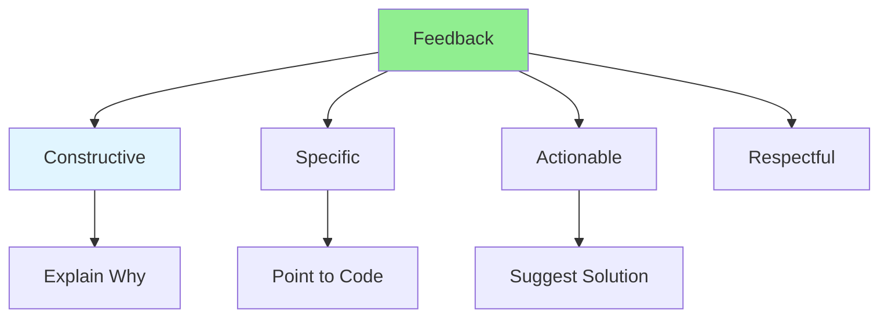

# 08.08 Providing Feedback / Cung cấp phản hồi

## Table of Contents / Mục lục
1. [Introduction / Giới thiệu](#introduction--giới-thiệu)
2. [Feedback Guidelines / Hướng dẫn phản hồi](#feedback-guidelines--hướng-dẫn-phản-hồi)
3. [Feedback Examples / Ví dụ phản hồi](#feedback-examples--ví-dụ-phản-hồi)
4. [Best Practices / Thực hành tốt nhất](#best-practices--thực-hành-tốt-nhất)
5. [Summary / Tóm tắt](#summary--tóm-tắt)

---

## Introduction / Giới thiệu

### Overview / Tổng quan

**English**: Effective feedback helps improve code quality. Learn to provide constructive, actionable feedback in code reviews.

**Vietnamese**: Phản hồi hiệu quả giúp cải thiện chất lượng code. Học cách cung cấp phản hồi mang tính xây dựng, có thể hành động trong review code.

### Providing Feedback / Cung cấp phản hồi



---

## Feedback Guidelines / Hướng dẫn phản hồi

### Example 1: Good vs Bad Feedback / Ví dụ 1: Phản hồi tốt vs xấu

```markdown
# Feedback Examples

## ❌ Bad Feedback
- "This is wrong"
- "Why did you do this?"
- "This code is bad"
- "Fix this"

## ✅ Good Feedback
- "Consider extracting this logic into a separate function for better reusability"
- "This might cause a performance issue with large datasets. Consider using pagination here."
- "Great solution! One suggestion: we could also handle this edge case by..."
- "I notice this pattern is repeated in multiple places. Could we extract it to a utility function?"

## Feedback Structure
1. Acknowledge what's good / Ghi nhận điều tốt
2. Point out the issue / Chỉ ra vấn đề
3. Explain why it matters / Giải thích tại sao quan trọng
4. Suggest a solution / Đề xuất giải pháp
```

---

## Best Practices / Thực hành tốt nhất

1. **Be constructive** - Focus on improvement
2. **Be specific** - Point to exact code
3. **Explain why** - Provide reasoning
4. **Suggest solutions** - Don't just point problems
5. **Be respectful** - Professional tone

---

## Summary / Tóm tắt

### Key Takeaways / Điểm chính

- **Constructive**: Focus on improvement
- **Specific**: Point to exact issues
- **Actionable**: Provide solutions
- **Respectful**: Professional tone
- **Helpful**: Aim to help, not criticize

### Next Steps / Bước tiếp theo

- [08.09 Handling Review Comments](./08.09_Handling_Review_Comments.md) - Next: Handling Comments

---

**Last Updated / Cập nhật lần cuối**: 2024


