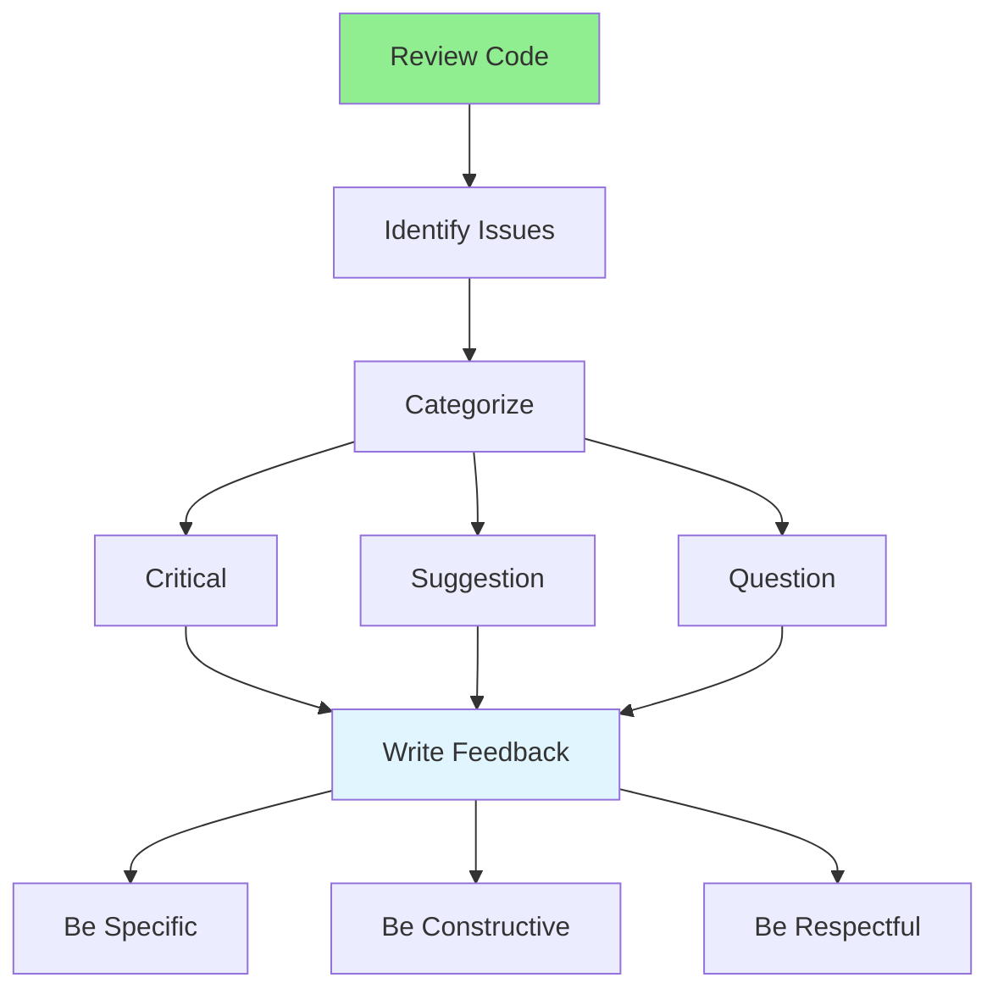

# 08.08 Providing Feedback / Providing Feedback

## Table of Contents / Mục lục
1. [Introduction / Giới thiệu](#introduction--giới-thiệu)
2. [Feedback Types / Loại phản hồi](#feedback-types--loại-phản-hồi)
3. [Writing Effective Feedback / Viết phản hồi hiệu quả](#writing-effective-feedback--viết-phản-hồi-hiệu-quả)
4. [Best Practices / Thực hành tốt nhất](#best-practices--thực-hành-tốt-nhất)
5. [Summary / Tóm tắt](#summary--tóm-tắt)

---

## Introduction / Giới thiệu

### Overview / Tổng quan

**English**: Effective feedback helps improve code quality and team collaboration. Learning to provide constructive, specific feedback is essential for professional code reviews.

**Vietnamese**: Phản hồi hiệu quả giúp cải thiện chất lượng code và hợp tác nhóm. Học cách đưa ra phản hồi mang tính xây dựng, cụ thể rất quan trọng cho review code chuyên nghiệp.

### Feedback Process / Quy trình phản hồi



---

## Feedback Types / Loại phản hồi

### Example 1: Feedback Categories / Ví dụ 1: Phân loại phản hồi

```typescript
interface Feedback {
  type: 'Blocking' | 'Suggestion' | 'Question' | 'Approval' | 'Nitpick';
  severity: 'Critical' | 'High' | 'Medium' | 'Low';
  message: string;
  location: string;
  suggestion?: string;
  example?: string;
}

// Example feedback / Ví dụ phản hồi
const feedbackExamples: Feedback[] = [
  {
    type: 'Blocking',
    severity: 'Critical',
    message: 'SQL injection vulnerability: Using string concatenation in query',
    location: 'user.service.ts:25',
    suggestion: 'Use parameterized queries with Prisma',
    example: `
// Instead of / Thay vì
const query = \`SELECT * FROM users WHERE email = '\${email}'\`;

// Use / Sử dụng
const user = await prisma.user.findUnique({ where: { email } });
    `
  },
  {
    type: 'Suggestion',
    severity: 'Medium',
    message: 'Consider extracting this logic into a separate function',
    location: 'order.service.ts:45',
    suggestion: 'Extract to calculateTotal() method for better readability'
  },
  {
    type: 'Question',
    severity: 'Low',
    message: 'Why is this using a loop instead of a database query?',
    location: 'user.service.ts:30',
    suggestion: 'Consider using JOIN to avoid N+1 problem'
  },
  {
    type: 'Approval',
    severity: 'Low',
    message: 'Looks good! Clean implementation.',
    location: 'product.service.ts:15'
  }
];
```

---

## Writing Effective Feedback / Viết phản hồi hiệu quả

### Example 2: Good vs Bad Feedback / Ví dụ 2: Phản hồi tốt vs xấu

```typescript
// ❌ Bad feedback / Phản hồi xấu
const badFeedback = {
  message: 'This is wrong',
  problem: 'Too vague, no explanation, not helpful'
};

// ✅ Good feedback / Phản hồi tốt
const goodFeedback = {
  message: 'Security issue: SQL injection vulnerability detected',
  location: 'user.service.ts:25',
  explanation: 'Using string concatenation in SQL query allows SQL injection attacks',
  suggestion: 'Use parameterized queries with Prisma',
  example: `
// Current (vulnerable) / Hiện tại (dễ bị tấn công)
const query = \`SELECT * FROM users WHERE email = '\${email}'\`;

// Suggested fix / Sửa chữa đề xuất
const user = await prisma.user.findUnique({ where: { email } });
  `,
  why: 'Parameterized queries prevent SQL injection by separating code from data'
};
```

---

## Best Practices / Thực hành tốt nhất

1. **Be specific** - Clear, detailed feedback
2. **Be constructive** - Helpful suggestions
3. **Explain why** - Reasoning behind feedback
4. **Provide examples** - Show how to fix
5. **Be respectful** - Professional tone

---

## Summary / Tóm tắt

### Key Takeaways / Điểm chính

- **Types**: Blocking, suggestion, question, approval
- **Be specific**: Clear, detailed feedback
- **Be constructive**: Helpful suggestions
- **Be respectful**: Professional communication

### Next Steps / Bước tiếp theo

- [08.09 Handling Review Comments](./08.09_Handling_Review_Comments.md) - Next: Handling Comments

---

**Last Updated / Cập nhật lần cuối**: 2024

