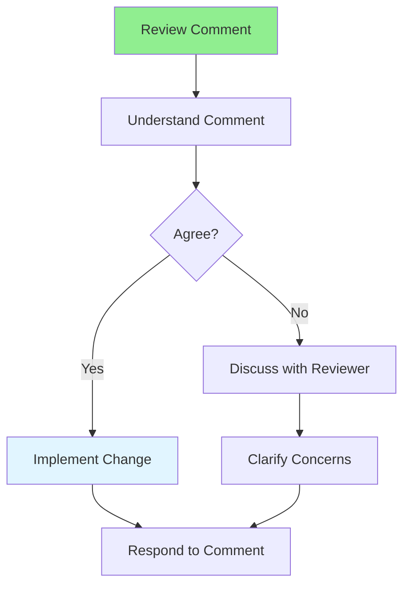

# 08.09 Handling Review Comments / Xử lý comment review

## Table of Contents / Mục lục
1. [Introduction / Giới thiệu](#introduction--giới-thiệu)
2. [Handling Comments / Xử lý comment](#handling-comments--xử-lý-comment)
3. [Response Strategies / Chiến lược phản hồi](#response-strategies--chiến-lược-phản-hồi)
4. [Best Practices / Thực hành tốt nhất](#best-practices--thực-hành-tốt-nhất)
5. [Summary / Tóm tắt](#summary--tóm-tắt)

---

## Introduction / Giới thiệu

### Overview / Tổng quan

**English**: Handling review comments professionally improves collaboration. Learn to respond to feedback constructively and implement changes.

**Vietnamese**: Xử lý comment review một cách chuyên nghiệp cải thiện cộng tác. Học cách phản hồi feedback mang tính xây dựng và triển khai thay đổi.

### Handling Review Comments / Xử lý comment review



---

## Handling Comments / Xử lý comment

### Example 1: Response Examples / Ví dụ 1: Ví dụ phản hồi

```markdown
# Handling Review Comments

## When You Agree
✅ "Good catch! I've fixed this in the latest commit."
✅ "Thanks for the suggestion. I've updated the code accordingly."
✅ "Fixed. Thanks for pointing this out!"

## When You Disagree
✅ "I understand your concern. However, I chose this approach because [reason]. What do you think?"
✅ "I see your point. Let me explain my reasoning: [explanation]. Would you like to discuss this further?"
✅ "I considered that approach, but went with this because [reason]. Open to alternatives if you have suggestions."

## When You Need Clarification
✅ "Could you clarify what you mean by [specific part]? I want to make sure I understand correctly."
✅ "I'm not sure I understand. Could you provide an example?"
✅ "Thanks for the feedback. Could you elaborate on [specific point]?"
```

---

## Best Practices / Thực hành tốt nhất

1. **Respond promptly** - Acknowledge comments quickly
2. **Be open** - Accept feedback graciously
3. **Ask questions** - Clarify if unclear
4. **Implement changes** - Make requested changes
5. **Thank reviewers** - Appreciate their time

---

## Summary / Tóm tắt

### Key Takeaways / Điểm chính

- **Respond promptly**: Acknowledge comments quickly
- **Be open**: Accept feedback graciously
- **Clarify**: Ask if unclear
- **Implement**: Make requested changes
- **Professional**: Maintain professional tone

### Next Steps / Bước tiếp theo

- [08.10 Review Tools](./08.10_Review_Tools.md) - Next: Review Tools

---

**Last Updated / Cập nhật lần cuối**: 2024

