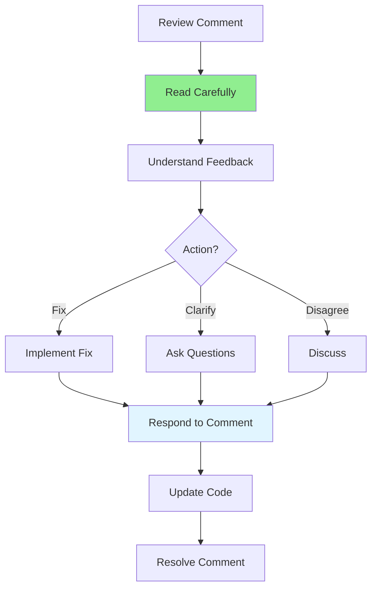

# 08.09 Handling Review Comments / Handling Review Comments

## Table of Contents / Mục lục
1. [Introduction / Giới thiệu](#introduction--giới-thiệu)
2. [Responding to Comments / Phản hồi comment](#responding-to-comments--phản-hồi-comment)
3. [Addressing Feedback / Xử lý phản hồi](#addressing-feedback--xử-lý-phản-hồi)
4. [Best Practices / Thực hành tốt nhất](#best-practices--thực-hành-tốt-nhất)
5. [Summary / Tóm tắt](#summary--tóm-tắt)

---

## Introduction / Giới thiệu

### Overview / Tổng quan

**English**: Handling review comments professionally improves collaboration and code quality. Learning to respond constructively and address feedback effectively is essential.

**Vietnamese**: Xử lý comment review chuyên nghiệp cải thiện hợp tác và chất lượng code. Học cách phản hồi mang tính xây dựng và xử lý phản hồi hiệu quả rất quan trọng.

### Handling Comments Process / Quy trình xử lý comment



---

## Responding to Comments / Phản hồi comment

### Example 1: Response Examples / Ví dụ 1: Ví dụ phản hồi

```typescript
// Good response examples / Ví dụ phản hồi tốt
interface CommentResponse {
  type: 'Fixed' | 'Clarification' | 'Discussion' | 'Acknowledged';
  message: string;
  action: string;
}

const responses: CommentResponse[] = [
  {
    type: 'Fixed',
    message: 'Thanks for catching that! I\'ve fixed the SQL injection vulnerability by using parameterized queries.',
    action: 'Fixed in latest commit'
  },
  {
    type: 'Clarification',
    message: 'Could you clarify what you mean by "extract this logic"? Which specific part should be extracted?',
    action: 'Asking for clarification'
  },
  {
    type: 'Discussion',
    message: 'I understand your concern, but I chose this approach because [reason]. What do you think?',
    action: 'Discussing approach'
  },
  {
    type: 'Acknowledged',
    message: 'Good point! I\'ll keep that in mind for future changes.',
    action: 'Acknowledged feedback'
  }
];
```

---

## Addressing Feedback / Xử lý phản hồi

### Example 2: Feedback Resolution / Ví dụ 2: Giải quyết phản hồi

```typescript
// Feedback resolution workflow / Quy trình giải quyết phản hồi
interface FeedbackResolution {
  commentId: string;
  status: 'Open' | 'In Progress' | 'Resolved' | 'Won\'t Fix';
  action: string;
  response: string;
}

const resolution: FeedbackResolution = {
  commentId: 'comment-123',
  status: 'Resolved',
  action: 'Fixed the issue',
  response: `
Fixed: Changed from string concatenation to parameterized query.

Before / Trước:
\`\`\`typescript
const query = \`SELECT * FROM users WHERE email = '\${email}'\`;
\`\`\`

After / Sau:
\`\`\`typescript
const user = await prisma.user.findUnique({ where: { email } });
\`\`\`
  `
};
```

---

## Best Practices / Thực hành tốt nhất

1. **Read carefully** - Understand feedback fully
2. **Respond promptly** - Don't leave comments hanging
3. **Be open** - Accept constructive criticism
4. **Fix issues** - Address blocking comments
5. **Communicate** - Explain your decisions

---

## Summary / Tóm tắt

### Key Takeaways / Điểm chính

- **Read**: Understand feedback
- **Respond**: Acknowledge comments
- **Fix**: Address issues
- **Communicate**: Explain decisions

### Next Steps / Bước tiếp theo

- [08.10 Review Tools](./08.10_Review_Tools.md) - Next: Review Tools

---

**Last Updated / Cập nhật lần cuối**: 2024

