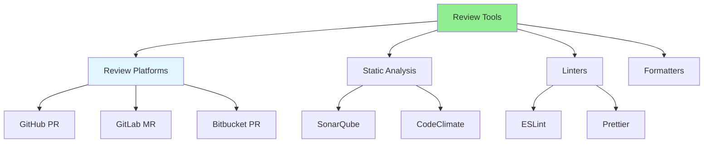

# 08.10 Review Tools / Review Tools

## Table of Contents / Mục lục
1. [Introduction / Giới thiệu](#introduction--giới-thiệu)
2. [Code Review Platforms / Nền tảng review code](#code-review-platforms--nền-tảng-review-code)
3. [Static Analysis Tools / Công cụ phân tích tĩnh](#static-analysis-tools--công-cụ-phân-tích-tĩnh)
4. [Best Practices / Thực hành tốt nhất](#best-practices--thực-hành-tốt-nhất)
5. [Summary / Tóm tắt](#summary--tóm-tắt)

---

## Introduction / Giới thiệu

### Overview / Tổng quan

**English**: Code review tools streamline the review process and provide automated checks. Using the right tools improves review efficiency and code quality.

**Vietnamese**: Công cụ review code hợp lý hóa quy trình review và cung cấp kiểm tra tự động. Sử dụng đúng công cụ cải thiện hiệu quả review và chất lượng code.

### Review Tools Ecosystem / Hệ sinh thái công cụ review



---

## Code Review Platforms / Nền tảng review code

### Example 1: Platform Features / Ví dụ 1: Tính năng nền tảng

```typescript
interface ReviewPlatform {
  name: string;
  features: string[];
  bestFor: string;
}

const platforms: ReviewPlatform[] = [
  {
    name: 'GitHub Pull Requests',
    features: [
      'Inline comments',
      'Review approvals',
      'CI/CD integration',
      'Code suggestions'
    ],
    bestFor: 'GitHub-hosted projects'
  },
  {
    name: 'GitLab Merge Requests',
    features: [
      'Code review',
      'Approval workflows',
      'CI/CD pipelines',
      'Discussion threads'
    ],
    bestFor: 'GitLab-hosted projects'
  },
  {
    name: 'Bitbucket Pull Requests',
    features: [
      'Code review',
      'Approval system',
      'Jira integration',
      'Diff view'
    ],
    bestFor: 'Bitbucket/Jira teams'
  }
];
```

---

## Static Analysis Tools / Công cụ phân tích tĩnh

### Example 2: Analysis Tools / Ví dụ 2: Công cụ phân tích

```typescript
// ESLint configuration / Cấu hình ESLint
// .eslintrc.js
module.exports = {
  extends: ['@typescript-eslint/recommended'],
  rules: {
    'no-console': 'warn',
    'no-unused-vars': 'error',
    'complexity': ['error', 10]
  }
};

// SonarQube integration / Tích hợp SonarQube
// sonar-project.properties
const sonarConfig = {
  'sonar.projectKey': 'my-project',
  'sonar.sources': 'src',
  'sonar.tests': 'tests',
  'sonar.javascript.lcov.reportPaths': 'coverage/lcov.info'
};

// CodeClimate / CodeClimate
// .codeclimate.yml
const codeClimateConfig = {
  version: '2',
  plugins: {
    eslint: {
      enabled: true,
      config: { '.eslintrc.js': true }
    }
  }
};
```

---

## Best Practices / Thực hành tốt nhất

1. **Use platforms** - GitHub, GitLab PRs
2. **Enable automation** - CI/CD checks
3. **Configure tools** - ESLint, Prettier
4. **Review reports** - Static analysis results
5. **Combine tools** - Multiple tools for coverage

---

## Summary / Tóm tắt

### Key Takeaways / Điểm chính

- **Platforms**: GitHub, GitLab, Bitbucket
- **Analysis**: SonarQube, CodeClimate
- **Linting**: ESLint, Prettier
- **Automate**: CI/CD integration

### Next Steps / Bước tiếp theo

- [08.11 Review Best Practices](./08.11_Review_Best_Practices.md) - Next: Best Practices

---

**Last Updated / Cập nhật lần cuối**: 2024

